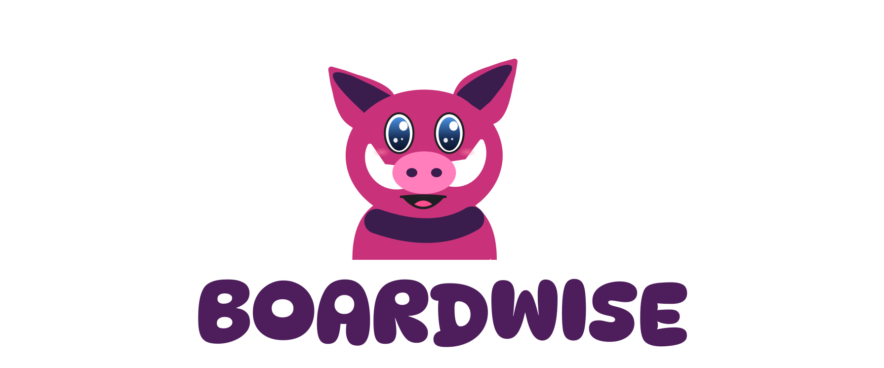
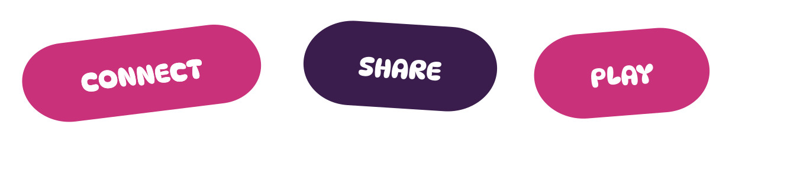
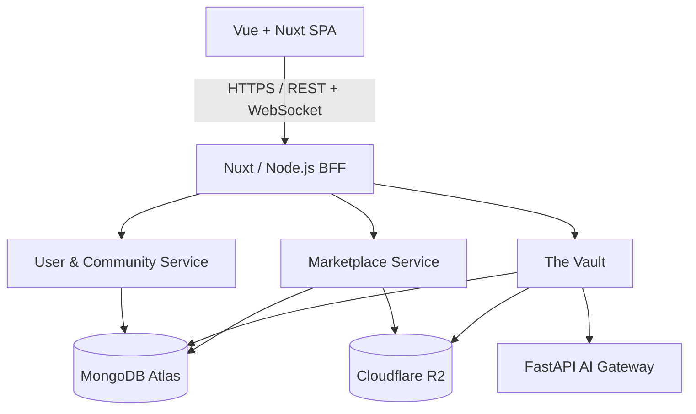

# Boardwise

**Discover, collect, trade and share board games in one connected platform.**


**Works On My Machine™** · A COS 301 Capstone Project
University of Pretoria · Client: EPI-USE Labs

[Overview](#overview) · [Features](#core-features) · [Technology](#technology-stack) · [Architecture](#architecture) · [Getting Started](#getting-started) · [Documentation](#documentation) · [Team](#team)

[](https://github.com/orgs/COS301-SE-2026/projects/46)
[](./docs/Demo3/srs.md)
[](#getting-started)

---

## Overview

Boardwise is a digital ecosystem for South Africa's tabletop gaming community. It brings together board-game discovery, collection management, peer-to-peer listings, community events and a collaboratively maintained rulebook library in one store-agnostic platform.

The platform is organised around three primary domains:

- **User and Community** - profiles, friends, groups, chats and events.
- **Marketplace** - peer-to-peer rental and sale listings, plus external retail discovery.
- **The Vault** - uploaded rulebooks, collaborative maintenance and AI-assisted ingestion.

### The Boardwise Experience

- **The Vault** - Keep rulebooks searchable, accessible and collaboratively maintained.
- **Game Discovery** - Find games, explore recommendations and grow a personal collection.
- **Community** - Meet local players, join groups and organise tabletop events.
- **Marketplace** - List, discover, rent and buy games through peer-to-peer listings.
- **AI Assistance** - Ask contextual questions grounded in available rulebook content.

### Project Resources

| Resource | Description | Link |
|---|---|---|
| Software Requirements Specification | Requirements, use cases and service contracts | [View SRS](./docs/Demo3/srs.md) |
| Software Architecture Specification | Architecture and system design | [View SAS](./docs/Demo3/sas.md) |
| Project Board | Issues, sprint work and delivery progress | [Open board](https://github.com/orgs/COS301-SE-2026/projects/46) |
| UI designs | Wireframes and interface references | [Open designs](./docs/design) |
| Brand style guide | Colour, typography, components and accessibility | [View guide](./docs/design/brandStyleGuide%20(version%202).pdf) |
| Coding standards | Shared implementation conventions | [View standards](./docs/Demo3/Coding_Standards.md) |
| Testing Policy Document | Shared implementation conventions | [View standards](./docs/demo3/TESTING_POLICY_DOCUMENT_.pdf) |

---

## Core Features

| Feature | What it provides | Main technologies |
|---|---|---|
| **Shared Rulebook Library - The Vault** | Uploading, browsing, reading and collaboratively maintaining digitised rulebooks with version history | Spring Boot · FastAPI · MongoDB Atlas · Cloudflare R2 |
| **Marketplace** | Peer-to-peer rental and sale listings, listing management and external retail discovery | Spring Boot · MongoDB Atlas · Cloudflare R2 |
| **Community and Events** | Communities, invitations, public or private events, RSVPs and attendee management | Spring Boot · MongoDB Atlas |
| **Profiles and Social Features** | Profiles, game collections, preferences, friends, direct messages and groups | Spring Security · JWT · WebSockets |
| **AI Rulebook Assistance** | Rulebook ingestion and contextual answers grounded in available rulebook content | Python · FastAPI |


---

## Technology Stack

The technologies behind Boardwise, grouped by where they contribute to the platform.

### Frontend Experience

| Vue.js | Nuxt | Vuetify | TypeScript | Sass |
|:---:|:---:|:---:|:---:|:---:|
|  |  |  |  |  |

### Services and Data

| Java | Spring Boot | Node.js | MongoDB | Cloudflare R2 |
|:---:|:---:|:---:|:---:|:---:|
|  |  |  |  |  |

### AI and Rulebook Ingestion

| Python | FastAPI |
|:---:|:---:|
|  |  |

### Delivery and Quality

| Docker | GitHub Actions | Vitest | Playwright | Git |
|:---:|:---:|:---:|:---:|:---:|
|  |  |  |  |  |

---

## Documentation

| Document | Contents |
|---|---|
| [SRS](./docs/Demo3/srs.md) | Requirements, use cases, domain model, API contracts and traceability |
| [SAS](./docs/Demo3/sas.md) | Architecture decisions, services and deployment design |
| [Brand Style Guide](./docs/design/brandStyleGuide%20(version%202).pdf) | Brand colours, typography, components and accessibility rules |
| [Wireframes](./docs/design) | Interface designs and navigation flows |
| [Design Tokens](./frontend/assets/theme.css) | Shared colour, type, spacing and interaction tokens |
| [Coding Standards](./docs/design/codingStandards.pdf) | Team-wide coding and review conventions |
| [Testing Policy Document](./docs/.pdf) | Team-wide coding and review conventions |

---
## Architecture

Boardwise uses a **client–server architecture** with **Service-Oriented Architecture (SOA)** as its overarching style. Component-based and domain-driven design separate the platform into bounded contexts, while each backend service follows a layered **Controller → Service → Repository** structure.



The Vault processes uploads asynchronously through sequential sanitisation and extraction stages. WebSocket communication supports real-time features, while MRSW - Multi-Reader, Single-Writer - locking protects collaborative rulebook editing.

See the [Software Requirements Specification](./docs/Demo3/srs.md) for detailed component diagrams, service contracts and the traceability matrix.

---

## Repository Structure

```text
Boardwise/
├── .github/                 # Workflows and CI/CD configuration
├── ai/                      # FastAPI AI gateway and ingestion pipeline
│   ├── app/
│   │   ├── models/
│   │   ├── pipeline/        # Sanitise → Extract
│   │   ├── routers/
│   │   └── services/
│   ├── tests/
│   └── main.py
├── backend/                 # Spring Boot services
│   └── src/main/java/com/boardwise/backend/
│       ├── user_service/    # Authentication, profiles, social and events
│       ├── marketplace/     # Marketplace listings
│       ├── vault/           # Rulebooks and collaborative editing
│       ├── databaseimages/
│       └── shared/
├── frontend/                # Vue and Nuxt application
│   ├── components/
│   │   ├── features/
│   │   ├── layout/
│   │   └── ui/
│   ├── composables/
│   ├── pages/
│   ├── services/
│   ├── public/
│   └── tests/
├── docs/                    # Requirements, architecture and design documents
└── README.md
```

---

## Getting Started

### 1. Clone the Repository

```bash
git clone https://github.com/COS301-SE-2026/Boardwise.git
cd Boardwise
```

### 2. Start the Frontend

```bash
cd frontend
npm install
npm run dev
```

### 3. Start the Backend

From the repository root:

```bash
cd backend
./mvnw spring-boot:run
```

### 4. Start the AI Gateway

From the repository root:

```bash
cd ai
pip install -r requirements.txt
uvicorn main:app --reload
```

> [!NOTE]
> Local environment variables and external service credentials must be configured before running every integrated feature. Consult the project documentation for the current configuration requirements.

---

## Branching Strategy

```text
main
└── dev
    ├── frontend-dev
    │   └── fe/feature/* or fe/task/*
    ├── backend-dev
    │   └── be/feature/* or be/task/*
    └── integration branches
```

| Branch | Purpose |
|---|---|
| `main` | Stable, production-ready code |
| `dev` | Central integration before promotion to `main` |
| `frontend-dev` | Shared frontend development |
| `backend-dev` | Shared backend development |
| Feature and task branches | Isolated implementation work merged through pull requests |

Pull requests require peer review, relevant passing tests and clean integration into the target branch.

---

## Quality and Testing

Boardwise combines multiple levels of verification:

- Component and service tests for frontend and backend behaviour.
- Playwright end-to-end tests for critical user journeys and responsive layouts.
- CI checks through GitHub Actions.
- Keyboard, focus, contrast and reduced-motion checks toward WCAG 2.2 Level AA.
- PWA manifest, icons, service-worker and installation checks.
- Manual desktop and mobile testing before production releases.

---

## Team

Boardwise is developed by University of Pretoria Computer Science students in partnership with EPI-USE Labs.

| Team Member | Roles | Primary Focus | LinkedIn |
|---|---|---|---|
| **Hayley Booysen** | UI/UX Engineer · Design Engineer · Integration Engineer | Coordination, frontend architecture and interface design | [Profile](https://www.linkedin.com/in/hayley-booysen-9372a9252/) |
|  **Karabo Nkomo** | Services Engineer · Systems Architect | Backend services, system architecture and deployment | [Profile](https://www.linkedin.com/in/karabo-nkomo-37b5b5319/) |
| **Njabulo Mathonsi** | DevOps Engineer · Services Engineer | CI/CD, backend services, authentication and data flow | [Profile](https://www.linkedin.com/in/njabulo-mathonsi-5126983aa/) |
|  **Palesa Nkosi** | UI Engineer | Responsive UI, accessibility and interface design | [Profile](https://www.linkedin.com/in/bridget-nkosi-03734834b) |
| **Bandile Mnyandu** - Team Lead | Project Manager · Services Engineer · Integration Engineer | Validation, integration and testing strategy | [Profile](https://www.linkedin.com/in/bandile-mnyandu-900b96303/) |

---

## Project Goals

- Digitise and expand South Africa's tabletop gaming experience.
- Strengthen local gaming communities through events and groups.
- Improve rulebook accessibility through a collaborative shared library.
- Enable peer-to-peer rentals and sales without retailer lock-in.
- Deliver a maintainable, scalable and accessible open-source platform.

---


**Play more. Learn faster. For people who love the table.**