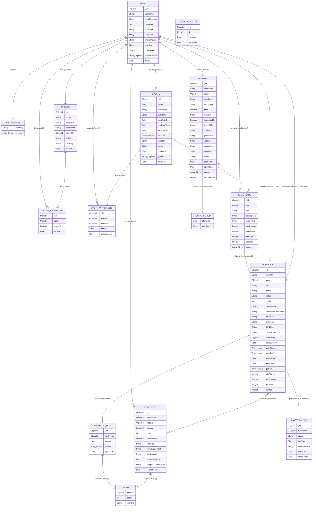

# Entity Relationship Diagram — Boardwise (Full System)

**Project:** Boardwise  
**Version:** 3.0  
**Sprint:** 2 — Demo 2  
**Date:** 2026-07-30  
**Status:** Active

---

## Conventions

- All `_id` fields are of type `ObjectId` and serve as the primary identifier for each document.
- Fields suffixed with `Id` (e.g. `userId`, `groupId`) are `ObjectId` references to documents in other collections.
- `Array_String` denotes an embedded array of scalar string values.
- `Array_ObjectId` denotes an embedded array of `ObjectId` references to documents in another collection.
- `Array_Object` denotes an embedded array of subdocuments (structured objects) stored within the parent document.
- `Array_Long` denotes an embedded array of 64-bit integer (version number) values.
- `String?`, `ObjectId?`, `Long?`, `Integer?`, etc. denote an optional field that may be null or absent.
- `Decimal` denotes a numeric value stored as a decimal type for monetary precision.
- `GeoJsonPoint` denotes a GeoJSON Point subdocument (`{ type: "Point", coordinates: [lng, lat] }`) used for geospatial (`2dsphere`) indexing.
- Fields backed by a Java `enum` (e.g. `status`, `visibility`) are shown as `String` at the ERD level; valid values are enumerated in the collection description below the diagram.
- Relationships are shown as logical references, not foreign key constraints, consistent with MongoDB's document model.
- Field naming follows `camelCase` consistently across all collections; collection (entity) names remain `UPPER_SNAKE_CASE`.
- Collections are colour-grouped by service boundary:
  - **User Service** — USER, PREFERENCES, FRIENDSHIP, GROUPS, GROUP_MEMBERSHIP, EVENTS, EVENT_PARTICIPANTS, TOKEN_BLACKLIST
  - **Shared** — BOARD_GAME (referenced by both User Service and Marketplace/Vault where noted)
  - **Marketplace Service** — LISTINGS, RENTAL_PERIOD
  - **Shared Library (The Vault)** — RULEBOOK, RULEBOOK_TEXT, CHUNK, EDIT_EVENT, INGESTION_JOB

---

## Cross-Service Notes

- `BOARD_GAME` is a **shared collection** owned by the User Service. Cross-service reads are mediated through the BFF and REST API calls — the Marketplace Service and the Vault do not query the User Service database directly.
- `USER` is owned exclusively by the User Service. The Vault denormalises `contributorUsername` directly onto `RULEBOOK` rather than maintaining a separate user stub collection, so it never needs a live cross-service lookup to display a contributor's name. Similarly, `LISTINGS` denormalises `username` directly onto the listing document.
- As of Demo 2, `LISTINGS` no longer holds a `gameId` reference to `BOARD_GAME`. Listings instead carry their own free-text `gameTitle` and `genres`, decoupling the Marketplace Service from the User Service's game catalogue entirely.
- All cross-service `ObjectId` references are logical references only — MongoDB does not enforce referential integrity across collections or databases.

---

## Diagram

---

## Collection Descriptions

### USER SERVICE

#### USER
The primary collection for the User Service and the central entity of the entire system. Stores account credentials (`username`, `emailAddress`, `password`, both indexed/unique where applicable), profile information (`firstName`, `lastName`, `profilePicture`, `location`), and embedded `preferences`. The `ownedGames` field is an array of `ObjectId` references to documents in the `BOARD_GAME` collection, representing the user's game inventory. Preferences are embedded directly on the User document as they are always accessed alongside the user and never queried independently. Referenced by all three services via `ObjectId`.

#### PREFERENCES *(Embedded in USER)*
Not a standalone collection. Preferences are embedded as a subdocument within each `USER` document. Holds a `visibility` setting (`public` by default, governing the visibility of the user's profile/activity) and an array of `genres` representing the user's board game interests. The previous `mechanics` array has been dropped.

#### FRIENDSHIP
Represents an established mutual connection between two users, referencing `userAId` and `userBId` (both `ObjectId` references to `USER`). Queried directly for friends list lookups. When a user unfriends another, the `FRIENDSHIP` document is permanently deleted. **Note:** the `FRIEND_REQUEST` collection from the previous demo has been removed — friend requests are no longer modelled as a separate pending-state document.

#### GROUPS
Stores user-created social groups (renamed from `GROUP`). The `name` field is now unique (indexed). Adds `imageUrl` (group cover image) and `category` (freeform group category string) compared to the prior demo, alongside the existing `description`, `ownerId` (`ObjectId` reference to `USER`), and `visibility` (`PUBLIC` or `PRIVATE`). Group membership is tracked separately in the `GROUP_MEMBERSHIP` collection.

#### GROUP_MEMBERSHIP
Join collection linking `USER` and `GROUPS`. Each document holds a `userId` and `groupId` reference along with a `joinedAt` timestamp. This collection is queried to determine group members and a user's group count.

#### EVENTS
Stores gaming events created by users (renamed from `EVENT`). Significant expansion from the previous demo: the single `date`/`time` pair has been replaced by `startDateTime` and `endDateTime`; a new `location` field stores a `GeoJsonPoint` (indexed with a `2dsphere` geospatial index) for proximity queries, while `locationText` retains a human-readable address/venue string for display. `description` and `eventImg` are new descriptive fields. The `visibility` field holds `PUBLIC` or `PRIVATE`. The new `status` field holds one of `OPEN`, `CLOSED`, `FULLY_BOOKED`, `CANCELLED`, defaulting to `OPEN` on creation. `creatorId` references the organising `USER`. `games` (renamed from the singular `gameId`) is an array of `ObjectId` references into `BOARD_GAME`, allowing an event to feature multiple games. RSVPs/attendance are tracked separately in `EVENT_PARTICIPANTS`.

#### EVENT_PARTICIPANTS
Tracks user attendance responses to events (renamed from `RSVP`; the underlying collection is now `EVENT_PARTICIPANTS`). Each document references a `userId` and `eventId`, with a compound unique index on the pair to prevent duplicate participation records. The `status` field now holds one of `INVITED`, `REQUESTED`, `ATTENDING`, `NOT_ATTENDING` (previously a simpler `Joined`/`Declined` pair), supporting both host-initiated invites and user-initiated join requests. `respondedAt` records when the status was last set.

#### TOKEN_BLACKLIST
**New in Demo 2.** Supports JWT-based logout/revocation. Each document stores the `jti` (JWT ID, indexed unique) of a token that has been explicitly invalidated, along with `createdAt`. `expiresAt` carries a TTL index (`expireAfter = 1s`), so MongoDB automatically deletes the document shortly after the token's natural expiry — the blacklist only needs to hold an entry for the remaining lifetime of the token, not indefinitely. This collection has no direct relationship to other collections since it is keyed purely by token identifier, not by user.

---

### SHARED

#### BOARD_GAME
Stores the board game catalogue entries, owned by the User Service. Expanded in Demo 2 with structured game details: `bggId` (an optional integer reference to the corresponding BoardGameGeek catalogue entry, absent for games not sourced from BGG), `minPlayers`, `maxPlayers`, `minAge`, and `duration` (in minutes). `title` is text-indexed to support search. The previous `edition` field has been dropped from this collection (edition is now tracked per-rulebook in the Vault instead), and the separate `genre`/`mechanics` arrays have been consolidated into a single `genres` array. Referenced by `USER` (via `ownedGames`), `EVENTS` (via `games`), and `RULEBOOK` (via `gameId`). `LISTINGS` no longer references `BOARD_GAME` directly (see Cross-Service Notes).

---

### MARKETPLACE SERVICE

#### LISTINGS
The primary collection for the Marketplace Service (renamed from `LISTING`). Stores all peer-to-peer rental and sale listings created by authenticated users. `userId` is an `ObjectId` reference to the `USER` document in the User Service, with `username` denormalised directly onto the listing for display without a cross-service lookup. The listing no longer references `BOARD_GAME` by id — instead `gameTitle` and `genres` are freeform/denormalised fields supplied at listing-creation time, and `edition` has been replaced by a generic `version` string.

New fields in Demo 2: `location` (freeform listing location string), `isNegotiable` (whether the price is open to offers), `listingTitle` (the listing's own headline, distinct from the underlying game's title), and `condition` (the item's physical condition, e.g. for sales). `rentalPeriod` is a new embedded `RENTAL_PERIOD` object populated only when `listingType` indicates a rental, capturing the requested `startDate`/`endDate`.

The `itemType`, `listingType`, and `status` fields remain enum-backed Strings as before.

#### RENTAL_PERIOD *(Embedded in LISTINGS)*
**New in Demo 2.** Not a standalone collection. Embedded as the `rentalPeriod` subdocument on a `LISTINGS` document when the listing represents a rental. Holds `startDate` and `endDate`, the requested rental window.

---

### SHARED LIBRARY — THE VAULT

#### RULEBOOK
The aggregate root for The Vault. Stores rulebook metadata including the Cloudflare R2 keys for the raw PDF (`r2PdfKey`) and the cover image (`r2CoverKey`), the latter surfaced via `coverUrl`. The `gameId` field is an `ObjectId` reference to the `BOARD_GAME` collection, identifying which board game this rulebook belongs to. `title`, `edition`, `description`, and `language` describe the rulebook itself. The `contributorId` field references the `USER` who uploaded the rulebook, with `contributorUsername` denormalised onto the document. The `status` field holds one of: `Processing`, `Ready`, `PendingReview`, `Failed`, following the same lifecycle as before.

**New in Demo 2:** `RULEBOOK` now denormalises core game details — `genres`, `minPlayers`, `maxPlayers`, `duration`, and `minAge` — directly from `BOARD_GAME`, letting the Vault's rulebook detail views render this information without a cross-service lookup on every request.

The exclusive MRSW write lock held during collaborative editing remains embedded directly on `RULEBOOK`: `lockHeldBy` references the `USER` currently holding the lock (or is absent if the rulebook is unlocked), and `lockExpiresAt` drives the 30-second idle expiry. The `undoStack` and `redoStack` fields hold ordered lists of `versionPostEdit` values from `EDIT_EVENT`.

Owns `RULEBOOK_TEXT`, `EDIT_EVENT`, and `INGESTION_JOB` via one-to-one or one-to-many relationships.

#### RULEBOOK_TEXT
Stores the mutable collaborative text content of a rulebook as an array of embedded `CHUNK` subdocuments. Separated from `RULEBOOK` intentionally — the chunk array can be large, and keeping it in a separate collection ensures that list and search queries on `RULEBOOK` remain lean and never load the full text unnecessarily.

Each chunk carries a `chunkId`, an `index` (its ordinal position in the document), and a `content` string (the text of that segment). Chunks are the natural unit of both display and editing — a collaborative delta targets a specific `chunkId` rather than a byte offset in an unbounded string, making delta semantics unambiguous and WebSocket broadcast payloads lightweight.

Vector embeddings produced by the `Vectorise` stage of the ingestion pipeline are **not** stored here. They are stored separately in a vector store and keyed by `chunkId`. This keeps `RULEBOOK_TEXT` reads fast and avoids transmitting large float arrays to the collaborative editor, which has no use for them.

#### CHUNK *(Embedded in RULEBOOK_TEXT)*
Not a standalone collection. Chunks are embedded as subdocuments within the `chunks` array of each `RULEBOOK_TEXT` document. Each chunk represents a discrete segment of the rulebook's extracted text, carrying a stable `chunkId`, an `index` denoting its position in the document, and a `content` string. The `chunkId` is the key used by the collaborative delta mechanism to target specific segments during editing, and by the vector store to associate each embedding with its source text.

#### EDIT_EVENT
The immutable event sourcing ledger for collaborative edits. Each document references the `rulebookId` and `editorId`, and targets a specific `chunkId` at a given `index` (its positional placement, which makes undo/redo easier to reason about). `chunkBefore` records the `ObjectId` of the chunk that preceded this one, or is absent for a delete event. The `editType` field categorises the change (e.g. insert, update, delete, undo, redo). `previousContent` and `newContent` capture the before/after text of the chunk. `versionPostEdit` is the resulting rulebook version after this edit is applied, and is the value pushed onto `RULEBOOK.undoStack`/`redoStack`. `compensatesVersion` is set only on undo/redo events, indicating which prior version the compensating edit targets. This design enables full edit history reconstruction and rollback without joining back to `RULEBOOK_TEXT`.

#### INGESTION_JOB
Tracks the state of the FastAPI pipe-and-filter ingestion pipeline for each uploaded rulebook. The `stage` field reflects the current or last completed pipeline stage: `Sanitise`, `Extract`, `Chunk`, `Vectorise`. The `jobStatus` field holds one of: `Processing`, `Completed`, `Failed`. `Processing` indicates the pipeline is actively running. `Completed` indicates all stages finished successfully, at which point the parent `RULEBOOK` status transitions to `Ready`. `Failed` indicates an unrecoverable error occurred at the stage recorded in `stage` — the `failureReason` field captures the error detail and the parent `RULEBOOK` status transitions to `Failed`. The `completedAt` field is null while the job is still in progress.
