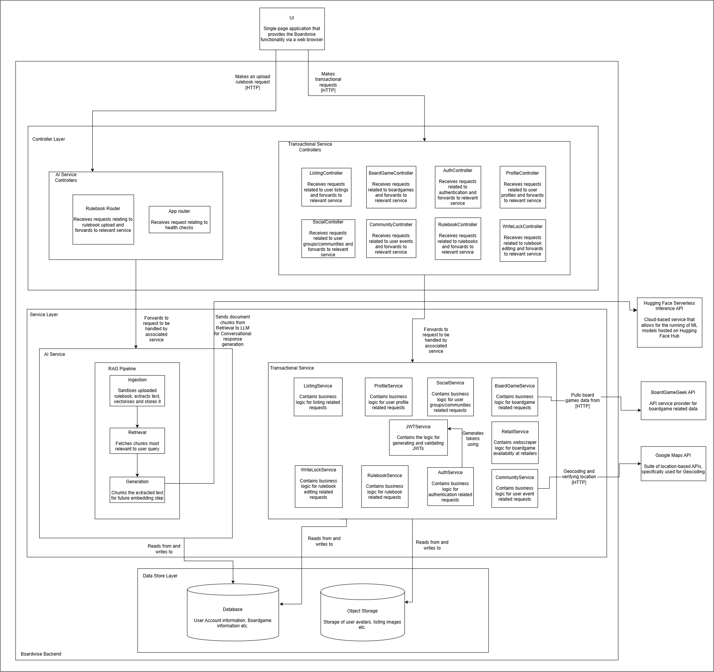
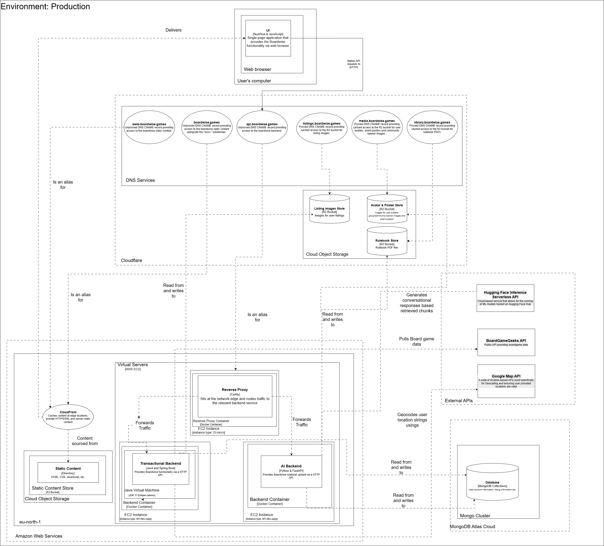

# Software Architecture Specifications (SAS)
## Boardwise - Capstone Project 2026
**Item:** Capstone Project 2026 – Demo 2  
**Team Name:** Works On My Machine 
**Team Members:**

| Name     | Surname   | Student Number | % Contribution |
| -------- | --------- | -------------- | -------------- |
| Hayley   | Booysen   | u24868346      | --             |
| Bandile\*| Mnyandu\* | u24675394\*    | --             |
| Karabo   | Nkomo     | u24865169      | --             |
| Palesa   | Nkosi     | u22664638      | --             |
| Njabulo  | Mathonsi  | u24676412      | --             |
*\* - indicates team leader*

---

## 1. Overall Software Architecture

### 1.1 Introduction

This Software Architecture Specification (SAS) describes the architectural design of Boardwise, a digital platform for the South African board gaming community that combines a peer-to-peer marketplace, a community events hub, and a collaboratively maintained shared library of rulebooks (The Vault). Where the Software Requirements Specification (SRS) defines *what* the system must do - its functional and non-functional requirements - this document defines *how* the system is structured to satisfy those requirements.

The purpose of this SAS is to translate the architectural requirements captured in the SRS into a concrete, technology-neutral architectural design, and subsequently into justified technology choices. It documents the overall system structure, the communication patterns between subsystems, the architectural patterns applied within each subsystem, the quality attributes the architecture must satisfy, the constraints imposed on the system, and the API and deployment contracts that realise the design. Each architectural decision recorded here is traceable back to a specific functional or non-functional requirement identified in the SRS, ensuring that the resulting system is both requirement-driven and scientifically justified rather than based on developer preference.

### 1.2 System-Wide Architectural Style & Granularity
#### 1.2.1 First Level of Granularity: High-Level System Structure

Boardwise follows a **Client-Server architecture**. The client is a Vue.js single-page application running in the user's browser. The server side consists of multiple backend services hosted on free-tier cloud infrastructure. All communication between the client and the server is initiated by the client, with the server responding to requests - there is no peer-to-peer communication between clients.

#### 1.2.2 Second Level of Granularity: Inter-Subsystem Communication Patterns

The primary communication pattern across the system is the **Request-Response model**, implemented over HTTP/HTTPS using **REST** as the application-level messaging protocol. The client sends HTTP requests directly to the appropriate backend service.

The client applies **direct-to-microservice routing**: transactional requests (user, marketplace, Vault metadata, and collaborative editing) are forwarded to Spring Boot, while AI and ingestion tasks (PDF upload processing) are forwarded directly to the FastAPI AI Gateway/Service. This bypasses Spring Boot for compute-heavy AI workloads, eliminating a bottleneck.

The Shared Library (The Vault) introduces an additional communication pattern: **WebSocket-based push messaging** between the Spring Boot backend and connected Vue.js clients. This is used specifically for real-time collaborative editing - when a user acquires or releases the MRSW write lock, or when a text delta is committed, the Spring Boot service broadcasts the state change to all active readers via WebSocket, ensuring consistency without requiring clients to poll.

#### 1.2.3 Third Level of Granularity: Subsystem Architectural Patterns

**Service-Oriented Architecture (SOA)** is the overarching pattern for the system as a whole. The three backend services - User Service, Marketplace Service, and Shared Library (The Vault) - are logically separated, each owning its domain and exposing well-defined REST APIs. They communicate through function/method calls as these services are logically separated by exist in the same code base.

**Layered (N-Tier) Architecture** is applied within each backend service. Each service is structured into a presentation layer (REST controllers & FastAPI Routers), a business logic/Service layer (service beans), and a data access/store layer (repositories communicating with MongoDB and HTTP request to Cloudflare R2 buckets).

**Pipe and Filter** is applied within The Vault's AI ingestion pipeline. A PDF upload passes sequentially through discrete processing stages - Sanitise → Extract → Chunk - each stage transforming the data before passing it to the next; the final chunking stage splits extracted text into the discrete units later used as the atomic unit of collaborative editing. This pattern is realised by the FastAPI AI Gateway.

**Domain-Driven Design (DDD)** informs the logical separation of the system into bounded contexts. Each of the three services represents a bounded context with its own domain model and ubiquitous language, with cross-context interactions mediated through API calls rather than shared data models.

**Command Query Responsibility Segregation (CQRS)** governs the boundary between HTTP and WebSocket traffic within The Vault. HTTP is used exclusively for fetching absolute state (queries) and requesting mutations (commands); the WebSocket channel is a strictly one-way, server-to-client event bus for delta notifications and is never used by the client to issue a command or request a sync. A client that reconnects and has missed broadcast events does not request a replay over the socket - it re-hydrates by issuing a fresh `GET /api/vault/rulebooks/{id}/text` query, which returns the full materialised chunk state and current version counter.

**Event Sourcing** underpins The Vault's collaborative-editing history. Every committed mutation (insert, update, delete) is captured as an immutable `EditEvent` in an append-only ledger rather than only being reflected as an in-place document update; undo/redo operations are implemented by looking up and applying the *inverse* of a prior event rather than maintaining a separate state-snapshot stack, and each compensating action is itself written back to the ledger as a new event tagged with the version it compensates for.

### 1.3 High-Level Architectural Diagram



The diagram depicts Boardwise as a Client-Server, layered system. The **Client Layer** is the Vue.js single-page application running in the user's browser; it is the sole initiator of all communication and holds no server-side responsibilities. Below it, the **Controller Layer** shows two physical entities: **Transactional Service Controllers** (REST controllers within the Spring Boot User, Marketplace, and Vault-transactional services) and **AI Service Controllers** (FastAPI routers within the Vault's AI Gateway). The client routes requests directly to whichever controller owns the relevant domain - transactional CRUD and collaborative-editing traffic goes to the Spring Boot controllers, while PDF ingestion traffic goes directly to the FastAPI controllers, bypassing Spring Boot entirely for compute-heavy AI workloads.

Beneath the Controller Layer sits the **Service (Business Logic) Layer**, which enforces domain rules such as ownership validation on marketplace listings and MRSW lock arbitration in the Vault. The **Data Access Layer** below it is responsible for persistence, communicating with MongoDB Atlas for structured/document data (users, listings, rulebook metadata, edit events) and with Cloudflare R2 over HTTP for large binary object storage (listing images and raw PDF rulebooks). A cross-cutting **WebSocket Layer**, realised by Spring Boot, sits alongside the REST controllers within the Vault subsystem and pushes lock and delta state changes to all connected clients without requiring the client to poll.

### 1.4 System-Wide Architectural Responsibilities

Several cross-cutting concerns are handled centrally rather than being re-implemented in each subsystem:

**Identity & Token Authority.** The User Service is the single authentication authority for the entire platform. It is the only component permitted to issue JSON Web Tokens (JWTs), which it does on successful registration or login. The Marketplace Service and the Vault's Spring Boot backend do not re-implement authentication - they independently *validate* JWTs against a secret shared at deployment time, avoiding a cross-service call on every request while still enforcing a single source of truth for identity.

**Security Filter Chain.** Each Spring Boot service exposes its REST controllers behind a `SecurityFilterChain` composed of, in order: an IP-based rate-limit filter (applied to authentication routes only, to mitigate brute-force attacks), a JWT validation filter (applied to all non-public endpoints), and a general rate-limit filter. This acts as a central, cross-cutting Security Filter for every transactional request in the system. The FastAPI AI Gateway performs the equivalent JWT verification independently at its own ingress point using the shared secret.

**Unified Error Handling.** Each backend service implements a global exception handler (`@ControllerAdvice` in Spring Boot; a FastAPI exception handler in the AI Gateway) that intercepts unhandled exceptions and normalises them into a consistent error response shape (status code, message, and optional field-level validation errors), so that the client can rely on one error contract regardless of which service produced the failure.

**Transaction Boundary Management.** Multi-document writes that must not be left in a partially-applied state - most notably Marketplace listing mutations (NFR3.1) - are wrapped in MongoDB multi-document transactions at the service layer, giving each affected service its own local transaction boundary rather than relying on a distributed transaction coordinator across services.

**Event/Audit Ledger.** The Vault subsystem maintains a cross-cutting, append-only `EDIT_EVENT` ledger that records every committed rulebook edit as an immutable event, providing system-wide auditability for collaborative changes independent of the current document state.

**External API Integration.** Two third-party APIs are consumed server-side rather than by the client directly, keeping API keys off the browser and giving the backend a single point of control over rate limiting and response shaping: the **BoardGameGeek API** is pulled from to populate and enrich the platform's board game catalogue (consumed by the service owning `BoardGameService`), and the **Google Maps API** is used specifically for geocoding - validating and normalising the free-text location strings supplied when a Community event is created or updated (reflected in the Event API's `404 Not Found` response, returned when a supplied location cannot be resolved by Google Maps).

### 1.5 Global Architecture Constraints

*   **Constraint 1 [Technical - Target Hardware]**: The application architecture must remain lightweight enough that both client-side rendering (Vue.js) and server-side processing do not demand high-end hardware, targeting mid-range mobile and desktop devices. This constrains frontend bundle size, the complexity of client-side rendering, and the payload sizes returned by backend APIs - all list endpoints must be paginated and large binary assets (images, PDFs) must be served from object storage rather than inline in API payloads.
*   **Constraint 2 [Organizational - Free/Low-Cost-Tier Infrastructure]**: All backend services must be hosted within tightly bounded resource limits. MongoDB Atlas is capped at 512 MB of storage across the shared cluster; Cloudflare R2 is capped at 10 GB storage and 10 million Class A operations per month; compute hosting (AWS EC2, per the confirmed deployment topology in 4.5) provides a limited CPU/RAM allocation per instance. This constrains the number of independently deployable processes the team can run concurrently - which is why the User, Marketplace, and Vault-transactional modules are packaged into a single Transactional Backend container rather than three separate ones - and requires explicit connection-pool and JVM heap tuning to avoid exhausting each instance's resource limits (e.g. MongoDB Atlas M0's 500 concurrent connection cap).
*   **Constraint 3 [Business/Legal - Open Source Licensing]**: The entire codebase must be released and maintained under an Open Source licence. This constrains the selection of third-party libraries and frameworks to those with compatible licences (e.g. MIT, Apache 2.0); proprietary SDKs or paid managed services (e.g. Auth0, Keycloak-as-a-service) may not be used.
*   **Constraint 4 [Organizational - Client-Mandated Architecture]**: The project owner has mandated Component-Based Architecture and Domain-Driven Design as required architectural styles for the system, with Pipe & Filter and Service-Oriented Architecture specified as recommended styles. These are non-negotiable client requirements and are reflected throughout the design decisions in this document.

### 1.6 Mapping Quality Requirements to Architectural Decisions

| Quality Requirement | Target Metrics (from SRS) | Architectural Decision & Mechanism |
| :--- | :--- | :--- |
| **Performance (Response Time)** | REST endpoints respond within 500ms under normal load (NFR1.2); Vault deltas reflected to all readers within 1s (NFR1.1). | WebSocket push (rather than polling) for Vault delta/lock broadcasts; mandatory pagination (default 20, max 50) on all list endpoints; Lighthouse performance target of ≥ 70 on mid-range mobile. |
| **Scalability (Concurrency)** | Support ≥ 50 concurrent user sessions without response-time degradation in Sprint 1 (NFR/CON2). | The Transactional Backend and AI Backend are each stateless at the application layer and independently containerised on their own dedicated EC2 instance (4.5), so either can be horizontally scaled (additional EC2 instances declared in Pulumi and added to the reverse proxy's routing rules) without architectural change; the User/Marketplace/Vault-transactional modules remain logically decoupled internally (DDD bounded contexts, 1.2.3) even though they currently share one deployable, preserving the option to split them into separate containers later without a redesign. MongoDB Atlas free-tier storage is actively monitored to stay within the 512MB cap. |
| **Security (Data Protection)** | Zero plain-text password storage; JWT-based session management; mitigation of OWASP Top 10 (NFR3.3). | BCrypt password hashing at rest; JWTs signed with a ≥256-bit secret expiring within 24 hours; per-service `SecurityFilterChain` (User Service, Marketplace Service) and shared-secret JWT verification (Vault AI Gateway); IP-based rate limiting on authentication routes. |
| **Reliability (Data Consistency)** | ACID-compliant listing mutations (NFR3.1); MRSW-safe concurrent rulebook editing (NFR3.2). | MongoDB multi-document transactions on the Atlas M0 replica set for Marketplace writes; Spring Boot lock manager enforcing an exclusive MRSW write lock with a 5-minute TTL (renewed on every successful commit, so an idle-but-active editor is never pre-emptively evicted) to prevent deadlocks, with WebSocket-broadcast lock state changes. |
| **Usability (Accessibility & Responsiveness)** | Fully responsive UI across mobile/tablet/desktop; WCAG 2.1 Level AA compliance (NFR2.1, NFR2.2). | Mobile-first responsive CSS layout in the Vue.js frontend; ARIA labelling, sufficient colour contrast, and full keyboard navigation support. |
| **Maintainability (Testability)** | ≥ 80% automated unit test coverage per service; SonarQube maintainability rating of A/B. | Layered (Controller → Service → Repository) structuring within each Spring Boot service; cyclomatic complexity capped at 10 per function; interface-driven dependency injection to keep class coupling low; CI/CD pipeline blocking merges on test failure. |

---

## 2. Granular Subsystem Architecture

### 2.1 Architectural Component A: User Service (Including Community)

#### 2.1.1 Overview & Subsystem Boundaries

The User Service is the identity and social backbone of Boardwise. It owns authentication (registration, login, logout), profile management, game inventory, preferences, social features (friends and groups), and community features (events and RSVPs). All other subsystems depend on it for user context: the Marketplace Service and The Vault do not issue tokens themselves, but independently validate JWTs issued by this service against a shared secret. Its logical boundary is defined by the `User` bounded context - no other service holds or mutates user identity data directly; cross-context reads (e.g. a listing's owner display name) are resolved via the JWT claims or read-only API calls rather than shared tables.

#### 2.1.2 Subsystem Quality Requirements

- **Security**: as the sole issuer of JWTs for the platform, this subsystem carries the highest security burden - it must resist credential stuffing and brute-force attacks (NFR3.3).
- **Reliability**: user data mutations (profile, friends, groups) must be atomic to avoid partially-applied social-graph changes.
- **Maintainability**: as the most frequently extended subsystem (new social/community features are the most likely area of future growth), it must maintain low class coupling and a clear layered structure.

#### 2.1.3 Architectural Responsibilities

- Authentication and authorisation - JWT issuance on registration/login, and invalidation on logout.
- Enforcing a multi-layered Security Filter Chain: IP-based rate limiting on auth routes, JWT validation on protected routes, and general rate limiting.
- Profile, game inventory, and preference CRUD operations.
- Social graph management - friend requests, friend lists, and group membership.
- Community feature management - event creation, visibility control, RSVP tracking, invitations, and event image upload.
- Server-side geocoding of user-supplied event location strings via the Google Maps API, rejecting an event create/update with `404 Not Found` if the location cannot be resolved (AC-EVT-02, AC-EVT-03).
- Storing user avatars and event/community banner images in a dedicated Cloudflare R2 bucket, served publicly via the `media.boardwise.games` proxied subdomain.
- Persisting all of the above as MongoDB documents scoped to the `User` bounded context.

The `AuthController`, `ProfileController`, `SocialController`, and `CommunityController` blocks (Transactional Service Controllers) and their corresponding `AuthService`, `JWTService`, `ProfileService`, `SocialService`, and `CommunityService` blocks (Transactional Service) in the diagram above realise the User Service's architectural responsibilities described in this section.

#### 2.1.4 Frameworks & Technologies Evaluation

| Evaluation Criteria | Option 1: Spring Boot (Java/Kotlin) | Option 2: Quarkus | Option 3: Micronaut |
| :--- | :--- | :--- | :--- |
| **License & Cost** | Open Source (Apache 2.0), Free | Open Source (Apache 2.0), Free | Open Source (Apache 2.0), Free |
| **Security Ecosystem** | Mature Spring Security module with built-in filter chains, OAuth2 support | Smaller Quarkus Security extension, less mature JWT tooling | Micronaut Security available but smaller community/ecosystem |
| **Ease of Integration** | Extensive documentation, large community, first-class MongoDB support via Spring Data | Faster startup/lower memory but steeper learning curve for the team | Compile-time DI reduces memory but limited MongoDB driver maturity |
| **Free-Tier Fit (CON2)** | Higher memory footprint at startup (~256–512MB), requires JVM heap tuning | Lower memory footprint, better suited to constrained free-tier RAM | Low memory footprint, but ecosystem gaps increase development risk |
| **Verdict** | **Highly Suitable** (Chosen) | Suitable, but ecosystem/tooling risk outweighs memory benefit for this team | Suitable, but immature MongoDB tooling is a risk for CON1/CON2 |

Authentication is further evaluated against integrating a managed OAuth 2.0 identity provider versus building credential management from scratch on top of Spring Security:

| Evaluation Criteria | Option 1: Spring Security + JWT (self-managed) | Option 2: Auth0 | Option 3: Keycloak |
| :--- | :--- | :--- | :--- |
| **License & Cost** | Open Source (Apache 2.0), Free | Proprietary, free tier with usage caps | Open Source (Apache 2.0), but requires a hosted instance |
| **CON1/CON2 Fit** | Fully compliant - no proprietary dependency, no extra hosted process | Violates CON1 (proprietary SaaS dependency) | Compliant licence, but adds a fourth hosted process against CON2's limited free-tier RAM budget |
| **Control** | Full control over authorisation logic and token claims | Limited - vendor-controlled token format | Full control, but at the cost of an additional deployment |
| **Verdict** | **Highly Suitable** (Chosen) | Unsuitable (violates CON1) | Unsuitable (violates CON2 resource constraint) |

#### 2.1.5 Architectural Realization Mapping

| Architectural Responsibility (2.1.3) | Realised By |
| :--- | :--- |
| JWT issuance/validation | `AuthController` → `AuthService` (Spring Security, BCrypt, JJWT) |
| Security Filter Chain (rate limiting, JWT validation) | Spring `SecurityFilterChain` bean composed of `IpRateLimitFilter`, `JwtAuthFilter`, `RateLimitFilter` |
| Profile/inventory/preference CRUD | `ProfileController`, `InventoryController`, `PreferenceController` → respective Service beans |
| Social graph management | `SocialController` → `FriendService`, `GroupService` |
| Community/event management (create, update, cancel, RSVP, invite/respond) | `CommunityController` → `CommunityService` |
| Event location geocoding & validation | `CommunityService` → Google Maps API (geocoding endpoint), invoked synchronously on event create/update |
| Avatar & event/community image storage | `CommunityService`/`ProfileService` → R2 S3-compatible SDK, writing to the shared avatar/poster bucket surfaced at `media.boardwise.games` |
| Persistence | Spring Data MongoDB repositories per aggregate root (`UserRepository`, `GroupRepository`, `EventRepository`) |

#### 2.1.6 Technology Choice & Scientific Justification

Spring Boot (Java/Kotlin) with Spring Security and Spring Data MongoDB was selected for the User Service. This is justified objectively as follows: (1) Spring Security provides a production-grade, declarative filter-chain mechanism that directly satisfies the layered rate-limiting and JWT-validation responsibilities identified in 2.1.3, without requiring custom middleware to be built and independently security-audited; (2) Spring Data MongoDB's repository abstraction measurably reduces boilerplate compared to a driver-level integration (Morphia, Jongo), lowering the surface area for data-access defects; (3) both Auth0 and Keycloak were ruled out on constraint grounds - Auth0 is a proprietary SaaS dependency that violates CON1, and Keycloak, while open-source, requires an additional always-on hosted process that competes for the same constrained free-tier memory budget under CON2. Quarkus and Micronaut were considered for their lower memory footprint, which is relevant under CON2, but were ruled out because their JWT/security tooling is comparatively less mature, and the User Service is the platform's single highest-consequence subsystem for a security defect.

---

### 2.2 Architectural Component B: Marketplace Service

#### 2.2.1 Overview & Subsystem Boundaries

The Marketplace Service owns all peer-to-peer listing activity (rental and sale) and external retail-link aggregation. Its boundary is the `Listing` bounded context. Unauthenticated (Guest) users may browse and view listings without a JWT; write operations (create, update, delete) require a valid JWT, which this service validates independently using the shared secret issued by the User Service - it never calls the User Service directly to authenticate a request, keeping the two services decoupled.

#### 2.2.2 Subsystem Quality Requirements

- **Reliability**: all listing mutations must be ACID-compliant (NFR3.1) - a listing must never be left in a partially-created or partially-updated state.
- **Performance**: browse endpoints must remain fast under CON3's mid-range-device constraint, primarily through pagination.
- **Security**: ownership of a listing must be verified server-side on every mutating request, independent of any client-supplied identifier.

#### 2.2.3 Architectural Responsibilities

- Listing CRUD operations (create, read, update, delete/deactivate).
- Server-side ownership enforcement on listing mutation endpoints.
- Pagination (default page size 20, maximum 50) and filtering on listing browse endpoints.
- Listing image upload and association with Cloudflare R2 object storage.
- External retail purchase-link aggregation and serving.

The `ListingController` (Transactional Service Controllers) and `ListingService` (Transactional Service) blocks in the diagram above realise the Marketplace Service's architectural responsibilities described in this section, backed by the shared `Database` and `Object Storage` nodes in the Data Store Layer.

#### 2.2.4 Frameworks & Technologies Evaluation

| Evaluation Criteria | Option 1: Spring Boot (Java/Kotlin) | Option 2: Express.js | Option 3: FastAPI |
| :--- | :--- | :--- | :--- |
| **License & Cost** | Open Source (Apache 2.0), Free | Open Source (MIT), Free | Open Source (MIT), Free |
| **Transaction Support** | Native multi-document transaction support via Spring Data MongoDB + `@Transactional` | Requires manual session/transaction handling with the native MongoDB driver | Requires manual session/transaction handling via Motor/PyMongo |
| **Consistency with Platform** | Shares patterns, security filter chain, and data-access layer with the User Service | Introduces a second language/runtime (Node.js) alongside Java and Python | Duplicates the AI Gateway's language without sharing transactional patterns with Spring Boot |
| **Verdict** | **Highly Suitable** (Chosen) | Suitable, but increases operational/language diversity without added benefit | Unsuitable for this subsystem - better suited to async AI workloads, not transactional CRUD |

| Evaluation Criteria | Option 1: Cloudflare R2 | Option 2: AWS S3 | Option 3: Cloudinary |
| :--- | :--- | :--- | :--- |
| **License & Cost** | S3-compatible API, zero egress fees, 10GB/10M-ops free tier | Free tier available (5GB), but egress fees apply beyond a small allowance | Free tier available, but imposes transformation quotas and branding requirements |
| **Fit for Public Marketplace Browsing** | No egress cost regardless of read volume - well suited to frequently-viewed listing images | Egress costs scale with read traffic, difficult to bound on a public browse feature | Quota-limited, not designed for high-volume public image serving |
| **Verdict** | **Highly Suitable** (Chosen) | Unsuitable - unpredictable egress billing under CON2 | Unsuitable - quota and branding constraints |

#### 2.2.5 Architectural Realization Mapping

| Architectural Responsibility (2.2.3) | Realised By |
| :--- | :--- |
| Listing CRUD | `ListingController` → `ListingService` → `ListingRepository` (Spring Data MongoDB) |
| ACID-compliant mutations | `@Transactional` service methods against the MongoDB Atlas M0 replica set |
| Ownership enforcement | `ListingService` cross-checks the listing's `username` field against the JWT subject claim on every update/delete |
| Pagination & filtering | Spring Data `Pageable` query parameters exposed on all browse endpoints |
| Image storage | `ListingImageService` uploads via the R2 S3-compatible SDK to the dedicated listing-images bucket, surfaced publicly at `listings.boardwise.games`, storing the resulting URL on the `Listing` document |

#### 2.2.6 Technology Choice & Scientific Justification

Spring Boot was chosen for the Marketplace Service primarily because Spring Data MongoDB's `@Transactional` support directly and natively satisfies NFR3.1's ACID-compliance requirement against a MongoDB Atlas M0 replica set, whereas Express.js and FastAPI would require the team to hand-roll session/transaction management against the native driver, increasing the risk of an inconsistent implementation. A secondary, objective factor is consistency of data-access pattern with the User Service, which reduces the number of distinct persistence idioms the team must maintain and test under the 80% coverage requirement (12.2.8). Cloudflare R2 was chosen over AWS S3 and Cloudinary specifically because its zero-egress-cost, S3-compatible model removes an unpredictable billing variable for a publicly-browsed feature where images are fetched at high, unbounded frequency - a risk that directly conflicts with the free-tier constraint (CON2).

---

### 2.3 Architectural Component C: Shared Library - The Vault

#### 2.3.1 Overview & Subsystem Boundaries

The Vault provides the collaborative rulebook library and PDF ingestion pipeline. Its boundary spans two physically separate backend components that together form a single logical bounded context: a Spring Boot transactional backend (rulebook metadata, MRSW lock management, collaborative-edit commits, WebSocket broadcast) and a FastAPI AI Gateway (PDF sanitisation and text extraction on ingestion). Both validate JWTs independently against the same shared secret, so the client can route transactional requests to Spring Boot and ingestion requests directly to FastAPI without either service depending on the other for authentication.

#### 2.3.2 Subsystem Quality Requirements

- **Reliability**: concurrent edits must never corrupt rulebook text - enforced via MRSW versioning (NFR3.2).
- **Performance**: committed edits must reach all active readers within 1 second (NFR1.1); ingestion must not block the client on long-running processing.
- **Security**: uploaded PDFs must be sanitised before any downstream processing to prevent malicious content injection.
- **Scalability**: the collaborative editor must scale under concurrent reader load without added per-request overhead, which rules out a polling-based design.

#### 2.3.3 Architectural Responsibilities

- PDF upload proxying and secure storage to Cloudflare R2.
- AI ingestion pipeline (Sanitise → Extract → Chunk), realised as a Pipe & Filter pipeline within the FastAPI AI Gateway; the chunking stage produces the discrete, individually-addressable text units that the transactional side later locks, edits, inserts, and deletes.
- MRSW (Multi-Reader Single-Writer) lock management for collaborative editing, with a 5-minute lock TTL that is renewed on every successful commit and otherwise expires automatically, releasing the lock if an editor disconnects or goes idle.
- Edit delta commit, version incrementing, and WebSocket broadcast to all active readers.
- Maintaining an immutable, Event-Sourced `EDIT_EVENT` ledger of every committed edit for auditability and edit history, including compensating entries for undo/redo.
- Serving state re-hydration queries (`GET /text`) as the sole recovery path for clients that have missed WebSocket broadcasts, per the CQRS boundary (1.2.3).

The `RulebookController` and `WriteLockController` blocks (Transactional Service Controllers) with their `RulebookService` and `WriteLockService` counterparts realise the Vault's transactional responsibilities, while the `Rulebook Router` block (AI Service Controllers) with the `Ingestion Pipeline` (`Sanitiser` → `extractor` → `chunker`) realise the ingestion pipeline responsibilities.

#### 2.3.4 Frameworks & Technologies Evaluation

| Evaluation Criteria | Option 1: FastAPI (Python) | Option 2: Flask | Option 3: Django REST |
| :--- | :--- | :--- | :--- |
| **License & Cost** | Open Source (MIT), Free | Open Source (BSD), Free | Open Source (BSD), Free |
| **Async Support** | Native `async`/`await` support, essential for non-blocking PDF processing | Limited native async support; requires extensions | Async support added later, heavier framework overhead |
| **Free-Tier Fit (CON2)** | Lightweight process footprint | Lightweight process footprint | Heavier default footprint (ORM, admin, etc. largely unused here) |
| **Verdict** | **Highly Suitable** (Chosen) | Suitable but weaker async fit for the ingestion pipeline | Unsuitable - overhead not justified for a narrow ingestion API |

| Evaluation Criteria | Option 1: WebSocket (Spring Boot) | Option 2: Server-Sent Events (SSE) | Option 3: Long Polling |
| :--- | :--- | :--- | :--- |
| **License & Cost** | Open Source (Spring built-in), Free | Open Source (browser-native), Free | Free, no additional dependency |
| **Communication Direction** | Bidirectional - required for lock-acquisition acknowledgement plus delta broadcast | Server → client only | Bidirectional, but simulated via repeated requests |
| **Performance (NFR1.1)** | Push-based, sub-second delivery without polling overhead | Push-based, but no client → server channel for lock requests | Adds per-poll request overhead and latency, degrading under CON3 |
| **Verdict** | **Highly Suitable** (Chosen) | Suitable as a documented fallback if WebSocket proves unreliable on free-tier hosting | Unsuitable - polling overhead conflicts with performance targets |

#### 2.3.5 Architectural Realization Mapping

| Architectural Responsibility (2.3.3) | Realised By |
| :--- | :--- |
| PDF upload & R2 storage | FastAPI `UploadController` → R2 S3-compatible SDK |
| Sanitise → Extract → Chunk pipeline | Sequential FastAPI filter stages: `Sanitiser` → `extractor` → `chunker`, the last of which produces the chunk records later referenced by `chunkId` throughout the transactional editing endpoints |
| MRSW lock management | Spring Boot `WriteLockController` → `WriteLockService.acquireWriteLock`, backed by a MongoDB lock field per rulebook document with a 5-minute TTL, renewed on every commit and cleared on release/disconnect/expiry |
| Delta commit, versioning, broadcast | Spring Boot `WriteLockController.commitDelta` → `WriteLockService.commitEditDelta` → STOMP broadcast (after transaction commit) to `/topic/vault/rulebooks/{id}/delta` |
| Reconnection state re-hydration | `RulebookController.getRulebookText` → `GET /api/vault/rulebooks/{id}/text`, returning the full materialised chunk array, version, and lock state - used by clients that reconnect after missing WebSocket events, since the socket carries no client-initiated sync request (CQRS boundary, 1.2.3) |
| Undo / redo | `WriteLockController.undoEdit` / `redoEdit` → `WriteLockService.undoAction` / `redoAction`, applying the inverse of the target `EditEvent` and writing a compensating ledger entry |
| Immutable edit ledger | MongoDB `EDIT_EVENT` collection, append-only, written on every successful commit, insert, delete, undo, or redo |

#### 2.3.6 Technology Choice & Scientific Justification

FastAPI was chosen for the AI Gateway because its native `async`/`await` support directly satisfies the requirement that PDF ingestion (which can involve multi-second processing) not block the request thread - the API returns `202 Accepted` immediately and processes the pipeline asynchronously, a pattern that is comparatively harder to implement in Flask (limited native async) and unnecessarily heavyweight in Django REST given the narrow, non-CRUD-heavy scope of the ingestion API. WebSocket was chosen over Server-Sent Events for the collaborative editor specifically because lock acquisition requires a client → server acknowledgement channel in addition to server → client broadcast, which SSE cannot provide unidirectionally; long polling was ruled out because its per-request overhead directly conflicts with the sub-1-second delta delivery target (NFR1.1) under the mid-range-device constraint (CON3). Given the known free-tier hibernation risk to persistent WebSocket connections (CON2), SSE and long-polling remain documented fallback options rather than the primary design. The strict CQRS separation (1.2.3) - HTTP for commands/queries, WebSocket as a one-way broadcast bus with no client-initiated sync - was a deliberate choice to bound the WebSocket layer's responsibility: it removes the need to make delivery guarantees over the socket at all, since a client that has missed events simply re-queries `GET /text` for the authoritative state instead of requiring the server to buffer or replay a message backlog.

---

## 3. API Contracts

This section reproduces the full API contract set for all four service groupings, sourced directly from the project's contract documents rather than the earlier representative-only excerpt: **User Service** contracts from SRS Section 10.1, **Marketplace Service** contracts from SRS Section 10.2, **The Vault** contracts from the standalone Vault API Contracts document (which supersedes the older, less detailed version embedded in SRS Section 10.3 - see the note at the start of 3.3), and **Community & Events** contracts from the standalone Event API Service Contract document, which is not yet merged into the SRS at all (SRS Section 10 currently has no Community/Events subsection, despite Section 9.1's Community user stories and use cases).

**Known gap:** the Social domain's friend-request endpoints (US-SOC-01–04: send/accept/reject a friend request, view/unfriend) have corresponding user stories and use cases in SRS Section 9.1 but no published API contract - only the Groups endpoints (AC-SOC-01–07) are contracted below. This should be flagged to the team so the missing contracts can be written before that functionality is implemented against.

### 3.1 User Service API Contracts

#### 3.1.1 Authentication

##### AC-AUTH-01: Register an Account

|Field|Detail|
|---|---|
|**Contract ID**|AC-AUTH-01|
|**Endpoint**|`POST /api/auth/register`|
|**Description**|Registers a new user account. Returns a JWT access token upon successful registration.|
|**Authentication**|None required|

**Request Body:**

```json
{
  "username": "string (min 3 chars)",
  "emailAddress": "string (valid email format)",
  "password": "string (min 8 chars, must contain uppercase, number, and symbol)",
  "firstName": "string",
  "lastName": "string"
}
```

**Success Response - 201 Created:**

```json
{
  "message": "string",
  "accessToken": "string (JWT)"
}
```

**Error Responses:**

|Status Code|Reason|
|---|---|
|`400 Bad Request`|Missing or invalid required fields|
|`500 Internal Server Error`|Unexpected server error|

---

##### AC-AUTH-02: Log Into an Account

|Field|Detail|
|---|---|
|**Contract ID**|AC-AUTH-02|
|**Endpoint**|`POST /api/auth/login`|
|**Description**|Authenticates a registered user using their username and password. Returns a JWT access token upon success.|
|**Authentication**|None required|

**Request Body:**

```json
{
  "username": "string (min 3 chars)",
  "password": "string (min 8 chars, must contain uppercase, number, and symbol)"
}
```

**Success Response - 200 OK:**

```json
{
  "message": "string",
  "accessToken": "string (JWT)"
}
```

**Error Responses:**

|Status Code|Reason|
|---|---|
|`400 Bad Request`|Missing or invalid required fields|
|`500 Internal Server Error`|Unexpected server error|

---

##### AC-AUTH-03: Log Out of an Account

|Field|Detail|
|---|---|
|**Contract ID**|AC-AUTH-03|
|**Endpoint**|`DELETE /api/auth/logout`|
|**Description**|Invalidates the authenticated user's active JWT, terminating their session.|
|**Authentication**|Bearer token required|

**Request Body:** None

**Success Response - 200 OK:**

```json
{
  "message": "string"
}
```

**Error Responses:**

|Status Code|Reason|
|---|---|
|`401 Unauthorized`|Missing or invalid JWT|
|`500 Internal Server Error`|Unexpected server error|

---

#### 3.1.2 Profile & Preferences

##### AC-PROF-01: Get Another User's Profile

|Field|Detail|
|---|---|
|**Contract ID**|AC-PROF-01|
|**Endpoint**|`GET /api/users/{username}`|
|**Description**|Retrieves the public profile of a user by username, including their game inventory, preferences, and social counts.|
|**Authentication**|Bearer token required|

**Path Parameters:**

|Parameter|Type|Description|
|---|---|---|
|`username`|`string`|The username of the profile to retrieve|

**Request Body:** None

**Success Response - 200 OK:**

```json
{
  "fullName": "string",
  "username": "string",
  "profilePicture": "string | null",
  "friendCount": "number",
  "groupCount": "number",
  "ownedGameCount": "number",
  "games": [
    {
      "title": "string",
      "description": "string",
      "image": "string | null",
      "genre": ["string"],
      "mechanics": ["string"]
    }
  ],
  "preferences": {
    "visibility": "string",
    "genres": ["string"]
  },
  "createdAt": "ISO8601 date string"
}
```

**Error Responses:**

|Status Code|Reason|
|---|---|
|`401 Unauthorized`|Missing or invalid JWT|
|`404 Not Found`|User with the given username does not exist|
|`500 Internal Server Error`|Unexpected server error|

---

##### AC-PROF-02: Get Own Profile

|Field|Detail|
|---|---|
|**Contract ID**|AC-PROF-02|
|**Endpoint**|`GET /api/users/`|
|**Description**|Retrieves the authenticated user's own profile, including their game inventory, preferences, and social counts. Identity is derived from the Bearer token.|
|**Authentication**|Bearer token required|

**Request Body:** None

**Success Response - 200 OK:**

```json
{
  "fullName": "string",
  "username": "string",
  "profilePicture": "string | null",
  "friendCount": "number",
  "groupCount": "number",
  "ownedGameCount": "number",
  "games": [
    {
      "title": "string",
      "description": "string",
      "image": "string | null",
      "genre": ["string"],
      "mechanics": ["string"]
    }
  ],
  "preferences": {
    "visibility": "string",
    "genres": ["string"]
  },
  "createdAt": "ISO8601 date string"
}
```

**Error Responses:**

|Status Code|Reason|
|---|---|
|`401 Unauthorized`|Missing or invalid JWT|
|`404 Not Found`|User associated with token does not exist|
|`500 Internal Server Error`|Unexpected server error|

---

##### AC-PROF-03: Delete Own Account

|Field|Detail|
|---|---|
|**Contract ID**|AC-PROF-03|
|**Endpoint**|`DELETE /api/users/`|
|**Description**|Permanently deletes the authenticated user's account and all associated data. Identity is derived from the Bearer token.|
|**Authentication**|Bearer token required|

**Request Body:** None

**Success Response - 200 OK:**

```json
{
  "message": "Account deleted successfully."
}
```

**Error Responses:**

|Status Code|Reason|
|---|---|
|`401 Unauthorized`|Missing or invalid JWT|
|`500 Internal Server Error`|Failed to delete account|

---

##### AC-PROF-04: Update Own Profile

|Field|Detail|
|---|---|
|**Contract ID**|AC-PROF-04|
|**Endpoint**|`PATCH /api/users/`|
|**Description**|Updates the authenticated user's profile fields. Only fields included in the request body are modified. Identity is derived from the Bearer token.|
|**Authentication**|Bearer token required|

**Request Body:**

```json
{
  "username": "string | null (min 3 chars)",
  "emailAddress": "string | null (valid email format)",
  "password": "string | null (min 8 chars, must contain uppercase, number, and symbol)",
  "preferences": {
    "visibility": "string | null",
    "genres": ["string"] 
  }
}
```

**Success Response - 200 OK:**

```json
{
  "username": "string (if updated)",
  "email": "string (if updated)",
  "password": "string (if updated)"
}
```

**Error Responses:**

|Status Code|Reason|
|---|---|
|`401 Unauthorized`|Missing or invalid JWT|
|`500 Internal Server Error`|Unexpected server error during profile update|

---

##### AC-PROF-05: Update Profile Picture

|Field|Detail|
|---|---|
|**Contract ID**|AC-PROF-05|
|**Endpoint**|`POST /api/users/profilePicture`|
|**Description**|Uploads a new profile picture for the authenticated user. Accepts a multipart file upload. Identity is derived from the Bearer token.|
|**Authentication**|Bearer token required|
|**Content-Type**|`multipart/form-data`|

**Request Parts:**

|Part|Type|Required|Description|
|---|---|---|---|
|`profilePicture`|`file`|Yes|The image file to set as the user's profile picture|

**Success Response - 200 OK:**

```json
{
  "message": "string",
  "profilePictureUrl": "string"
}
```

**Error Responses:**

|Status Code|Reason|
|---|---|
|`401 Unauthorized`|Missing or invalid JWT|
|`500 Internal Server Error`|IO error or unexpected failure during upload|

---

##### AC-PREF-01: Set or Update Preferences

|Field|Detail|
|---|---|
|**Contract ID**|AC-PREF-01|
|**Endpoint**|`PUT /api/users/preferences`|
|**Description**|Sets or updates the authenticated user's board game genre preferences and visibility setting. Identity is derived from the Bearer token.|
|**Authentication**|Bearer token required|

**Request Body:**

```json
{
  "visibility": "string (Public | Private)",
  "genres": ["string"]
}
```

**Success Response - 200 OK:**

```json
{
  "message": "Preferences updated successfully.",
  "preferences": {
    "visibility": "string",
    "genres": ["string"]
  }
}
```

**Error Responses:**

|Status Code|Reason|
|---|---|
|`401 Unauthorized`|Missing or invalid JWT|
|`500 Internal Server Error`|Unexpected server error during preferences update|

---

#### 3.1.3 Social - Groups

##### AC-SOC-01: Create a Group

|Field|Detail|
|---|---|
|**Contract ID**|AC-SOC-01|
|**Endpoint**|`POST /api/social/groups`|
|**Description**|Creates a new group. The authenticated user is automatically assigned as the group owner and first member.|
|**Authentication**|Bearer token required|

**Request Body:**

```json
{
  "name": "string (min 3 chars, required)",
  "description": "string | null",
  "visibility": "string (default: Public)"
}
```

**Success Response - 201 Created:**

```json
{
  "message": "string",
  "group": {
    "groupId": "string",
    "name": "string",
    "description": "string | null",
    "owner": "string (username)",
    "visibility": "string",
    "memberCount": "number"
  }
}
```

**Error Responses:**

|Status Code|Reason|
|---|---|
|`401 Unauthorized`|Missing or invalid JWT|
|`500 Internal Server Error`|Unexpected server error during group creation|

---

##### AC-SOC-02: Get All Groups

|Field|Detail|
|---|---|
|**Contract ID**|AC-SOC-02|
|**Endpoint**|`GET /api/social/groups`|
|**Description**|Retrieves all groups visible to the authenticated user. Private groups are only returned if the user is a member.|
|**Authentication**|Bearer token required|

**Request Body:** None

**Success Response - 200 OK:**

```json
{
  "groups": [
    {
      "groupId": "string",
      "name": "string",
      "description": "string | null",
      "owner": "string (username)",
      "visibility": "string",
      "memberCount": "number"
    }
  ]
}
```

**Error Responses:**

|Status Code|Reason|
|---|---|
|`401 Unauthorized`|Missing or invalid JWT|
|`500 Internal Server Error`|Unexpected server error|

---

##### AC-SOC-03: Get Group by ID

|Field|Detail|
|---|---|
|**Contract ID**|AC-SOC-03|
|**Endpoint**|`GET /api/social/groups/{groupId}`|
|**Description**|Retrieves the full details and member list of a group by its ID. The response includes whether the authenticated user is a member.|
|**Authentication**|Bearer token required|

**Path Parameters:**

|Parameter|Type|Description|
|---|---|---|
|`groupId`|`string`|The ID of the group to retrieve|

**Request Body:** None

**Success Response - 200 OK:**

```json
{
  "groupId": "string",
  "name": "string",
  "description": "string | null",
  "owner": "string (username)",
  "memberCount": "number",
  "members": ["object"],
  "isMember": "boolean"
}
```

**Error Responses:**

|Status Code|Reason|
|---|---|
|`401 Unauthorized`|Missing or invalid JWT|
|`404 Not Found`|Group with the given ID does not exist|
|`500 Internal Server Error`|Unexpected server error|

---

##### AC-SOC-04: Join a Group

|Field|Detail|
|---|---|
|**Contract ID**|AC-SOC-04|
|**Endpoint**|`POST /api/social/groups/{groupId}`|
|**Description**|Adds the authenticated user as a member of the specified group.|
|**Authentication**|Bearer token required|

**Path Parameters:**

|Parameter|Type|Description|
|---|---|---|
|`groupId`|`string`|The ID of the group to join|

**Request Body:** None

**Success Response - 200 OK:**

```json
{
  "message": "string",
  "data": {}
}
```

**Error Responses:**

|Status Code|Reason|
|---|---|
|`401 Unauthorized`|Missing or invalid JWT|
|`404 Not Found`|Group with the given ID does not exist|
|`409 Conflict`|User is already a member of this group|
|`500 Internal Server Error`|Unexpected server error|

---

##### AC-SOC-05: Leave a Group

|Field|Detail|
|---|---|
|**Contract ID**|AC-SOC-05|
|**Endpoint**|`DELETE /api/social/groups/{groupId}`|
|**Description**|Removes the authenticated user from the specified group.|
|**Authentication**|Bearer token required|

**Path Parameters:**

|Parameter|Type|Description|
|---|---|---|
|`groupId`|`string`|The ID of the group to leave|

**Request Body:** None

**Success Response - 200 OK:**

```json
{
  "message": "string",
  "data": {}
}
```

**Error Responses:**

|Status Code|Reason|
|---|---|
|`401 Unauthorized`|Missing or invalid JWT|
|`404 Not Found`|Group with the given ID does not exist|
|`409 Conflict`|User is not a member of this group|
|`500 Internal Server Error`|Unexpected server error|

---

##### AC-SOC-06: Update a Group

|Field|Detail|
|---|---|
|**Contract ID**|AC-SOC-06|
|**Endpoint**|`PATCH /api/social/groups/{groupId}`|
|**Description**|Updates the name or description of an existing group. Only the group owner may perform this action.|
|**Authentication**|Bearer token required|

**Path Parameters:**

|Parameter|Type|Description|
|---|---|---|
|`groupId`|`string`|The ID of the group to update|

**Request Body:**

```json
{
  "name": "string | null (min 3 chars)",
  "description": "string | null"
}
```

**Success Response - 200 OK:**

```json
{
  "message": "string",
  "data": {}
}
```

**Error Responses:**

|Status Code|Reason|
|---|---|
|`401 Unauthorized`|Missing or invalid JWT|
|`404 Not Found`|Group with the given ID does not exist|
|`500 Internal Server Error`|Unexpected server error|

---

##### AC-SOC-07: Search Groups by Name

|Field|Detail|
|---|---|
|**Contract ID**|AC-SOC-07|
|**Endpoint**|`GET /api/social/groups/search/{groupName}`|
|**Description**|Retrieves group information by searching for a group matching the given name.|
|**Authentication**|None required|

**Path Parameters:**

|Parameter|Type|Description|
|---|---|---|
|`groupName`|`string`|The name of the group to search for|

**Request Body:** None

**Success Response - 200 OK:**

```json
{
  "groupId": "string",
  "name": "string",
  "description": "string | null",
  "owner": "string (username)",
  "visibility": "string",
  "memberCount": "number"
}
```

**Error Responses:**

|Status Code|Reason|
|---|---|
|`500 Internal Server Error`|Unexpected server error|

---

## 3.3.6 Social - Friends
 
### AC-FRND-01: Get Own Friends List
 
|Field|Detail|
|---|---|
|**Contract ID**|AC-FRND-01|
|**Endpoint**|`GET /api/users/friends`|
|**Description**|Retrieves the authenticated user's accepted friends. Identity is derived from the Bearer token.|
|**Authentication**|Bearer token required|
 
**Request Body:** None
 
**Success Response - 200 OK:**
 
```json
{
  "message": "User friends list successfully retrieved",
  "friends": [
    {
      "id": "string",
      "username": "string",
      "fullName": "string",
      "profilePicture": "string | null"
    }
  ],
  "mutuals": null
}
```
 
`mutuals` is always null on this endpoint.
 
**Error Responses:**
 
|Status Code|Reason|
|---|---|
|`401 Unauthorized`|Missing, malformed, or invalid JWT|
|`500 Internal Server Error`|Unexpected server error|
 
---
 
### AC-FRND-02: Get Another User's Friends List
 
|Field|Detail|
|---|---|
|**Contract ID**|AC-FRND-02|
|**Endpoint**|`GET /api/users/{userId}/friends`|
|**Description**|Retrieves the accepted friends of the specified user, along with the subset that are also friends of the authenticated user.|
|**Authentication**|Bearer token required|
 
**Path Parameters:**
 
|Parameter|Type|Description|
|---|---|---|
|`userId`|`string`|The ID of the user whose friends list is requested|
 
**Request Body:** None
 
**Success Response - 200 OK:**
 
```json
{
  "message": "User friends list successfully retrieved",
  "friends": [
    {
      "id": "string",
      "username": "string",
      "fullName": "string",
      "profilePicture": "string | null"
    }
  ],
  "mutuals": [
    {
      "id": "string",
      "username": "string",
      "fullName": "string",
      "profilePicture": "string | null"
    }
  ]
}
```
 
**Error Responses:**
 
|Status Code|Reason|
|---|---|
|`401 Unauthorized`|Missing, malformed, or invalid JWT|
|`404 Not Found`|userId does not exist|
|`500 Internal Server Error`|Unexpected server error|
 
---
 
### AC-FRND-03: Unfriend a User
 
|Field|Detail|
|---|---|
|**Contract ID**|AC-FRND-03|
|**Endpoint**|`DELETE /api/users/friends/{userId}`|
|**Description**|Ends an accepted friendship between the authenticated user and the specified user. This is a soft removal: the friendship record's status is set to declined rather than deleted.|
|**Authentication**|Bearer token required|
 
**Path Parameters:**
 
|Parameter|Type|Description|
|---|---|---|
|`userId`|`string`|The ID of the user to unfriend|
 
**Request Body:** None
 
**Success Response - 200 OK:**
 
```json
{
  "message": "Unfriend user query successful."
}
```
 
**Error Responses:**
 
|Status Code|Reason|
|---|---|
|`401 Unauthorized`|Missing, malformed, or invalid JWT|
|`404 Not Found`|userId does not exist|
|`400 Bad Request`|No accepted friendship exists between the authenticated user and userId|
|`500 Internal Server Error`|Unexpected server error|
 
---
 
### AC-FRND-04: Get Incoming Friend Requests
 
|Field|Detail|
|---|---|
|**Contract ID**|AC-FRND-04|
|**Endpoint**|`GET /api/users/friendRequests`|
|**Description**|Retrieves pending friend requests sent to the authenticated user.|
|**Authentication**|Bearer token required|
 
**Request Body:** None
 
**Success Response - 200 OK:**
 
```json
{
  "message": "User friend request successfully retrieved",
  "requests": [
    {
      "id": "string",
      "sender": {
        "id": "string",
        "username": "string",
        "fullName": "string",
        "profilePicture": "string | null"
      }
    }
  ]
}
```
 
**Error Responses:**
 
|Status Code|Reason|
|---|---|
|`401 Unauthorized`|Missing, malformed, or invalid JWT|
|`500 Internal Server Error`|Unexpected server error|
 
---
 
### AC-FRND-05: Send a Friend Request
 
|Field|Detail|
|---|---|
|**Contract ID**|AC-FRND-05|
|**Endpoint**|`POST /api/users/{userId}/friendRequests`|
|**Description**|Sends a friend request from the authenticated user to the specified user. Sends a notification to the receiver on success.|
|**Authentication**|Bearer token required|
 
**Path Parameters:**
 
|Parameter|Type|Description|
|---|---|---|
|`userId`|`string`|The ID of the user to send the request to|
 
**Request Body:** None
 
**Success Response - 200 OK:**
 
```json
{
  "message": "Friend request successfully sent."
}
```
 
**Error Responses:**
 
|Status Code|Reason|
|---|---|
|`401 Unauthorized`|Missing, malformed, or invalid JWT|
|`404 Not Found`|userId does not exist|
|`400 Bad Request`|Sending a request to self, users are already friends, or a pending request already exists between the two users in either direction|
|`500 Internal Server Error`|Unexpected server error|
 
---
 
### AC-FRND-06: Respond to a Friend Request
 
|Field|Detail|
|---|---|
|**Contract ID**|AC-FRND-06|
|**Endpoint**|`PATCH /api/users/friendRequests/{requestId}?status`|
|**Description**|Accepts or declines a pending friend request sent to the authenticated user. Sends a confirmation notification to the original sender on accept.|
|**Authentication**|Bearer token required|
 
**Path Parameters:**
 
|Parameter|Type|Description|
|---|---|---|
|`requestId`|`string`|The ID of the friend request to respond to|
 
**Query Parameters:**
 
|Parameter|Type|Description|
|---|---|---|
|`status`|`string`|Case-insensitive, must be `accept` or `decline`|
 
**Request Body:** None
 
**Success Response - 200 OK:**
 
```json
{
  "message": "Friend request response successfully recorded."
}
```
 
**Error Responses:**
 
|Status Code|Reason|
|---|---|
|`401 Unauthorized`|Missing, malformed, or invalid JWT|
|`404 Not Found`|requestId does not exist|
|`400 Bad Request`|Authenticated user is not the receiver of this request, the request already has a response, or status is not `accept` or `decline`|
|`500 Internal Server Error`|Unexpected server error|
 
---
 
## 3.3.7 Notifications
 
### AC-NOTIF-01: Get Missed Notifications
 
|Field|Detail|
|---|---|
|**Contract ID**|AC-NOTIF-01|
|**Endpoint**|`GET /api/users/notifications`|
|**Description**|Retrieves notifications generated for the authenticated user since they were last online. Calling this endpoint marks the returned notifications as delivered, so it is not idempotent for repeat reads.|
|**Authentication**|Bearer token required|
 
**Request Body:** None
 
**Success Response - 200 OK:**
 
```json
{
  "message": "Missed user notifications retrieved",
  "notifications": [
    { "type": "DIRECT_MESSAGE", "senderId": "string", "message": "string" },
    { "type": "COMMUNITY_MESSAGE", "senderId": "string", "message": "string" },
    { "type": "INVITE", "host": "string", "event": "object" },
    { "type": "FRIEND_REQUEST", "request": { "id": "string", "sender": "FriendDTO" } },
    { "type": "FRIEND_CONFIRMATION", "friend": "FriendDTO" }
  ]
}
```
 
Note: the exact field names for each notification subtype are not confirmed against the DTO source and should be verified before typing this response in the frontend.
 
**Error Responses:**
 
|Status Code|Reason|
|---|---|
|`401 Unauthorized`|Missing, malformed, or invalid JWT|
|`500 Internal Server Error`|Unexpected server error|
 
---

### 3.2 Marketplace Service API Contracts

#### AC-MKT-01: Get All Active Listings

|Field|Detail|
|---|---|
|**Contract ID**|AC-MKT-01|
|**Endpoint**|`GET /api/marketplace/listings`|
|**Description**|Returns a list of all active community listings.|
|**Authentication**|None required|

**Request Body:** None

**Success Response - 200 OK:**

```json
[
  {
    "listingId": "string",
    "username": "string",
    "gameTitle": "string",
    "itemType": "string",
    "listingType": "string",
    "price": "number",
    "description": "string",
    "imageUrl": "string | null",
    "genres": ["string"],
    "rentalPeriod": "object | null",
    "createdAt": "ISO8601 date string",
    "updatedAt": "ISO8601 date string",
    "status": "string"
  }
]
```

**Error Responses:**

|Status Code|Reason|
|---|---|
|`204 No Content`|No active listings exist|
|`500 Internal Server Error`|Unexpected server error|

---

#### AC-MKT-02: Get Listing by ID

|Field|Detail|
|---|---|
|**Contract ID**|AC-MKT-02|
|**Endpoint**|`GET /api/marketplace/listings/{listingId}`|
|**Description**|Returns the full details of a single active listing by its unique ID.|
|**Authentication**|None required|

**Path Parameters:**

|Parameter|Type|Description|
|---|---|---|
|`listingId`|`string`|The unique identifier of the listing|

**Request Body:** None

**Success Response - 200 OK:**

```json
{
  "listingId": "string",
  "username": "string",
  "gameTitle": "string",
  "itemType": "string",
  "listingType": "string",
  "price": "number",
  "description": "string",
  "imageUrl": "string | null",
  "genres": ["string"],
  "rentalPeriod": "object | null",
  "createdAt": "ISO8601 date string",
  "updatedAt": "ISO8601 date string",
  "status": "string"
}
```

**Error Responses:**

|Status Code|Reason|
|---|---|
|`500 Internal Server Error`|Unexpected server error|

---

#### AC-MKT-03: Create a Listing

|Field|Detail|
|---|---|
|**Contract ID**|AC-MKT-03|
|**Endpoint**|`POST /api/marketplace/listings`|
|**Description**|Creates a new rental or sale listing associated with the authenticated user's account.|
|**Authentication**|Bearer token required|
|**Content-Type**|`multipart/form-data`|

**Request Parts:**

|Part|Type|Required|Description|
|---|---|---|---|
|`data`|`JSON`|Yes|Listing details (see body below)|
|`image`|`file`|Yes|Image file for the listing|

**Request Body (`data` part):**

```json
{
  "itemType": "string (required)",
  "listingType": "string (required)",
  "price": "number (positive, required)",
  "gameTitle": "string (required)",
  "description": "string (required)",
  "genres": ["string (required, at least one)"],
  "rentalPeriod": ["string | null"]
}
```

**Success Response - 201 Created:**

```json
{
  "listingId": "string",
  "username": "string",
  "gameTitle": "string",
  "itemType": "string",
  "listingType": "string",
  "price": "number",
  "description": "string",
  "imageUrl": "string",
  "genres": ["string"],
  "rentalPeriod": "object | null",
  "createdAt": "ISO8601 date string",
  "updatedAt": "ISO8601 date string",
  "status": "ACTIVE"
}
```

**Error Responses:**

|Status Code|Reason|
|---|---|
|`401 Unauthorized`|Missing or invalid JWT|
|`422 Unprocessable Entity`|Missing or invalid required fields|
|`500 Internal Server Error`|Unexpected server error|

---

#### AC-MKT-04: Update a Listing

|Field|Detail|
|---|---|
|**Contract ID**|AC-MKT-04|
|**Endpoint**|`PATCH /api/marketplace/listings/{listingId}`|
|**Description**|Partially updates an existing listing. Only the fields included in the request body are modified. Only the listing owner may perform this action.|
|**Authentication**|Bearer token required|

**Path Parameters:**

|Parameter|Type|Description|
|---|---|---|
|`listingId`|`string`|The unique identifier of the listing to update|

**Request Body:**

```json
{
  "gameTitle": "string | null",
  "listingType": "string | null",
  "price": "number | null",
  "description": "string | null",
  "status": "string | null (ACTIVE | INACTIVE | DELETED)",
  "imageUrl": "string | null",
  "genres": ["string | null"],
  "rentalPeriod": ["ISO8601 date string | null"]
}
```

**Success Response - 200 OK:**

```json
{
  "listingId": "string",
  "username": "string",
  "gameTitle": "string",
  "itemType": "string",
  "listingType": "string",
  "price": "number",
  "description": "string",
  "imageUrl": "string | null",
  "genres": ["string"],
  "rentalPeriod": "object | null",
  "createdAt": "ISO8601 date string",
  "updatedAt": "ISO8601 date string",
  "status": "string"
}
```

**Error Responses:**

|Status Code|Reason|
|---|---|
|`401 Unauthorized`|Missing or invalid JWT|
|`403 Forbidden`|Authenticated user does not own this listing|
|`404 Not Found`|No listing exists with the provided ID|
|`500 Internal Server Error`|Unexpected server error|

---

#### AC-MKT-05: Delete a Listing

|Field|Detail|
|---|---|
|**Contract ID**|AC-MKT-05|
|**Endpoint**|`DELETE /api/marketplace/listings/{listingId}`|
|**Description**|Permanently removes a listing. Only the listing owner may perform this action.|
|**Authentication**|Bearer token required|

**Path Parameters:**

|Parameter|Type|Description|
|---|---|---|
|`listingId`|`string`|The unique identifier of the listing to delete|

**Request Body:** None

**Success Response - 204 No Content:** No response body returned.

**Error Responses:**

|Status Code|Reason|
|---|---|
|`401 Unauthorized`|Missing or invalid JWT|
|`403 Forbidden`|Authenticated user does not own this listing|
|`404 Not Found`|No listing exists with the provided ID|
|`500 Internal Server Error`|Unexpected server error|

---

#### AC-MKT-06: Get User's Own Listings

|Field|Detail|
|---|---|
|**Contract ID**|AC-MKT-06|
|**Endpoint**|`GET /api/marketplace/listings/user/{user}`|
|**Description**|Returns all listings belonging to the specified user.|
|**Authentication**|None required|

**Path Parameters:**

|Parameter|Type|Description|
|---|---|---|
|`user`|`string`|The username whose listings to retrieve|

**Request Body:** None

**Success Response - 200 OK:**

```json
[
  {
    "listingId": "string",
    "username": "string",
    "gameTitle": "string",
    "itemType": "string",
    "listingType": "string",
    "price": "number",
    "description": "string",
    "imageUrl": "string | null",
    "genres": ["string"],
    "rentalPeriod": "object | null",
    "createdAt": "ISO8601 date string",
    "updatedAt": "ISO8601 date string",
    "status": "string"
  }
]
```

**Error Responses:**

|Status Code|Reason|
|---|---|
|`204 No Content`|No listings found for this user|
|`500 Internal Server Error`|Unexpected server error|

---

#### AC-MKT-07: Get Filtered Listings

|Field|Detail|
|---|---|
|**Contract ID**|AC-MKT-07|
|**Endpoint**|`GET /api/marketplace/listings/search`|
|**Description**|Returns listings filtered by listing type, item type, price range, and genres. All query parameters are optional.|
|**Authentication**|None required|

**Query Parameters:**

|Parameter|Type|Required|Description|
|---|---|---|---|
|`listingType`|`string`|No|Filter by `RENT` or `SALE`|
|`itemType`|`string`|No|Filter by `BOARD_GAME`, `MERCHANDISE`, or `EXPANSION`|
|`minPrice`|`number`|No|Minimum price filter|
|`maxPrice`|`number`|No|Maximum price filter|
|`genres`|`string[]`|No|Filter by one or more genre values|

**Request Body:** None

**Success Response - 200 OK:**

```json
[
  {
    "listingId": "string",
    "username": "string",
    "gameTitle": "string",
    "itemType": "string",
    "listingType": "string",
    "price": "number",
    "description": "string",
    "imageUrl": "string | null",
    "genres": ["string"],
    "rentalPeriod": "object | null",
    "createdAt": "ISO8601 date string",
    "updatedAt": "ISO8601 date string",
    "status": "string"
  }
]
```

**Error Responses:**

|Status Code|Reason|
|---|---|
|`204 No Content`|No listings match the applied filters|
|`500 Internal Server Error`|Unexpected server error|

### 3.3 The Vault API Contracts

> **Supersedes SRS 10.3:** the version of these contracts embedded in SRS Section 10.3 is an earlier draft (9 endpoints, no chunk insert/delete, undo/redo, or release-all, and an unused client-initiated "sync" WebSocket message). The standalone Vault API Contracts document below is the current, authoritative version - it explicitly establishes the CQRS boundary (1.2.3) and removes the client-initiated sync message entirely in favour of `GET /text` re-hydration. This SAS follows the standalone document throughout.

All Vault endpoints require JWT authentication unless noted otherwise. JWTs are issued by Spring Boot and independently verified by FastAPI using a shared secret.

The system enforces a strict Command Query Responsibility Segregation (CQRS) boundary between HTTP and WebSockets. HTTP is used for fetching absolute state and requesting mutations; WebSockets serve strictly as a one-way event bus for deltas. There is no client-initiated STOMP "sync" request - a client that has missed events (e.g. after a reconnect) re-hydrates by calling `GET /api/vault/rulebooks/{id}/text`.

Every mutation on `{id}/chunk/*`, `{id}/lock/*`, and `{id}/action/*` shares a common request shape, `VaultBaseRequestDto` (`expectedVersion`, `content`), which each concrete request DTO extends. `content` is inherited by every endpoint even where it isn't semantically meaningful (e.g. undo/redo, lock acquire, delete); each endpoint's Request Body section documents which fields it actually reads.

---

#### AC-VLT-01: Upload a PDF Rulebook

| Field | Detail |
|---|---|
| **Contract ID** | AC-VLT-01 |
| **Endpoint** | `POST /api/vault/rulebooks` |
| **Routes To** | FastAPI |
| **Description** | Uploads a PDF rulebook. The BFF streams the multipart payload directly to FastAPI, which sanitises and extracts the content before writing metadata to MongoDB Atlas and the raw file to Cloudflare R2. Processing runs in the background; the endpoint returns 202 immediately. |
| **Authentication** | Bearer JWT - verified by FastAPI via shared secret |
| **Content-Type** | `multipart/form-data` |

**Request Body (multipart/form-data):**

| Field | Required | Description |
|---|---|---|
| `file` | Yes | PDF only, max 50 MB |
| `game_name` | Yes | String, max 120 chars |
| `edition` | No | e.g. `"3rd Edition"` |
| `game_id` | Yes | MongoDB ObjectId string of the associated game catalogue entry |

**Success Response - 202 Accepted:**
```json
{
  "rulebook_id": "string",
  "game_name":   "string",
  "edition":     "string | null",
  "game_id":     "string",
  "status":      "Processing",
  "message":     "Rulebook upload accepted. Processing in background."
}
```

**Error Responses:**

| Status Code | Reason |
|---|---|
| `401 Unauthorized` | JWT is missing, expired, or signature verification failed; or `userId` claim absent from token |
| `413 Payload Too Large` | File exceeds the 50 MB size limit |
| `415 Unsupported Media Type` | Uploaded file is not a valid PDF (`content_type != "application/pdf"`) |
| `422 Unprocessable Entity` | Sanitisation stage detected unsafe embedded content |
| `500 Internal Server Error` | Unexpected server error |

---

#### AC-VLT-02: List / Search Rulebooks

| Field | Detail |
|---|---|
| **Contract ID** | AC-VLT-02 |
| **Endpoint** | `GET /api/vault/rulebooks` |
| **Routes To** | Spring Boot (`RulebookController.listRulebooks` → `RulebookService.searchRulebooks`) |
| **Description** | Returns a paginated Spring `Page` response of rulebooks whose status is `Ready`, ordered by most recently updated. The `Ready` filter is hardcoded server-side. Supports optional partial, case-insensitive title search via `search`, plus filtering by genre, language, player count, duration, and minimum age. |
| **Authentication** | Bearer JWT |

**Query Parameters:**

| Parameter | Required | Default | Description |
|---|---|---|---|
| `search` | No | `""` | Partial, case-insensitive match against rulebook `title` |
| `genre` | No | - | Filters to rulebooks whose `genres` list contains this value |
| `languages` | No | - | Repeatable; filters to rulebooks matching any of the given languages |
| `playerCount` | No | - | Filters to rulebooks whose `minPlayers`–`maxPlayers` range includes this value |
| `duration` | No | - | Filters by rulebook `duration` |
| `minAge` | No | - | Filters to rulebooks with `minAge` at or below this value |
| `page` | No | `1` | Page number (1-indexed) |
| `limit` | No | `20` | Page size (capped server-side at 100) |

**Success Response - 200 OK:**
```json
{
  "content": [
    {
      "id":         "string",
      "coverUrl":   "string",
      "title":      "string",
      "language":   "string",
      "edition":    "string | null",
      "version":    12,
      "genres":     ["string"],
      "minPlayers": 2,
      "maxPlayers": 6,
      "duration":   45,
      "minAge":     10
    }
  ],
  "totalElements": 48,
  "totalPages":    3,
  "number":        0,
  "size":          20
}
```

**Error Responses:**

| Status Code | Reason |
|---|---|
| `401 Unauthorized` | JWT is missing or invalid |
| `404 Not Found` | A rulebook's linked `gameId` does not resolve to an existing Boardgame catalogue entry (`BoardgameNotFoundException`) |
| `500 Internal Server Error` | MongoDB query failed |

---

#### AC-VLT-03: Get Rulebook Detail

| Field | Detail |
|---|---|
| **Contract ID** | AC-VLT-03 |
| **Endpoint** | `GET /api/vault/rulebooks/{id}` |
| **Routes To** | Spring Boot (`RulebookController.getRulebook` → `RulebookService.getRulebookById`) |
| **Description** | Returns full metadata for a single rulebook, including its current processing status and active lock state. Not restricted to `Ready`-status rulebooks. |
| **Authentication** | Bearer JWT |

**Path Parameters:**

| Parameter | Type | Required | Description |
|---|---|---|---|
| `id` | `string` | Yes | The ObjectId hex string of the rulebook |

**Success Response - 200 OK:**
```json
{
  "id":                  "string",
  "coverUrl":            "string",
  "title":               "string",
  "edition":             "string | null",
  "genres":              ["string"],
  "version":             12,
  "status":              "Processing | Ready | PendingReview",
  "contributorUsername": "string",
  "description":         "string",
  "language":            "string",
  "lockHeldBy":          "string | null",
  "lockExpiresAt":       "ISO 8601 | null",
  "uploadedAt":          "ISO 8601",
  "updatedAt":           "ISO 8601",
  "minPlayers":          2,
  "maxPlayers":          6,
  "minAge":              10,
  "duration":            45
}
```

**Error Responses:**

| Status Code | Reason |
|---|---|
| `400 Bad Request` | `id` is not a valid ObjectId format |
| `401 Unauthorized` | JWT is missing or invalid |
| `404 Not Found` | No rulebook exists with the provided `id`, or the rulebook's `lockHeldBy`/`gameId` reference does not resolve to an existing user/game |
| `500 Internal Server Error` | Unexpected server error |

---

#### AC-VLT-04: Download Raw PDF

| Field | Detail |
|---|---|
| **Contract ID** | AC-VLT-04 |
| **Endpoint** | `GET /api/vault/rulebooks/{id}/download` |
| **Routes To** | Spring Boot (`RulebookController.downloadRulebook` → `RulebookService.getDownloadUrl`) |
| **Description** | Generates a short-lived pre-signed URL (5 minute validity) to the raw PDF stored in Cloudflare R2. |
| **Authentication** | Bearer JWT |

**Path Parameters:**

| Parameter | Type | Required | Description |
|---|---|---|---|
| `id` | `string` | Yes | The ObjectId hex string of the rulebook |

**Success Response - 200 OK:**
```json
{
  "downloadUrl": "string",
  "expiresAt":   "ISO 8601"
}
```

**Error Responses:**

| Status Code | Reason |
|---|---|
| `400 Bad Request` | `id` is not a valid ObjectId format |
| `401 Unauthorized` | JWT is missing or invalid |
| `404 Not Found` | Rulebook not found, or no PDF has been stored yet (`r2PdfKey` is `null`) |
| `502 Bad Gateway` | R2 pre-sign request failed (`R2PresignException`) |

---

#### AC-VLT-05: Get Rulebook Text State

| Field | Detail |
|---|---|
| **Contract ID** | AC-VLT-05 |
| **Endpoint** | `GET /api/vault/rulebooks/{id}/text` |
| **Routes To** | Spring Boot (`RulebookController.getRulebookText` → `RulebookService.getRulebookText`) |
| **Description** | Returns the current collaborative text state as a materialized array of chunks, plus the version counter and active lock status. Used for initial UI hydration and for bridging the "missed delta" gap on WebSocket reconnection. |
| **Authentication** | Bearer JWT |

**Path Parameters:**

| Parameter | Type | Required | Description |
|---|---|---|---|
| `id` | `string` | Yes | The ObjectId hex string of the rulebook |

**Success Response - 200 OK:**
```json
{
  "rulebookId": "string",
  "chunks": [
    {
      "chunkId": "string",
      "content": "string",
      "index":   0
    }
  ],
  "version":    12,
  "lockHeldBy": "string | null",
  "updatedAt":  "ISO 8601"
}
```

**Error Responses:**

| Status Code | Reason |
|---|---|
| `400 Bad Request` | `id` is not a valid ObjectId format |
| `401 Unauthorized` | JWT is missing or invalid |
| `404 Not Found` | Rulebook not found, or no `RulebookText` document exists for it, or `lockHeldBy` does not resolve to an existing user |
| `500 Internal Server Error` | Unexpected server error |

---

#### AC-VLT-06: Acquire Write Lock (MRSW)

| Field | Detail |
|---|---|
| **Contract ID** | AC-VLT-06 |
| **Endpoint** | `POST /api/vault/rulebooks/{id}/lock/acquire` |
| **Routes To** | Spring Boot (`WriteLockController.getWriteLock` → `WriteLockService.acquireWriteLock`) |
| **Description** | Atomically requests the exclusive write lock on a rulebook. Succeeds only if no other user currently holds the lock. Lock TTL is 5 minutes. On success, publishes `LockAcquiredEventDto`, broadcast to `/topic/vault/rulebooks/{id}/lock/acquired`. |
| **Authentication** | Bearer JWT |

**Path Parameters:**

| Parameter | Type | Required | Description |
|---|---|---|---|
| `id` | `string` | Yes | The ObjectId hex string of the rulebook |

**Success Response - 200 OK:**
```json
{
  "lockGranted":    true,
  "lockedBy":       "string",
  "expiresAt":      "ISO 8601",
  "currentVersion": 12
}
```

**Error Responses:**

| Status Code | Reason |
|---|---|
| `400 Bad Request` | `id` is not a valid ObjectId format, or the authenticated user's ID is not a valid ObjectId |
| `401 Unauthorized` | JWT is missing or invalid |
| `404 Not Found` | Rulebook not found (`RulebookNotFoundException`), or the authenticated user does not exist |
| `409 Conflict` | Write lock is already held by another user (`LockConflictException`) |

---

#### AC-VLT-07: Commit Edit Delta (Update Chunk)

| Field | Detail |
|---|---|
| **Contract ID** | AC-VLT-07 |
| **Endpoint** | `PATCH /api/vault/rulebooks/{id}/chunk/update` |
| **Routes To** | Spring Boot (`WriteLockController.commitDelta` → `WriteLockService.commitEditDelta`) |
| **Description** | Commits a text delta to a single chunk. Spring Boot atomically validates the caller holds the write lock **and** checks `expectedVersion` in one operation, extending the lock TTL by 5 minutes on success. It updates the target chunk, pushes the edit onto the rulebook's undo stack (clearing its redo stack), appends an `EDIT_EVENT` ledger entry, and broadcasts the delta to `/topic/vault/rulebooks/{id}/delta`. |
| **Authentication** | Bearer JWT - caller must be the current lock holder |

**Path Parameters:**

| Parameter | Type | Required | Description |
|---|---|---|---|
| `id` | `string` | Yes | The ObjectId hex string of the rulebook |

**Request Body:**
```json
{
  "expectedVersion": 12,
  "content":         "string",
  "chunkId":         "string"
}
```

**Success Response - 200 OK:**
```json
{
  "committed":   true,
  "newVersion":  13,
  "committedAt": "ISO 8601"
}
```

**Error Responses:**

| Status Code | Reason |
|---|---|
| `400 Bad Request` | `id` is not a valid ObjectId format, or `chunkId` in the request body is not a valid ObjectId format |
| `401 Unauthorized` | JWT is missing or invalid |
| `403 Forbidden` | Caller does not hold the current write lock (`LockNotHeldException`) |
| `404 Not Found` | Rulebook not found, or the target chunk does not exist (`ChunkNotFoundException`) |
| `409 Conflict` | `expectedVersion` mismatch (`VersionMismatchException`), or the atomic lock/version check failed for another reason (`ConcurrentModificationAnomalyException`) |
| `500 Internal Server Error` | MongoDB write or WebSocket broadcast failed |

---

#### AC-VLT-08: Release Write Lock

| Field | Detail |
|---|---|
| **Contract ID** | AC-VLT-08 |
| **Endpoint** | `POST /api/vault/rulebooks/{id}/lock/release` |
| **Routes To** | Spring Boot (`WriteLockController.releaseLock` → `WriteLockService.releaseWriteLock`) |
| **Description** | Voluntarily releases the write lock held by the caller. Atomically clears the lock and publishes `LockReleasedEventDto` (reason `"voluntary"`) to `/topic/vault/rulebooks/{id}/lock/released`. Returns `200 OK` with no response body. |
| **Authentication** | Bearer JWT - caller must be the current lock holder |

**Path Parameters:**

| Parameter | Type | Required | Description |
|---|---|---|---|
| `id` | `string` | Yes | The ObjectId hex string of the rulebook |

**Success Response - 200 OK:** No response body.

**Error Responses:**

| Status Code | Reason |
|---|---|
| `400 Bad Request` | `id` is not a valid ObjectId format |
| `401 Unauthorized` | JWT is missing or invalid |
| `403 Forbidden` | Caller does not hold the write lock (`LockNotHeldException`) |
| `404 Not Found` | Rulebook not found, or the authenticated user does not exist |
| `409 Conflict` | Atomic release failed for a reason other than not holding the lock (`ConcurrentModificationAnomalyException`) |

---

#### AC-VLT-09: Get Rulebook Edit History

| Field | Detail |
|---|---|
| **Contract ID** | AC-VLT-09 |
| **Endpoint** | `GET /api/vault/rulebooks/{id}/history` |
| **Routes To** | Spring Boot (`RulebookController.getEditHistory` → `RulebookService.getEditHistory`) |
| **Description** | Returns the full chronological edit event ledger for a rulebook, ordered oldest → newest. Each entry represents an immutable committed action on a specific chunk, the editor (by username), and the resulting version number. |
| **Authentication** | Bearer JWT |

**Path Parameters:**

| Parameter | Type | Required | Description |
|---|---|---|---|
| `id` | `string` | Yes | The ObjectId hex string of the rulebook |

**Success Response - 200 OK:**
```json
{
  "rulebookId": "string",
  "totalEdits": 2,
  "edits": [
    {
      "id":              "string",
      "rulebookId":      "string",
      "editor":          "string",
      "chunkId":         "string",
      "editType":        "INSERT | UPDATE | DELETE",
      "previousContent": "string | null",
      "newContent":      "string | null",
      "versionPostEdit": 2,
      "committedAt":     "ISO 8601"
    }
  ]
}
```

**Error Responses:**

| Status Code | Reason |
|---|---|
| `400 Bad Request` | `id` is not a valid ObjectId format |
| `401 Unauthorized` | JWT is missing or invalid |
| `404 Not Found` | No rulebook exists with the provided `id`, or an edit event's `editorId` does not resolve to an existing user |
| `500 Internal Server Error` | Unexpected server error |

---

#### AC-VLT-10: Release All Write Locks

| Field | Detail |
|---|---|
| **Contract ID** | AC-VLT-10 |
| **Endpoint** | `POST /api/vault/rulebooks/lock/release-all` |
| **Routes To** | Spring Boot (`WriteLockController.releaseAllLocksForUser` → `WriteLockService.releaseAllWriteLocksForUser`) |
| **Description** | Releases **every** write lock currently held by the authenticated user, across all rulebooks. Finds all locked rulebooks, atomically clears every lock in one operation, and publishes one `LockReleasedEventDto` per affected rulebook to that rulebook's `/topic/vault/rulebooks/{id}/lock/released` topic. No-op if the user holds no locks. |
| **Authentication** | Bearer JWT |

**Request Body:** None.

**Success Response - 200 OK:** No response body.

**Error Responses:**

| Status Code | Reason |
|---|---|
| `401 Unauthorized` | JWT is missing or invalid |
| `404 Not Found` | The authenticated user does not exist |

---

#### AC-VLT-11: Insert New Chunk

| Field | Detail |
|---|---|
| **Contract ID** | AC-VLT-11 |
| **Endpoint** | `POST /api/vault/rulebooks/{id}/chunk/insert` |
| **Routes To** | Spring Boot (`WriteLockController.insertChunk` → `WriteLockService.insertNewChunk`) |
| **Description** | Inserts a new chunk into the rulebook text at the requested index. Validates lock + version, generates a new chunk ID, atomically inserts it, pushes the edit onto the undo stack (clearing redo), appends an `INSERT` ledger entry, and broadcasts `ChunkInsertedEventDto`. |
| **Authentication** | Bearer JWT - caller must be the current lock holder |

**Path Parameters:**

| Parameter | Type | Required | Description |
|---|---|---|---|
| `id` | `string` | Yes | The ObjectId hex string of the rulebook |

**Request Body:**
```json
{
  "expectedVersion": 12,
  "content":         "string",
  "insertIndex":     3
}
```

**Success Response - 200 OK:**
```json
{
  "inserted":    true,
  "newVersion":  13,
  "chunkId":     "string",
  "actualIndex": 3,
  "insertedAt":  "ISO 8601"
}
```

**Broadcast:** `ChunkInsertedEventDto` → `/topic/vault/rulebooks/{id}/chunk/inserted`.

**Error Responses:**

| Status Code | Reason |
|---|---|
| `400 Bad Request` | `id` is not a valid ObjectId format |
| `401 Unauthorized` | JWT is missing or invalid |
| `403 Forbidden` | Caller does not hold the write lock (`LockNotHeldException`) |
| `404 Not Found` | Rulebook not found, or the authenticated user does not exist |
| `409 Conflict` | `expectedVersion` mismatch, other concurrent-modification failure, or the atomic insert itself failed (`ConcurrentModificationAnomalyException`, thrown when `atomicInsertChunk` returns `null`) |
| `500 Internal Server Error` | Unexpected server error (e.g. the chunk is missing immediately after its own insert - `IllegalStateException`, should not occur in practice) |

---

#### AC-VLT-12: Delete Chunk

| Field | Detail |
|---|---|
| **Contract ID** | AC-VLT-12 |
| **Endpoint** | `DELETE /api/vault/rulebooks/{id}/chunk/remove` |
| **Routes To** | Spring Boot (`WriteLockController.deleteChunk` → `WriteLockService.removeChunk`) |
| **Description** | Removes a chunk from the rulebook text. Validates lock + version, captures the chunk's current content and index (for undo), deletes it, pushes the edit onto the undo stack (clearing redo), appends a `DELETE` ledger entry, and broadcasts `ChunkDeletedEventDto`. |
| **Authentication** | Bearer JWT - caller must be the current lock holder |

**Path Parameters:**

| Parameter | Type | Required | Description |
|---|---|---|---|
| `id` | `string` | Yes | The ObjectId hex string of the rulebook |

**Request Body:**
```json
{
  "expectedVersion": 12,
  "content":         "string",
  "chunkId":         "string",
  "chunkBeforeId":   "string | null"
}
```

**Success Response - 200 OK:**
```json
{
  "deleted":    true,
  "newVersion": 13,
  "chunkId":    "string",
  "deletedAt":  "ISO 8601"
}
```

**Broadcast:** `ChunkDeletedEventDto` → `/topic/vault/rulebooks/{id}/chunk/deleted`.

**Error Responses:**

| Status Code | Reason |
|---|---|
| `400 Bad Request` | `id` is not a valid ObjectId format, or `chunkId`/`chunkBeforeId` is not a valid ObjectId format |
| `401 Unauthorized` | JWT is missing or invalid |
| `403 Forbidden` | Caller does not hold the write lock (`LockNotHeldException`) |
| `404 Not Found` | Rulebook not found, the target chunk does not exist (`ChunkNotFoundException`), or the authenticated user does not exist |
| `409 Conflict` | `expectedVersion` mismatch, or other concurrent-modification failure (`ConcurrentModificationAnomalyException`) |

---

#### AC-VLT-13: Undo Action

| Field | Detail |
|---|---|
| **Contract ID** | AC-VLT-13 |
| **Endpoint** | `POST /api/vault/rulebooks/{id}/action/undo` |
| **Routes To** | Spring Boot (`WriteLockController.undoEdit` → `WriteLockService.undoAction`) |
| **Description** | Reverts the most recent edit on the rulebook's undo stack. Validates lock + version, pops the rulebook's `undoStack` (pushing onto `redoStack`), looks up the corresponding `EditEvent`, and applies its **inverse** operation: an `INSERT` is undone by deleting the chunk (broadcasts `ChunkDeletedEventDto`); a `DELETE` is undone by re-inserting the chunk at its original index (broadcasts `ChunkInsertedEventDto`); an `UPDATE` is undone by restoring the previous content (broadcasts `DeltaCommitedEventDto`). A new compensating `EditEvent` is written, tagged with `compensatesVersion` pointing at the version being undone. |
| **Authentication** | Bearer JWT - caller must be the current lock holder |

**Path Parameters:**

| Parameter | Type | Required | Description |
|---|---|---|---|
| `id` | `string` | Yes | The ObjectId hex string of the rulebook |

**Request Body:**
```json
{
  "expectedVersion": 12,
  "content":         "string",
  "chunkId":         "string"
}
```

**Success Response - 200 OK:**
```json
{
  "done":       true,
  "newVersion": 13,
  "chunkId":    "string",
  "doneAt":     "ISO 8601"
}
```

**Broadcast:** one of `ChunkDeletedEventDto`, `ChunkInsertedEventDto`, or `DeltaCommitedEventDto`, depending on the inverse operation performed, to the corresponding topic from AC-VLT-11/12/WS-VLT-04.

**Error Responses:**

| Status Code | Reason |
|---|---|
| `400 Bad Request` | `id` is not a valid ObjectId format |
| `401 Unauthorized` | JWT is missing or invalid |
| `403 Forbidden` | Caller does not hold the write lock (`LockNotHeldException`) |
| `404 Not Found` | Rulebook not found, or the authenticated user does not exist |
| `409 Conflict` | `expectedVersion` mismatch (`VersionMismatchException`), the undo stack is empty (`NoActionsToUndoException`), or another concurrent-modification failure (`ConcurrentModificationAnomalyException`) |
| `500 Internal Server Error` | Ledger corruption - the undo stack points at a version with no matching `EditEvent` (`IllegalStateException`), or an unrecognized `editType` (`IllegalArgumentException`); neither should occur in practice |

---

#### AC-VLT-14: Redo Action

| Field | Detail |
|---|---|
| **Contract ID** | AC-VLT-14 |
| **Endpoint** | `POST /api/vault/rulebooks/{id}/action/redo` |
| **Routes To** | Spring Boot (`WriteLockController.redoEdit` → `WriteLockService.redoAction`) |
| **Description** | Mirror image of AC-VLT-13: re-applies the most recently undone edit. Pops the rulebook's `redoStack` (pushing back onto `undoStack`), looks up the target `EditEvent`, and re-applies its inverse (i.e. undoes the undo), broadcasting the corresponding event. |
| **Authentication** | Bearer JWT - caller must be the current lock holder |

**Path Parameters:**

| Parameter | Type | Required | Description |
|---|---|---|---|
| `id` | `string` | Yes | The ObjectId hex string of the rulebook |

**Request Body:** Same shape as AC-VLT-13. `content` and `chunkId` are not read by `redoAction`.
```json
{
  "expectedVersion": 12,
  "content":         "string",
  "chunkId":         "string"
}
```

**Success Response - 200 OK:**
```json
{
  "done":       true,
  "newVersion": 13,
  "chunkId":    "string",
  "doneAt":     "ISO 8601"
}
```

**Broadcast:** one of `ChunkDeletedEventDto`, `ChunkInsertedEventDto`, or `DeltaCommitedEventDto`, same as AC-VLT-13.

**Error Responses:**

| Status Code | Reason |
|---|---|
| `400 Bad Request` | `id` is not a valid ObjectId format |
| `401 Unauthorized` | JWT is missing or invalid |
| `403 Forbidden` | Caller does not hold the write lock (`LockNotHeldException`) |
| `404 Not Found` | Rulebook not found, or the authenticated user does not exist |
| `409 Conflict` | `expectedVersion` mismatch, the redo stack is empty (`NoActionsToRedoException`), or another concurrent-modification failure |
| `500 Internal Server Error` | Ledger corruption or unrecognized `editType` (should not occur in practice) |

---

### 3.4 Community & Events API Contracts

#### AC-EVT-01: Get Events
| Field              | Detail                                                                                                                                                                                                             |
| ------------------ | ------------------------------------------------------------------------------------------------------------------------------------------------------------------------------------------------------------------ |
| **Contract ID**    | AC-EVT-01                                                                                                                                                                                                          |
| **Endpoint**       | `GET /api/community/?name`                                                                                                                                                                                         |
| **Description**    | Retrieves all events that are not closed or cancelled. Returns 25 entities at a time. The "name" query parameter is optional and should be used for searching and will return the top 10 relevant events when used |
| **Authentication** | Bearer token required                                                                                                                                                                                              |
**Success Response - 200 OK :**
```json
{
	"message" : "string",
	"result" : [
		{
			"id" : "string",
			"name" : "string",
			"description" : "string",
			"imageUrl" : "string | null",
			"date" : "string (format: yyy-mm-dd)",
			"startTime" : "string (format: hh:mm)",
			"endTime" : "string (format: hh:mm)",
			"attendeeCount" : "number",
			"location" : "string",
			"visibility" : "PUBLIC | PRIVATE",
			"eventStatus" : "OPEN | CLOSED | CANCELLED | FULLY_BOOKED",
			"rsvpStatus" : "ATTENDING | NOT_ATTENDING | INVITED | REQUESTED",
			"host" : {
				"username" : "string",
				"imageUrl" : "string | null"
			},
			"games" : [
				{
		          "id": "string",
		          "title": "string",
		          "description": "string",
		          "imageUrl": "string",
		          "genres": ["string"]
		        }
			]
		}
	]
}
```

**Error Responses:**

| Status Code                 | Reason                            |
| --------------------------- | --------------------------------- |
| `401 Unauthorized`          | Missing, Malformed or Invalid JWT |
| `500 Internal Server Error` | Unexpected server error           |

---
#### AC-EVT-02: Create Event

| Field              | Detail                                                                 |
| ------------------ | ---------------------------------------------------------------------- |
| **Contract ID**    | AC-EVT-02                                                              |
| **Endpoint**       | `POST /api/community/`                                                 |
| **Description**    | Create a new event and assigns the requesting user as the host/creator |
| **Authentication** | Bearer token required                                                  |

**Request Body:**

``` multipart/form-data

--boundary
Content-Disposition: form-data; name="EventImage"; filename="string"
Content-Type: image/*


--boundary
Content-Disposition: form-data; name="EventInfo";
Content-Type: application/json

{
	"name" : "string",
	"description" : "string",
	"date" : "string (format: yyy-mm-dd)",
	"startTime" : "string (format: hh:mm)",
	"endTime" : "string (format: hh:mm)",
	"location" : "string",
	"visibility" : "PUBLIC | PRIVATE",
	"games" : ["string"]
}
```

**Success Response - 201 CREATED :**
```json
{
	"message" : "string",
	"data" : {
		"id" : "string",
		"name" : "string",
		"description" : "string",
		"imageUrl" : "string | null",
		"date" : "string (format: yyy-mm-dd)",
		"startTime" : "string (format: hh:mm)",
		"endTime" : "string (format: hh:mm)",
		"attendeeCount" : "number",
		"location" : "string",
		"visibility" : "PUBLIC | PRIVATE",
		"eventStatus" : "OPEN | CLOSED | CANCELLED | FULLY_BOOKED",
		"rsvpStatus" : "ATTENDING | NOT_ATTENDING | INVITED | REQUESTED",
		"host" : {
			"username" : "string",
			"imageUrl" : "string | null"
		},
		"games" : [
			{
			  "id": "string",
			  "title": "string",
			  "description": "string",
			  "imageUrl": "string",
			  "genres": ["string"]
			}
		]
	}
}
```

**Error Responses:**

| Status Code                 | Reason                                                 |
| --------------------------- | ------------------------------------------------------ |
| `401 Unauthorized`          | Missing, Malformed or Invalid JWT                      |
| `404 Not Found`             | The location could not be found by the Google Maps API |
| `500 Internal Server Error` | Unexpected server error                                |

---

#### AC-EVT-03: Update an Event

| Field              | Detail                                                                 |
| ------------------ | ---------------------------------------------------------------------- |
| **Contract ID**    | AC-EVT-03                                                              |
| **Endpoint**       | `PATCH /api/community/:eventId`                                                 |
| **Description**    | Allows the event host to update the details of the event. The "EventImage" and "EventInfo" parts of the body are not required. Only send the part that you wish to update. As for the fields of the fields of the EventInfo part, not all are required. Send only the fields you wish to update.|
| **Authentication** | Bearer token required                                                  |

**Request Body:**

``` multipart/form-data

--boundary
Content-Disposition: form-data; name="EventImage"; filename="string"
Content-Type: image/*


--boundary
Content-Disposition: form-data; name="EventInfo";
Content-Type: application/json

{
	"name" : "string",
	"description" : "string",
	"date" : "string (format: yyy-mm-dd)",
	"startTime" : "string (format: hh:mm)",
	"endTime" : "string (format: hh:mm)",
	"location" : "string",
	"visibility" : "PUBLIC | PRIVATE",
	"games" : ["string"]
}
```

**Success Response - 200 OK :**
```json
{
	"message" : "string",
	"data" : {
		"id" : "string",
		"name" : "string",
		"description" : "string",
		"imageUrl" : "string | null",
		"date" : "string (format: yyy-mm-dd)",
		"startTime" : "string (format: hh:mm)",
		"endTime" : "string (format: hh:mm)",
		"attendeeCount" : "number",
		"location" : "string",
		"visibility" : "PUBLIC | PRIVATE",
		"eventStatus" : "OPEN | CLOSED | CANCELLED | FULLY_BOOKED",
		"rsvpStatus" : "ATTENDING | NOT_ATTENDING | INVITED | REQUESTED",
		"host" : {
			"username" : "string",
			"imageUrl" : "string | null"
		},
		"games" : [
			{
			  "id": "string",
			  "title": "string",
			  "description": "string",
			  "imageUrl": "string",
			  "genres": ["string"]
			}
		]
	}
}
```

**Error Responses:**

| Status Code                 | Reason                                                 |
| --------------------------- | ------------------------------------------------------ |
| `401 Unauthorized`          | Missing, Malformed or Invalid JWT                      |
| `403 Forbidden`             | The user attempting to update the event is not the host |
| `404 Not Found`             | The event ID sent does not exist |
| `500 Internal Server Error` | Unexpected server error                                |

---

#### AC-EVT-04: Cancel an Event

| Field              | Detail                                                                 |
| ------------------ | ---------------------------------------------------------------------- |
| **Contract ID**    | AC-EVT-04                                                              |
| **Endpoint**       | `DELETE /api/community/:eventId`                                                 |
| **Description**    | Allows the event host to cancel the event. This will apply a soft delete (set event status to "CANCELLED") |
| **Authentication** | Bearer token required                                                  |

**Success Response - 200 OK :**
``` json
{
	"message" : "string"
}
```

**Error Responses:**

| Status Code                 | Reason                                                 |
| --------------------------- | ------------------------------------------------------ |
| `401 Unauthorized`          | Missing, Malformed or Invalid JWT                      |
| `403 Forbidden`             | The user attempting to delete the event is not the host |
| `404 Not Found`             | The event ID sent does not exist |
| `500 Internal Server Error` | Unexpected server error                                |

---

#### AC-EVT-05: RSVP to an Event

| Field              | Detail                                                                 |
| ------------------ | ---------------------------------------------------------------------- |
| **Contract ID**    | AC-EVT-05                                                              |
| **Endpoint**       | `POST /api/community/:eventId`                                                 |
| **Description**    | Allows users to RSVP to public events or events they have been invited to. |
| **Authentication** | Bearer token required                                                  |

**Success Response - 201 CREATED :**
```json
{
	"message" : "string",
	"data" : {
		"id" : "string",
		"name" : "string",
		"description" : "string",
		"imageUrl" : "string | null",
		"date" : "string (format: yyy-mm-dd)",
		"startTime" : "string (format: hh:mm)",
		"endTime" : "string (format: hh:mm)",
		"attendeeCount" : "number",
		"location" : "string",
		"visibility" : "PUBLIC | PRIVATE",
		"eventStatus" : "OPEN | CLOSED | CANCELLED | FULLY_BOOKED",
		"rsvpStatus" : "ATTENDING | NOT_ATTENDING | INVITED | REQUESTED",
		"host" : {
			"username" : "string",
			"imageUrl" : "string | null"
		},
		"games" : [
			{
			  "id": "string",
			  "title": "string",
			  "description": "string",
			  "imageUrl": "string",
			  "genres": ["string"]
			}
		]
	}
}
```

**Error Responses:**

| Status Code                 | Reason                                                 |
| --------------------------- | ------------------------------------------------------ |
| `401 Unauthorized`          | Missing, Malformed or Invalid JWT                      |
| `404 Not Found`             | The event ID sent does not exist |
| `500 Internal Server Error` | Unexpected server error                                |

---

#### AC-EVT-06: De-RSVP to an Event

| Field              | Detail                                                                 |
| ------------------ | ---------------------------------------------------------------------- |
| **Contract ID**    | AC-EVT-06                                                              |
| **Endpoint**       | `PATCH /api/community/`                                                 |
| **Description**    | Allows users to De-RSVP from events that they have RSVP'd for. |
| **Authentication** | Bearer token required                                                  |

**Request Body:**
``` json
{
	"eventId" : "string"
}
```

**Success Response - 200 OK :**
```json
{
	"message" : "string",
	"data" : {
		"id" : "string",
		"name" : "string",
		"description" : "string",
		"imageUrl" : "string | null",
		"date" : "string (format: yyy-mm-dd)",
		"startTime" : "string (format: hh:mm)",
		"endTime" : "string (format: hh:mm)",
		"attendeeCount" : "number",
		"location" : "string",
		"visibility" : "PUBLIC | PRIVATE",
		"eventStatus" : "OPEN | CLOSED | CANCELLED | FULLY_BOOKED",
		"rsvpStatus" : "ATTENDING | NOT_ATTENDING | INVITED | REQUESTED",
		"host" : {
			"username" : "string",
			"imageUrl" : "string | null"
		},
		"games" : [
			{
			  "id": "string",
			  "title": "string",
			  "description": "string",
			  "imageUrl": "string",
			  "genres": ["string"]
			}
		]
	}
}
```

**Error Responses:**

| Status Code                 | Reason                                                 |
| --------------------------- | ------------------------------------------------------ |
| `401 Unauthorized`          | Missing, Malformed or Invalid JWT                      |
| `400 Bad Request`          | The user attempting to de-RSVP from an event they are not RSVP'd for |
| `404 Not Found`             | The event ID sent does not exist |
| `500 Internal Server Error` | Unexpected server error                                |

---

#### AC-EVT-07: Get User Event Invites

| Field              | Detail                                                                 |
| ------------------ | ---------------------------------------------------------------------- |
| **Contract ID**    | AC-EVT-07                                                              |
| **Endpoint**       | `GET /api/community/invite`                                            |
| **Description**    | Get all events a user is invited to |
| **Authentication** | Bearer token required                                                  |

**Success Response - 200 OK :**
```json
{
	"message" : "string",
	"inviteCount" : "number",
	"data" : [
		{
			"status" : "string",
			"host" : {
				"username" : "string",
				"imageUrl" : "string | null"
			},
			"event" : {
				"id" : "string",
				"name" : "string",
				"image" : "string | null",
				"date" : "string (format: yyy-mm-dd)"
			}
		}	
	]
}
```

**Error Responses:**

| Status Code                 | Reason                                                 |
| --------------------------- | ------------------------------------------------------ |
| `401 Unauthorized`          | Missing, Malformed or Invalid JWT                      |
| `500 Internal Server Error` | Unexpected server error                                |

---

#### AC-EVT-08: Invite users to an Event

| Field              | Detail                                                                 |
| ------------------ | ---------------------------------------------------------------------- |
| **Contract ID**    | AC-EVT-08                                                              |
| **Endpoint**       | `POST /api/community/invite`                                            |
| **Description**    | Let users invite other users to events. The "invitee" field must be the intended user's username |
| **Authentication** | Bearer token required                                                  |

**Request Body:**
``` json
{
	"invitee" : "string",
	"eventId" : "string"
}
```

**Success Response - 201 CREATED :**
``` json
{
	"message" : "string"
}
```


---

#### AC-EVT-09: Respond to received Event Invites

| Field              | Detail                                                                 |
| ------------------ | ---------------------------------------------------------------------- |
| **Contract ID**    | AC-EVT-09                                                              |
| **Endpoint**       | `PATCH /api/community/invite/:eventId?status`                                            |
| **Description**    | Allow users to respond to event invites. The "status" parameter is required and must be either "accept" or "decline" |
| **Authentication** | Bearer token required                                                  |

**Success Response - 200 OK :**
``` json
{
	"message" : "string"
}
```

**Error Responses:**

| Status Code                 | Reason                                                 |
| --------------------------- | ------------------------------------------------------ |
| `401 Unauthorized`          | Missing, Malformed or Invalid JWT                      |
| `400 Bad Request` | status parameter value was not "accept" or "decline"                                |
| `404 Not Found` | The event id does not exist or there is no invite to the event for this user |
| `500 Internal Server Error` | Unexpected server error                                |

---

### 3.5 WebSocket / Real-time Event Specifications (The Vault)

The Vault uses STOMP over WebSocket for all real-time broadcasts, published after transaction commit (`@TransactionalEventListener(phase = AFTER_COMMIT)`). Clients re-hydrate missed state via `GET /api/vault/rulebooks/{id}/text` rather than any client-initiated sync message.

---

#### WS-VLT-02: Lock Acquired Event

| Field | Detail |
|---|---|
| **Server broadcasts to** | `/topic/vault/rulebooks/{id}/lock/acquired` |
| **Trigger** | `WriteLockService.acquireWriteLock` (AC-VLT-06) |
| **Description** | Notifies all active readers that a user has taken the write lock. |

**Broadcast payload:**
```json
{
  "rulebookId":       "string",
  "lockedByUserId":   "string",
  "lockedByUsername": "string",
  "expiresAt":        "ISO 8601",
  "currentVersion":   12
}
```

---

#### WS-VLT-03: Lock Released Event

| Field | Detail |
|---|---|
| **Server broadcasts to** | `/topic/vault/rulebooks/{id}/lock/released` |
| **Trigger** | `WriteLockService.releaseWriteLock` (AC-VLT-08, reason `"voluntary"`) or `releaseAllWriteLocksForUser` (AC-VLT-10 and WebSocket disconnect cleanup, reason `"disconnected"`) |
| **Description** | Notifies all active readers that a write lock has been freed. |

**Broadcast payload:**
```json
{
  "rulebookId":         "string",
  "releasedByUserId":   "string",
  "releasedByUsername": "string",
  "reason":             "voluntary | disconnected | expired",
  "releasedAt":         "ISO 8601"
}
```

---

#### WS-VLT-04: Delta Broadcast

| Field | Detail |
|---|---|
| **Server broadcasts to** | `/topic/vault/rulebooks/{id}/delta` |
| **Trigger** | `WriteLockService.commitEditDelta` (AC-VLT-07), or `undoAction`/`redoAction` when the inverse of an `UPDATE` is applied (AC-VLT-13/14) |
| **Description** | Delivers a committed (or re-applied/reverted) chunk update to all active readers. |

**Broadcast payload:**
```json
{
  "eventType":     "DELTA_COMMITTED",
  "rulebookId":    "string",
  "editorId":      "string",
  "version":       13,
  "timestamp":     "ISO 8601",
  "chunkId":       "string",
  "deltaContent":  "string"
}
```

---

#### WS-VLT-05: Chunk Inserted Event

| Field | Detail |
|---|---|
| **Server broadcasts to** | `/topic/vault/rulebooks/{id}/chunk/inserted` |
| **Trigger** | `WriteLockService.insertNewChunk` (AC-VLT-11), or `undoAction`/`redoAction` when the inverse of a `DELETE` is applied (AC-VLT-13/14) |
| **Description** | Notifies all active readers that a new chunk was inserted (or a previously-deleted chunk was restored). |

**Broadcast payload:**
```json
{
  "eventType":  "CHUNK_INSERTED",
  "rulebookId": "string",
  "editorId":   "string",
  "version":    13,
  "timestamp":  "ISO 8601",
  "chunkId":    "string",
  "content":    "string",
  "index":      3
}
```

---

#### WS-VLT-06: Chunk Deleted Event

| Field | Detail |
|---|---|
| **Server broadcasts to** | `/topic/vault/rulebooks/{id}/chunk/deleted` |
| **Trigger** | `WriteLockService.removeChunk` (AC-VLT-12), or `undoAction`/`redoAction` when the inverse of an `INSERT` is applied (AC-VLT-13/14) |
| **Description** | Notifies all active readers that a chunk was removed (or a previously-inserted chunk was undone). |

**Broadcast payload:**
```json
{
  "eventType":  "CHUNK_DELETED",
  "rulebookId": "string",
  "editorId":   "string",
  "version":    13,
  "timestamp":  "ISO 8601",
  "chunkId":    "string"
}
```

---

#### Unused: `UndoEventDto`

A dedicated `UndoEventDto` class exists (extends `BaseVaultEventDto`, adds no fields) but is not published anywhere in the service code. Undo and redo actions instead re-publish the existing `ChunkInsertedEventDto` / `ChunkDeletedEventDto` / `DeltaCommitedEventDto` types, representing the *inverse* operation actually performed. `UndoEventDto` is not currently used by any contract in this section.

---

### 3.6 Open Items on the Vault Contracts

The standalone Vault API Contracts document flags the following as unresolved and needing a team decision; they are reproduced here so they aren't lost between documents:

1. **HTTP status mapping for `NoActionsToUndoException` / `NoActionsToRedoException`** - currently documented as `409`, but these read more like "precondition not met" than a concurrency conflict; a `400` or `422` may be more appropriate. Please confirm the intended mapping (or point us to a global `@ExceptionHandler` if one exists).
2. **AC-VLT-10 reason field** - confirm whether the new explicit `release-all` endpoint should publish `"voluntary"` instead of always `"disconnected"`, so clients can tell the two triggers apart.
3. **AC-VLT-09 / `EditEventResponseDto`** - confirm whether `index`, `chunkBefore`, and `compensatesVersion` need to be exposed in the edit-history response now that undo/redo depend on them internally.

---

## 4. Deployment & Infrastructure Specification

### 4.1 Deployment Environment Parity

*   **Development**: Local machines running Docker Compose, orchestrating the Vue.js/Nuxt dev server, the single Spring Boot Transactional Backend (User + Marketplace + Vault-transactional modules), the FastAPI AI Backend, and a local/dev MongoDB connection.
*   **Production**: Automated deploys on commits/merges to `main`, deployed to the `eu-north-1` AWS region as described in 4.5.

### 4.2 Infrastructure as Code (IaC) & Containerisation

*   **Containerisation**: The two backend deployables - the Spring Boot Transactional Backend (running on JDK 21 Eclipse Temurin) and the FastAPI AI Backend - each have their own Dockerfile pinning an explicit base image tag (e.g. `eclipse-temurin:21-jdk-jammy` for the Transactional Backend, `python:3.12-slim` for the AI Backend), exposed port, and entry point. The Vue.js/Nuxt frontend is built as static assets (HTML/CSS/JS) rather than containerised. A root `docker-compose.yml` wires the two backend containers together for local development.
*   **Resource-Constrained Configuration**: Given CON2's constrained RAM budget, the Transactional Backend's Docker image is built with an explicit JVM heap cap (e.g. `-Xmx256m`) to reduce its memory footprint and the risk of out-of-memory failures on its host instance.
*   **IaC**: Infrastructure is declared and provisioned using **Pulumi**. The Transactional Backend and AI Backend containers are each hosted on their own dedicated AWS EC2 instance (`M7i-flex.large`), rather than a shared serverless task allocation; a third, smaller EC2 instance (`t3.micro`) hosts a lightweight reverse proxy (Caddy) in place of an Application Load Balancer, sitting at the network edge and routing incoming API traffic by path - `/api/sb/**` to the Transactional Backend and `/api/fa/**` to the AI Backend. Each EC2 instance's Pulumi declaration specifies the container image, exposed port, environment variables, and health-check path; CloudFront serves the static frontend bundle from its origin S3 bucket. This allows a fresh environment to be reproduced without manual console configuration.

### 4.3 Secrets Management Strategy

*   **Strict Rule**: No secrets (JWT signing secret, MongoDB Atlas connection string, Cloudflare R2 access keys, Google Maps API key) are committed to the repository.
*   **Mechanism**: Both backend containers read secrets from injected environment variables at runtime. Secrets are injected into each container during its initial boot, via an initialisation script declared alongside that container's infrastructure definition in Pulumi (executed as EC2 instance user-data), rather than being baked into the container image or committed anywhere in the repository.
*   **Production Secret Store**: GitHub Actions Secrets (for CI/CD-time injection) plus Pulumi's own encrypted configuration/secret values (backed by the Pulumi secrets provider) referenced by each EC2 instance's initialisation script, with a documented `.env.example` in each backend's root folder listing every required variable name without values. The JWT signing secret is provisioned once and shared identically between the Transactional Backend and the AI Backend, so the AI Backend can validate tokens independently without a live call back to the Transactional Backend.

### 4.4 Rollback Strategy

*   **Strategy**: Deployment uses image tag pinning and versioning - every successful build on `main` is tagged with the corresponding Git commit SHA and pushed to the container registry.
*   **Procedure**: If a newly deployed container image fails its post-deploy health check, the deployment pipeline halts before the affected EC2 instance's running container is replaced, leaving the previous stable image serving traffic; a failed pipeline run additionally triggers a notification so the team can either fix-forward or manually re-trigger a Pulumi deployment of the last known-good tag.

### 4.5 Cloud/Physical Topology Deployment Diagram



*The diagram shows the confirmed Production topology:*
*   **Client**: The user's browser loads the Nuxt/Vue SPA, which then makes direct API requests to `api.boardwise.games`.
*   **DNS/Edge (Cloudflare)**: `www.boardwise.games`/`boardwise.games` (static content), `api.boardwise.games` (backend API, unproxied CNAMEs), and three proxied, cached subdomains - `listings.boardwise.games`, `media.boardwise.games`, `library.boardwise.games` - fronting the three R2 buckets below.
*   **Cloud Object Storage (Cloudflare R2)**: three buckets - Listing Images Store, Avatar & Poster Store (avatars, group/community banners, event posters), and Rulebook Store (raw PDFs).
*   **AWS (`eu-north-1`)**: CloudFront (edge caching, HTTPS/SSL termination) sourced from an S3 "Static Content" bucket serving the built frontend; API traffic is forwarded into three AWS EC2 instances (Virtual Servers), provisioned via Pulumi. A `t3.micro` instance runs a **Reverse Proxy (Caddy)** container at the network edge, which routes incoming traffic by path to the appropriate backend - `/api/sb/**` to the Spring Boot **Transactional Backend** and `/api/fa/**` to the Python/FastAPI **AI Backend**. Each backend runs as its own Docker container on its own dedicated `M7i-flex.large` EC2 instance, rather than sharing a single host allocation.
*   **Data**: MongoDB Atlas Cloud (Mongo Cluster) holds all structured/document data, read from and written to directly by both backend containers.
*   **External APIs**: the BoardGameGeek API (board game catalogue data) and the Google Maps API (geocoding/validating event locations) are both called server-side from the Transactional Backend.
*   **Communication Paths**: HTTPS for all client-to-edge and edge-to-origin traffic; WSS (WebSocket over TLS) for Vault real-time broadcasts, routed through the same Reverse Proxy path-based rules as REST traffic; the MongoDB wire protocol (TLS-secured `mongodb+srv://`) between the Transactional Backend and Atlas; HTTPS to the R2 S3-compatible API and to the two external APIs.
*   **Environment Scope**: this diagram represents the **Production** topology; the Staging topology mirrors it on a separate set of EC2 instances (a separate Pulumi stack) and a separate Atlas database name (4.1).

### 4.6 CI/CD Pipeline Diagram

The pipeline (implemented in GitHub Actions) executes the following stages on every push to `main` and on every pull request:

1.  **Trigger Events**: Push to `main`, or a pull request opened/updated against `main`/`develop`.
2.  **Quality Gates**: A SonarQube scan enforcing the maintainability rating target (12.2.1).
3.  **Testing Jobs**: Automated unit tests (JUnit for Spring Boot, Pytest for FastAPI, Vitest for the frontend) enforcing the ≥ 80% coverage requirement (12.2.8), followed by integration tests against a test MongoDB instance verifying API status codes and response shapes.
4.  **Container Build**: On successful merge to `main`, each changed backend's Docker image is built, tagged with the commit SHA, and pushed to the container registry (e.g. Amazon ECR); the frontend is instead built to a static asset bundle and uploaded to the S3 origin bucket.
5.  **Deployment Stage**: Pulumi updates the relevant EC2 instance's container declaration to reference the newly pushed image tag and redeploys it, followed by an automated post-deploy health-check request to each backend container's `/health` endpoint before the Reverse Proxy continues routing traffic to it; the CloudFront distribution is invalidated to pick up the newly uploaded static bundle.
6.  **Failure Path & Notifications**: A failed test, or build stage blocks the merge/deploy; a failed post-deploy health check keeps the previous stable container image serving production on the relevant EC2 instance (see 4.4).

---

## 5. Architectural Summary

The Boardwise architecture is a Client-Server system built around three logically independent, DDD-aligned backend services - the User Service, the Marketplace Service, and The Vault's transactional half - each following a Layered (N-Tier) structure and communicating with the Vue.js/Nuxt client over REST, alongside a physically separate FastAPI AI Backend for Vault ingestion. This Service-Oriented separation directly satisfies the client-mandated Component-Based and Domain-Driven architectural styles (CON4), keeping each service's responsibilities, data ownership, and test surface independently scoped even though, under the confirmed AWS deployment topology (4.5), the three transactional services currently share a single deployable container to stay within the free/low-cost-tier resource budget (CON2).

Boardwise's defining real-time requirement - collaborative rulebook editing in The Vault - is met by combining an MRSW locking scheme with WebSocket push messaging, ensuring committed edits reach all active readers within one second (NFR1.1) without the overhead of client polling, while an Event-Sourced `EDIT_EVENT` ledger preserves a complete, auditable edit history. The Vault's PDF ingestion pipeline is isolated into its own FastAPI service using a Pipe & Filter (Sanitise → Extract) pattern, allowing compute-heavy AI workloads to scale and fail independently of the platform's transactional traffic.

Security is centralised around a single token-issuing authority (the User Service) with independent, shared-secret JWT validation at every other service, layered rate limiting, and BCrypt password hashing - satisfying NFR3.3 without introducing a single point of failure for every request. Reliability for Marketplace transactions is guaranteed through MongoDB multi-document transactions (NFR3.1), and testability is enforced platform-wide through an 80%-coverage CI/CD gate that blocks any merge or deployment that would regress the system's quality baseline. Together, these decisions allow Boardwise to meet its performance, collaboration, and reliability targets while remaining fully compliant with the project's open-source (CON1) and free-tier infrastructure (CON2) constraints.
