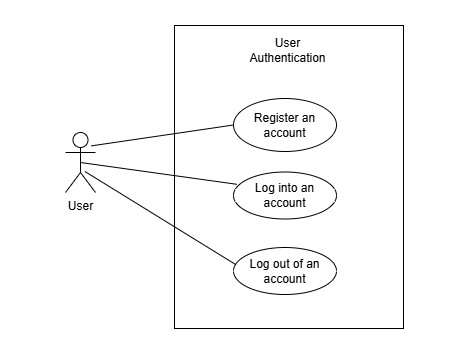
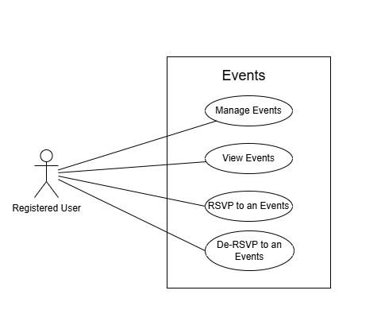
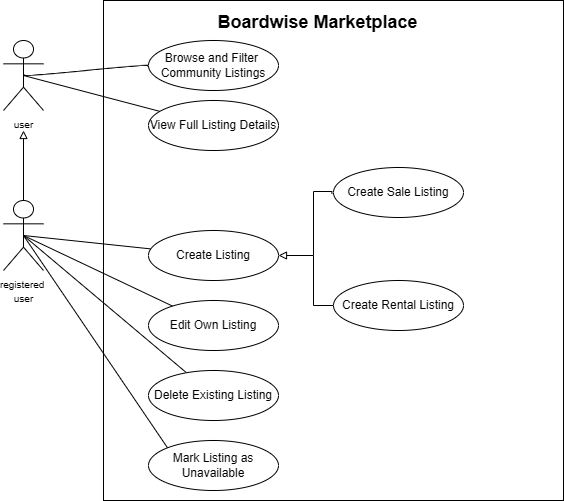
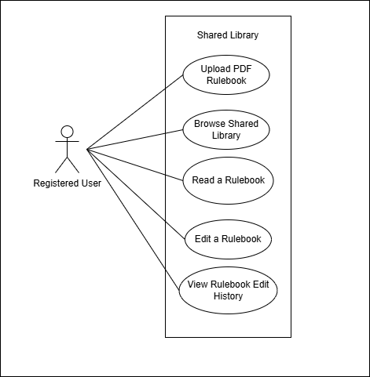
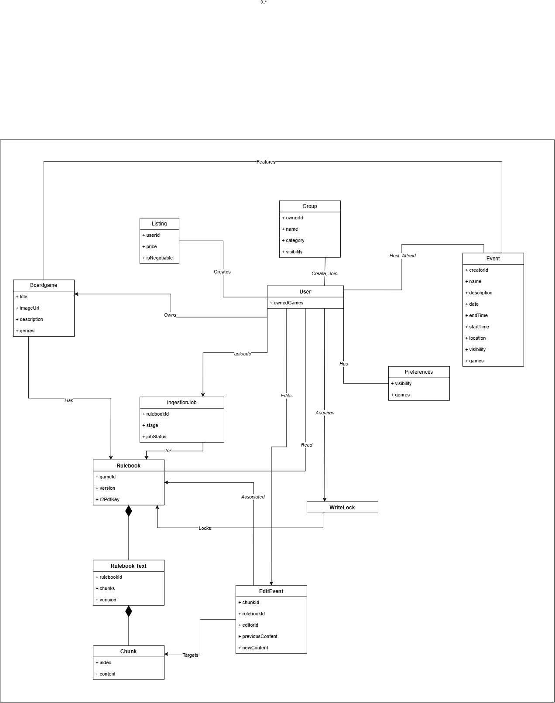

# Boardwise: Software Requirements Specification

**Department of Computer Science**
**Faculty of Engineering, Built Environment & IT**
**University of Pretoria**
**COS301 - Software Engineering**

---

**Item:** Capstone 2026 - Demo 2
**Team Name:** Works On My Machine
**Team Members:**

| Name | Surname | Student Number | % Contribution |
| --- | --- | --- | --- |
| Hayley | Booysen | u24868346 | -- |
| Bandile* | Mnyandu* | u24675394 | -- |
| Karabo | Nkomo | u24865169 | -- |
| Palesa | Nkosi | u22664638 | -- |
| Njabulo | Mathonsi | u24676412 | -- |

\*- indicates team leader

---

## Table of Contents

1. [Project Owner](#1-project-owner)
2. [Introduction](#2-introduction)
3. [User Stories / User Characteristics](#3-user-stories--user-characteristics)
4. [Use Cases](#4-use-cases)
5. [Functional Requirements](#5-functional-requirements)
6. [Non-Functional Requirements](#6-non-functional-requirements-quantified-targets)
7. [Domain Model](#7-domain-model)
8. [Subsystems](#8-subsystems)
9. [Traceability Matrix](#9-traceability-matrix)

---

### 1. Project Owner

**Name:** Saskia Steyn

**Email:** saskia.steyn@labs.epiuse.com

---

### 2. Introduction

**2.1 Business Need**

The South African board gaming community is vibrant but largely offline and fragmented. Enthusiasts currently rely on isolated, retailer-specific locations to discover new games, find playing groups, and participate in organised events. This creates a dependency on physical stores and limits organic, peer-to-peer (P2P) interaction between players.

Boardwise addresses this fragmentation by providing a centralised, store-agnostic digital ecosystem tailored to the local market. The vision of Boardwise is to digitise and expand the board game experience by optimising collection management and community engagement. By consolidating game discovery, P2P logistics, and social coordination into a single interface, Boardwise empowers players and collectors to connect, trade, and organise independently of any single retailer.

**2.2 Objectives**

The core objectives of the system are to:

* **Centralise the Community:** Provide a comprehensive digital home for board game enthusiasts in South Africa to manage their personal collections and discover local players.
* **Decentralise Transactions:** Enable a secure P2P marketplace for renting and selling board games, removing the reliance on commercial retailers for game acquisition.
* **Facilitate Organised Play:** Foster community formation by allowing users to create dedicated social groups and schedule thematic board game events independently.
* **Democratise Knowledge:** Maintain "The Vault," a shared digital library that allows the community to collaboratively upload, store, edit, and maintain board game rulebooks.

**2.3 Scope of this Document (Demo 2)**

This document is an **incremental update** to the Demo 1 SRS, produced in line with the team's Agile process - each demo milestone is captured as a new, versioned SRS rather than a full rewrite. It captures the requirements, use cases, and domain model in scope for **Demo 2**, building on the carried-over Demo 1 baseline (authentication, profile management, groups, marketplace browsing and listing management, and read-only Vault access) and adding the following new capability for this milestone:

* Game inventory management (adding/removing catalogue games to a personal collection).
* Full event lifecycle management (scheduling, editing) and event RSVP.
* Rulebook upload and asynchronous ingestion into The Vault.
* Real-time collaborative rulebook editing, including undo/redo, edit history, and Multi-Reader Single-Writer (MRSV) lock management.

The following capabilities remain explicitly **out of scope** for Demo 2 and are deferred to a future release:

* Direct user-to-user **friend connections** (the `FRIENDSHIP` entity exists in the data model but is not exposed through any Demo 2 functional requirement or use case).
* External retail price comparison / "Where to Buy" aggregation.
* Personalised recommendations and any RAG-based natural language query interface.
* Any AI/LLM-assisted functionality (e.g. a rules-lookup assistant or "Generative Game Architect").

---

### 3. User Stories / User Characteristics

#### 3.1 User Characteristics

The Boardwise platform utilises a simplified Role-Based Access Control (RBAC) and attribute-based visibility model consisting of two primary user types. Access to specific features and navigational paths is determined by the user's authentication status, their ownership of specific entities, and the visibility flags set within the data model.

**Guest User (Unauthenticated)**

* **Permissions:** Strictly read-only access.
* **Navigational Paths:** Limited to browsing public marketplace listings and reading `Ready`-status rulebooks within The Vault. Guest users are explicitly blocked from viewing user profiles, community groups, and events, and from all interactive features (creating listings, uploading rulebooks, RSVPing, etc.). A Guest's only interactive actions are registering a new account or logging into an existing one.

**Standard Registered User**

* **Permissions:** General authenticated access to all core platform features. A Standard Registered User acts as an event organiser, marketplace seller, or Vault contributor based purely on their system interactions and entity ownership - there is no separate "seller" or "organiser" role.
* **Visibility & Ownership Controls:**
  * **Profile & Social:** Their public data footprint is governed by the `USER.preferences.visibility` flag. If set to 'Private', their game mechanics, genres, and inventory are hidden from general queries. They can view and join groups where `visibility` is 'Public', and RSVP to events where the event `visibility` is 'Public' (or if explicitly invited to a 'Private' event).
  * **Events:** When a user creates an event, they gain exclusive ownership rights for that specific entity, allowing them to manage the `Event_Participants` list, update event details, and modify the event `status`.
  * **Marketplace:** Users can create `Listings` and manage embedded `Rental_Period` data. They hold exclusive write and delete permissions over their own marketplace listings, preventing unauthorised modification by other Standard Registered Users.
  * **The Vault:** Users are authorised to initiate an `Ingestion_Job` by uploading a PDF rulebook. They are also authorised to acquire a Multi-Reader Single-Writer (MRSW) lock on an existing `Rulebook`. While holding this lock, they gain access to the collaborative editor interface to modify `Chunk` data, which sequentially appends to the immutable `Edit_Event` ledger.

#### 3.2 User Stories

*Stories are grouped by subsystem epic. Stories marked **(New - Demo 2)** correspond to functionality introduced in this milestone; all other stories are carried over from Demo 1 and included here for completeness.*

**Epic: Authentication** *(Social & Events subsystem)*

##### US-AUTH-01: Register an Account

**As a user, I want to register an account, so that I can access the Boardwise platform and its features.**

**Acceptance Criteria:**
- Given I am on the registration page, when I provide a valid username, email address, and password and submit the form, then a new account is created and I am redirected to my profile setup page.
- Given I submit the form with an email address that is already registered, then the system displays an error informing me the email is already in use.
- Given I have successfully registered, then my password is stored in an encrypted format and is never stored in plain text.

##### US-AUTH-02: Log Into an Account

**As a user, I want to log into my account, so that I can access my personalised profile and platform features.**

**Acceptance Criteria:**
- Given I provide a valid registered email and correct password, then I am authenticated, a secure JWT is issued, and I am redirected to my home feed.
- Given I provide an incorrect password or unregistered email, then the system displays a generic error message and does not grant access.

##### US-AUTH-03: Log Out of an Account

**As a user, I want to log out of my account, so that my session is secure when I am done using the platform.**

**Acceptance Criteria:**
- Given I am logged in, when I select logout, then my session is terminated, my JWT is added to the `Token_Blacklist`, and I am redirected to the login page.
- Given I have logged out, when I attempt to navigate to a protected page, then I am redirected to the login page.

---

**Epic: Profile Management** *(Social & Events subsystem)*

##### US-PROF-01: Manage My Profile

**As a user, I want to view and update my profile information, so that I can keep my details accurate and control what other users can see.**

**Acceptance Criteria:**
- Given I am on my profile page, when I select the edit option, then I can modify my display name, bio, and profile picture.
- Given I toggle my `preferences.visibility` to Private, then my game mechanics, genres, and inventory are hidden from other users' queries of my profile.
- Given I attempt to save with the display name field empty, then the system displays a validation error and does not save the changes.

##### US-PROF-02: View a Profile

**As a user, I want to view my own profile and the public profiles of other users, so that I can see their information and game collections.**

**Acceptance Criteria:**
- Given I navigate to my own profile, then I see my full details including any private fields.
- Given I navigate to another user's profile and their `visibility` is Public, then I see a read-only view of their inventory and preferences.
- Given the profile I navigate to has `visibility` set to Private, then their inventory and preferences are hidden from me.

---

**Epic: Game Inventory (New - Demo 2)**

##### US-INV-01: Manage My Game Inventory

**As a user, I want to add board games from the catalogue to my personal inventory, or remove games I no longer own, so that my collection stays accurate.**

**Acceptance Criteria:**
- Given I search for a game title, when local catalogue results are insufficient, then the system retrieves matching results via the BoardGameGeek (BGG) integration.
- Given I select a game to add, then the relationship between my `User` record and the `Board_Game` is persisted and the game appears in my inventory.
- Given I select the remove action on a game in my inventory, then the relationship is deleted and the game no longer appears in my inventory.

---

**Epic: Social - Groups**

##### US-GRP-01: Manage Groups

**As a user, I want to create a group or join an existing public group, so that I can organise or participate in a dedicated community space.**

**Acceptance Criteria:**
- Given I provide a group name and submit, then a new group is created with me as the owner and I am automatically added as a member.
- Given I browse a group with `visibility` set to Public, when I select join, then I am added as a member.
- Given a group has `visibility` set to Private and I am not a member, then the group is not visible to me in search or browse results.

---

**Epic: Community - Events (New - Demo 2)**

##### US-EVT-01: Manage My Events

**As a user, I want to schedule a new gaming event or edit the details of an event I created, so that I can organise a session and keep its information accurate.**

**Acceptance Criteria:**
- Given I provide a name, date, time, location (validated via the Google Maps integration), game, and visibility (Public or Private), then a new `Events` entity is created and I am automatically added as a participant.
- Given I am the creator of an event, when I edit its details and save, then the entity is updated and existing participants are notified of the change.
- Given I am not the creator of an event, then no edit option is presented to me.

##### US-EVT-02: View Events

**As a user, I want to browse available gaming events, so that I can find sessions to join.**

**Acceptance Criteria:**
- Given I browse the events list, then I see all Public events and any Private events I have been explicitly invited to.
- Given there are no visible events, then the system displays a message indicating none are currently scheduled.

##### US-EVT-03: RSVP to an Event

**As a user, I want to join or withdraw from a gaming event, so that the organiser knows whether I plan to attend.**

**Acceptance Criteria:**
- Given I view a Public event, or a Private event I was invited to, when I select "Join", then my `Event_Participants` record is created and I appear on the attendee list.
- Given I have already joined an event, when I select "Withdraw", then my `Event_Participants` record is removed and the join option is restored.

---

**Epic: Marketplace**

##### US-MKT-01: Browse and Filter Listings

**As a board game enthusiast, I want to browse and filter listings created by other users, so that I can find board games available to rent or buy within my community.**

**Acceptance Criteria:**
- Given I open the marketplace, then all active listings are displayed showing game title, listing type (rent/sale), price, and availability.
- Given I filter by listing type, price range, or game title, then only matching listings are displayed.
- Given no listings match my filters, then a "No listings found" message is displayed.

##### US-MKT-02: View Listing Detail

**As a prospective buyer or renter, I want to view the full detail of a listing, so that I can decide whether to contact the seller.**

**Acceptance Criteria:**
- Given I select a listing, then I am shown its full description, price, rental period (if applicable), and the seller's display name.

##### US-MKT-03: Manage My Listings

**As a board game owner, I want to create, edit, and delete my own rental or sale listings, so that I can keep my availability and pricing accurate.**

**Acceptance Criteria:**
- Given I submit a valid listing form (game title, listing type, price, and - for rentals - a `Rental_Period`), then the listing is immediately published and visible in the marketplace.
- Given I select "Edit" on one of my own listings, then a pre-populated form is shown and my changes are persisted on save.
- Given I select "Delete" on one of my own listings, then it is immediately removed from the public marketplace.
- Given I attempt to edit or delete a listing that belongs to another user, then the action is rejected with an authorisation error.

---

**Epic: The Vault - Ingestion & Browsing**

##### US-VLT-01: Upload a Rulebook (New - Demo 2)

**As a community contributor, I want to upload a PDF rulebook, so that it can be added to the Shared Library for others to view and edit.**

**Acceptance Criteria:**
- Given I select a PDF file under 50 MB and a linked `game_id`, when I submit, then the system returns `202 Accepted` immediately and processes sanitisation, extraction, and storage in the background.
- Given my file exceeds 50 MB, is not a PDF, or fails sanitisation, then the upload is rejected with a clear error (`413`, `415`, or `422`).
- Given ingestion completes successfully, then the `Ingestion_Job` status transitions to `Ready` and the rulebook becomes visible in Vault search results.

##### US-VLT-02: Browse the Vault Library

**As a tabletop player, I want to search for and view rulebooks in the Vault, so that I can find the rules for a specific game.**

**Acceptance Criteria:**
- Given I search by game title, then only `Ready`-status rulebooks matching my query are returned.
- Given I am an unauthenticated Guest, then I can still browse and read `Ready`-status rulebooks.

---

**Epic: The Vault - Collaborative Editing (New - Demo 2)**

##### US-VLT-03: Edit a Rulebook

**As a community contributor, I want to edit a section of a rulebook, so that I can correct an error or add official errata.**

**Acceptance Criteria:**
- Given I hold the active MRSW write lock for the rulebook, when I modify, insert, or delete a `Chunk`, then the change is validated against the `expectedVersion`, persisted, and appended to the `Edit_Event` ledger.
- Given the `expectedVersion` I submit does not match the server's current version, then the edit is rejected with a `409 Conflict`.
- Given I commit a change, then all other active readers see the update reflected in real time via a WebSocket broadcast.

##### US-VLT-04: Undo and Redo My Edits

**As a contributor actively editing a rulebook, I want to undo my most recent edit or redo an undone edit, so that I can correct mistakes without manually retyping text.**

**Acceptance Criteria:**
- Given my undo stack is not empty, when I trigger "Undo", then the inverse operation is applied to the affected `Chunk`, a compensating `Edit_Event` entry is written, and the `Rulebook` version is incremented.
- Given I have just undone an edit, when I trigger "Redo", then the original operation is reapplied.
- Given my undo (or redo) stack is empty, when I trigger the corresponding action, then the system ignores the request without error.

##### US-VLT-05: View Rulebook Edit History

**As a Vault user, I want to view the full chronological edit history of a rulebook, so that I can audit what has changed and by whom.**

**Acceptance Criteria:**
- Given I select "View History" on a rulebook, then the system retrieves the immutable `Edit_Event` ledger and renders an ordered list.
- Given the history is displayed, then each entry shows the `editType`, target `chunkId`, editor's username, before/after text, and resulting `versionPostEdit`.

##### US-VLT-06: Concurrency Lock Management

**As a contributor, I want the system to manage the MRSW write lock automatically, so that two people can never edit a rulebook at the same time and locks don't get stuck.**

**Acceptance Criteria:**
- Given no other user holds the lock, when I request to edit, then I am granted the exclusive write lock and gain access to the editor.
- Given I finish editing and voluntarily release the lock, then the system clears the lock and broadcasts a `voluntary` release event to waiting users.
- Given I hold the lock and my session disconnects abruptly (e.g. WebSocket drop), then the system automatically clears the orphaned lock and broadcasts a `disconnected` release event.

---

### 4. Use Cases
The diagrams below present the high-level use cases per subsystem. Detailed use case specifications (actors, pre/postconditions, basic/alternative/exception flows) for every use case - including all Demo 2 additions - are provided in Section 8 (Subsystems), directly beneath each subsystem's use case table. Actor participation reflects the permissions defined in Section 3.1: Guest Users have no interactive access to the Social & Events subsystem beyond registration/login, read-only access to Marketplace browsing, and read-only access to `Ready` rulebooks in The Vault.

#### 4.1 Social & Events - Use Case Diagram

#### 4.2 Marketplace - Use Case Diagram

#### 4.3 The Vault - Use Case Diagram

---

### 5. Functional Requirements

*High-level, encapsulated functionality only. Individual use cases are detailed in Section 8. Each requirement is assigned to the subsystem responsible for its implementation.*

**Social & Events Subsystem**

* **R1:** The system shall provide functionality for users to create and manage social groups.
* **R2:** The system shall provide functionality for users to organise, discover, and RSVP to board game events.
* **R5:** The system shall manage user accounts and profiles (CRUD).
* **R6:** The system shall manage groups and group membership (CRUD).
* **R7:** The system shall manage events and event participation records (CRUD).
* **R8:** The system shall manage the board game catalogue (CRUD).
* **R12:** The system shall authenticate users and manage session validity, including token revocation on logout.
* **R13:** The system shall integrate with Google Maps to display and geospatially index event locations.
* **R14:** The system shall integrate with BoardGameGeek (BGG) to retrieve board game metadata for the catalogue.

**Marketplace Subsystem**

* **R3:** The system shall provide functionality for users to buy, sell, and rent board games through a peer-to-peer marketplace.
* **R9:** The system shall manage marketplace listings, including rental periods (CRUD).

**The Vault Subsystem**

* **R4:** The system shall provide functionality for users to collaboratively create and edit digital rulebooks (The Vault).
* **R10:** The system shall manage rulebook metadata, including upload, ingestion status, and versioned content (CRUD).
* **R11:** The system shall support real-time collaborative editing of rulebooks, including edit locking, undo/redo, and full edit history.

*(Calculations and AI/Models categories are not applicable for Demo 2 scope; RAG-based functionality is planned for a future release.)*

---

### 6. Non-Functional Requirements (Quantified Targets)

* **Reliability:** The system should achieve **99.9% uptime** and recover from critical failures within **5 minutes**.
* **Maintainability:** New features or bug fixes should be deployable within **2 hours**, and the codebase must maintain at least **80% automated test coverage**.
* **Usability:** A new user should be able to complete core tasks within **5 minutes** of first using the system, achieving at least **85% user satisfaction** during usability testing.
* **Availability:** The system must be available **24/7**, excluding scheduled maintenance periods which may not exceed **2 hours per month**.
* **Security:** All user passwords must be encrypted at rest (bcrypt, cost factor ≥ 10) and never stored or logged in plain text. All session tokens (JWTs) must be signed and validated on every request, and revoked tokens must be rejected via the `Token_Blacklist` within **1 second** of logout. **100% of state-changing Marketplace and Vault operations** (listing edit/delete, rulebook edit/lock) must verify resource ownership or lock possession server-side before executing.

---

### 7. Domain Model
The high-level domain model below contains the exact union of all classes shown across the subsystem domain models in Section 8 - no class is added, omitted, or duplicated between this diagram and the subsystem-level diagrams. Where a class is referenced by more than one subsystem (e.g. `Board_Game`), it appears once here, owned by its home subsystem, and is shown only as a referenced/dashed dependency in the diagrams of subsystems that consume it.

---

### 8. Subsystems

*Use cases are numbered `U<subsystem>.<sequence>`, where `<subsystem>` is the subsystem number (1, 2, 3) and `<sequence>` is the use case's order within that subsystem (e.g. U1.1, U1.2, U2.1). This numbering is used consistently in each subsystem's use case diagram (Section 4) and in the Section 9 traceability matrix.*

#### Subsystem 8.1: Social & Events

##### 8.1.1 Use Cases

| ID | Use Case | Demo 2 Status |
| --- | --- | --- |
| U1.1 | Register an Account | Carried over |
| U1.2 | Log Into an Account | Carried over |
| U1.3 | Log Out of an Account | Carried over |
| U1.4 | Manage Profile | Carried over |
| U1.5 | View a Profile | Carried over |
| U1.6 | Manage Game Inventory «include» Add Game to Inventory, Remove Game from Inventory | **New - Demo 2** |
| U1.7 | Manage Groups | Carried over |
| U1.8 | Manage Events «include» Schedule an Event, Edit an Event | **New - Demo 2** |
| U1.9 | View Events | Carried over |
| U1.10 | RSVP to an Event | **New - Demo 2** |

**U1.6: Manage Game Inventory**

| Field | Detail |
| --- | --- |
| **Use Case ID** | U1.6 |
| **Use Case Name** | Manage Game Inventory |
| **Actor(s)** | Standard Registered User |
| **Description** | A user searches the board game catalogue to add titles to their personal digital inventory or removes existing titles from their collection. |
| **Preconditions** | The user is authenticated. |
| **Postconditions** | The user's inventory is updated. If a new game is added that does not exist in the local database, it is fetched via the BoardGameGeek (BGG) integration and persisted to the local catalogue. |
| **Basic Flow (Add)** | 1. User navigates to their profile and selects to add a game. 2. User searches for a game title. 3. System retrieves matching results (utilizing the BGG integration if local catalogue results are insufficient). 4. User selects a game to add. 5. System persists the relationship between the `User` and the `Board_Game`. |
| **Basic Flow (Remove)** | 1. User views their inventory. 2. User selects the remove action on a specific board game. 3. System updates the inventory and removes the relationship. |

**U1.8: Manage Events**

| Field | Detail |
| --- | --- |
| **Use Case ID** | U1.8 |
| **Use Case Name** | Manage Events |
| **Actor(s)** | Standard Registered User (Event Organiser) |
| **Description** | A user schedules a new board game event or edits the details (date, time, location, visibility) of an existing event they have created. |
| **Preconditions** | The user is authenticated. For editing, the user must be the original creator of the event. |
| **Postconditions** | A new `Events` entity is persisted, or an existing one is updated. |
| **Basic Flow (Schedule)** | 1. User selects to create a new event. 2. User provides event details, utilizing the Google Maps integration to set and validate the event location. 3. User sets the event visibility (Public or Private) and selects a board game from the catalogue. 4. System validates inputs and creates the `Events` entity, automatically adding the creator as a participant. |
| **Basic Flow (Edit)** | 1. Organiser selects to edit their event. 2. System populates the form with existing `Events` data. 3. Organiser modifies details and submits. 4. System updates the entity and notifies existing participants of changes. |

**U1.10: RSVP to an Event**

| Field | Detail |
| --- | --- |
| **Use Case ID** | U1.10 |
| **Use Case Name** | RSVP to an Event |
| **Actor(s)** | Standard Registered User |
| **Description** | A user joins a visible board game event or withdraws an existing RSVP. |
| **Preconditions** | The user is authenticated. The event must exist and be visible to the user (either Public, or Private with a direct invite). |
| **Postconditions** | The `Event_Participants` record is updated to reflect the user's attendance status. |
| **Basic Flow** | 1. User navigates to an event details page. 2. User selects the action to "Join" (if not attending) or "Withdraw" (if already attending). 3. System validates the request and updates the `Event_Participants` linkage. 4. System updates the UI to reflect the new RSVP status. |

##### 8.1.2 Subsystem Domain Model

*Rule: A class must belong to one and only one subsystem. `Board_Game` is owned by Social & Events; Marketplace and The Vault reference it only via `ObjectId` (`gameId`/`games[]`/`ownedGames[]`) - no direct cross-service class ownership or join.*

Classes owned by this subsystem: `User`, `Preferences` *(embedded)*, `Friendship`, `Groups`, `Group_Membership`, `Events`, `Event_Participants`, `Token_Blacklist`, `Board_Game`.

* **User:** Core identity entity containing authentication and profile fields. *Constraints:* Email addresses must be unique. Passwords must be encrypted at rest.
* **Preferences (Embedded):** Stores the user's genre and mechanic preferences. *Constraints:* Governed by a `visibility` toggle (Public/Private).
* **Friendship:** Represents a peer-to-peer connection. *Constraints:* Scoped for future release; tracks pending/accepted states. **Not exposed by any Demo 2 requirement or use case** (see Section 2.3).
* **Groups & Group_Membership:** Manages social hubs and user affiliations. *Constraints:* A `Group` must have at least one owner.
* **Events & Event_Participants:** Manages scheduled board game sessions and RSVPs. *Constraints:* `Events` visibility dictates who can create an `Event_Participants` record.
* **Token_Blacklist:** Manages session invalidation. *Constraints:* Stores revoked JWT signatures to prevent replay attacks post-logout.
* **Board_Game:** The central catalogue entity populated via the BoardGameGeek integration. *Constraints:* Acts as the source of truth for game metadata; referenced by ID in other subsystems.

---

#### Subsystem 8.2: Marketplace

##### 8.2.1 Use Cases

| ID | Use Case | Demo 2 Status |
| --- | --- | --- |
| U2.1 | Browse and Filter Community Listings | Carried over |
| U2.2 | View Full Listing Detail | Carried over |
| U2.3 | Create a Rental or Sale Listing | Carried over |
| U2.4 | Edit an Existing Listing | Carried over |
| U2.5 | Delete a Listing | Carried over |

##### 8.2.2 Subsystem Domain Model

Classes owned by this subsystem: `Listings`, `Rental_Period` *(embedded)*.

*Note: `Listings` does not reference `Board_Game` by ID; `gameTitle` and `genres` are freeform/denormalised fields captured at listing-creation time, decoupling the Marketplace Service from the User Service's game catalogue.*

* **Listings:** Represents a user-generated offer to rent or sell a board game. *Fields:* `listingType` (Rent/Sale), `price`, `status`, `gameTitle`, `genres`. *Constraints:* `gameTitle` and `genres` are denormalized at creation to decouple from the User Service catalogue. Price must be a positive value.
* **Rental_Period (Embedded):** Tracks availability for rental listings. *Constraints:* Start dates cannot be in the past; end dates must strictly follow start dates. Sale listings do not utilize this embedded document.

---

#### Subsystem 8.3: The Vault

##### 8.3.1 Use Cases

| ID | Use Case | Demo 2 Status |
| --- | --- | --- |
| U3.1 | Upload a Rulebook | **New - Demo 2** |
| U3.2 | Browse the Vault Library | Carried over |
| U3.3 | Read a Rulebook | Carried over |
| U3.4 | Edit a Rulebook *(Collaborative Editing)* | **New - Demo 2** |
| U3.5 | Undo and Redo Edits *(Collaborative Editing)* | **New - Demo 2** |
| U3.6 | View Rulebook Edit History | **New - Demo 2** |
| U3.7 | Lock Management and Release *(Collaborative Editing)* | **New - Demo 2** |

**U3.1: Upload a Rulebook**

| Field | Detail |
| --- | --- |
| **Use Case ID** | U3.1 |
| **Use Case Name** | Upload a Rulebook |
| **Actor(s)** | Standard Registered User |
| **Description** | A user uploads a PDF rulebook to The Vault, initiating the asynchronous ingestion and text-extraction pipeline. |
| **Preconditions** | The user is authenticated. The file is a valid PDF and does not exceed the 50 MB size limit. |
| **Postconditions** | An `Ingestion_Job` is initiated, the raw PDF is stored in Cloudflare R2, and metadata is persisted in MongoDB Atlas. |
| **Basic Flow** | 1. User navigates to The Vault and selects the option to upload. 2. User provides the PDF file, `game_name`, and selects the linked `game_id` from the catalogue. 3. User submits the upload. 4. The BFF streams the payload directly to the FastAPI service. 5. System immediately returns a `202 Accepted` status to the client and continues sanitization and extraction in the background. |
| **Exception Flow** | **3a.** File exceeds 50 MB, is an invalid format, or fails sanitization: The system rejects the upload with a `413`, `415`, or `422` error and displays a clear message to the user. |

**U3.4: Edit a Rulebook (Collaborative Editing)**

| Field | Detail |
| --- | --- |
| **Use Case ID** | U3.4 |
| **Use Case Name** | Edit a Rulebook |
| **Actor(s)** | Standard Registered User |
| **Description** | A user modifies, inserts, or deletes a text chunk in a rulebook using the real-time collaborative editor. |
| **Preconditions** | The user is authenticated and has successfully acquired an exclusive MRSW write lock for the target rulebook. |
| **Postconditions** | The `Chunk` data is updated, a record is appended to the `Edit_Event` ledger, the `Rulebook` version is incremented, and the change is pushed to the undo stack. |
| **Basic Flow** | 1. User makes an edit (modify, insert, or delete) to a rulebook chunk in the editor UI. 2. System validates the edit against the `expectedVersion` to prevent concurrent modification anomalies. 3. System persists the atomic change to the database and records it in the undo ledger. 4. System broadcasts the appropriate WebSocket event (`DELTA_COMMITTED`, `CHUNK_INSERTED`, or `CHUNK_DELETED`) to all active readers so their views update instantly. |
| **Exception Flow** | **2a.** Version Mismatch: The `expectedVersion` does not match the server's version. The system rejects the edit with a `409 Conflict` error. |

**U3.5: Undo and Redo Edits (Collaborative Editing)**

| Field | Detail |
| --- | --- |
| **Use Case ID** | U3.5 |
| **Use Case Name** | Undo and Redo Edits |
| **Actor(s)** | Standard Registered User |
| **Description** | A user reverts their most recent edit or reapplies an undone edit without manually re-typing or deleting text. |
| **Preconditions** | The user is authenticated and holds the active MRSW write lock. The undo (or redo) stack for their current session is not empty. |
| **Postconditions** | An inverse operation is applied to the `Chunk` data, a compensating entry is added to the `Edit_Event` ledger, and the `Rulebook` version is incremented. |
| **Basic Flow** | 1. User triggers an "Undo" or "Redo" action in the editor. 2. System pops the target operation from the respective stack. 3. System applies the exact inverse operation (e.g., reverting a deletion by re-inserting the chunk). 4. System writes a compensating ledger entry to maintain immutability. 5. System broadcasts the corresponding WebSocket event reflecting the inverse change. |
| **Exception Flow** | **1a.** Stack Empty: If the user attempts to undo/redo when the stack is empty, the system ignores or rejects the request. |

**U3.6: View Rulebook Edit History**

| Field | Detail |
| --- | --- |
| **Use Case ID** | U3.6 |
| **Use Case Name** | View Rulebook Edit History |
| **Actor(s)** | Standard Registered User |
| **Description** | A user views the full, chronological version history of a rulebook to audit changes. |
| **Preconditions** | The user is authenticated. |
| **Postconditions** | The complete history of the rulebook is displayed; no state is modified. |
| **Basic Flow** | 1. User selects to view the edit history for a specific rulebook. 2. System retrieves the immutable `Edit_Event` ledger for that rulebook from the database. 3. System renders an ordered list detailing the total number of edits. 4. For each event, the UI displays the `editType`, target `chunkId`, resolving editor's username, the before/after text content, and the resulting `versionPostEdit`. |

**U3.7: Lock Management and Release (Collaborative Editing)**

| Field | Detail |
| --- | --- |
| **Use Case ID** | U3.7 |
| **Use Case Name** | Lock Management and Release |
| **Actor(s)** | Standard Registered User, System |
| **Description** | The system manages the release of MRSW write locks either voluntarily by the user or automatically upon disconnection. |
| **Preconditions** | The user holds at least one active write lock. |
| **Postconditions** | The write lock is cleared from the database, allowing other users to acquire it. |
| **Basic Flow (Voluntary)** | 1. User finishes editing and explicitly selects the action to release the lock (or triggers a "release all" command). 2. System clears the lock association in the database. 3. System broadcasts a lock released event with the reason `voluntary` via WebSocket to notify waiting users. |
| **Basic Flow (Automatic)** | 1. A user holding a lock abruptly disconnects (e.g., WebSocket session drops). 2. System detects the disconnection and automatically triggers a "release all" flow to clear orphaned locks. 3. System broadcasts a lock released event with the reason `disconnected`. |

##### 8.3.2 Subsystem Domain Model

Classes owned by this subsystem: `Rulebook`, `Rulebook_Text`, `Chunk` *(embedded)*, `Edit_Event`, `Ingestion_Job`.

* **Ingestion_Job:** Tracks the asynchronous processing status of uploaded PDFs. *Constraints:* Statuses include Pending, Processing, Ready, or Failed.
* **Rulebook:** The metadata envelope for the digital manual. *Constraints:* Must maintain a strict version counter to validate incoming edits.
* **Rulebook_Text & Chunk (Embedded):** Stores the actual content of the rulebook, broken into sequential `Chunk` arrays to allow granular editing. *Constraints:* Chunks must maintain a strict index order.
* **Edit_Event:** The event sourcing ledger tracking all collaborative changes. *Constraints:* Strictly immutable. Every atomic commit (including Undo/Redo) appends a new record detailing the `editType`, `chunkId`, and resulting version.

---

### 9. Traceability Matrix

| Use Case | R1 | R2 | R3 | R4 | R5 | R6 | R7 | R8 | R9 | R10 | R11 | R12 | R13 | R14 |
| --- | --- | --- | --- | --- | --- | --- | --- | --- | --- | --- | --- | --- | --- | --- |
| U1.1 Register an Account |  |  |  |  |  |  |  |  |  |  |  | X |  |  |
| U1.2 Log Into an Account |  |  |  |  |  |  |  |  |  |  |  | X |  |  |
| U1.3 Log Out of an Account |  |  |  |  |  |  |  |  |  |  |  | X |  |  |
| U1.4 Manage Profile |  |  |  |  | X |  |  |  |  |  |  |  |  |  |
| U1.5 View a Profile |  |  |  |  | X |  |  |  |  |  |  |  |  |  |
| U1.6 Manage Game Inventory |  |  |  |  |  |  |  | X |  |  |  |  |  | X |
| U1.7 Manage Groups | X |  |  |  |  | X |  |  |  |  |  |  |  |  |
| U1.8 Manage Events |  | X |  |  |  |  | X |  |  |  |  |  | X |  |
| U1.9 View Events |  | X |  |  |  |  | X |  |  |  |  |  |  |  |
| U1.10 RSVP to an Event |  | X |  |  |  |  | X |  |  |  |  |  |  |  |
| U2.1 Browse and Filter Listings |  |  | X |  |  |  |  |  | X |  |  |  |  |  |
| U2.2 View Full Listing Detail |  |  | X |  |  |  |  |  | X |  |  |  |  |  |
| U2.3 Create a Rental or Sale Listing |  |  | X |  |  |  |  |  | X |  |  |  |  |  |
| U2.4 Edit an Existing Listing |  |  | X |  |  |  |  |  | X |  |  |  |  |  |
| U2.5 Delete a Listing |  |  | X |  |  |  |  |  | X |  |  |  |  |  |
| U3.1 Upload a Rulebook |  |  |  | X |  |  |  | X |  | X |  |  |  |  |
| U3.2 Browse the Vault Library |  |  |  | X |  |  |  |  |  | X |  |  |  |  |
| U3.3 Read a Rulebook |  |  |  | X |  |  |  |  |  | X |  |  |  |  |
| U3.4 Edit a Rulebook |  |  |  | X |  |  |  |  |  |  | X |  |  |  |
| U3.5 Undo and Redo Edits |  |  |  | X |  |  |  |  |  |  | X |  |  |  |
| U3.6 View Rulebook Edit History |  |  |  | X |  |  |  |  |  |  | X |  |  |  |
| U3.7 Lock Management and Release |  |  |  | X |  |  |  |  |  |  | X |  |  |  |

*Note: R8 (board game catalogue management) is satisfied indirectly - via U1.6 (adding a game to inventory may create/reference a catalogue entry) and U3.1 (rulebook upload references an existing `gameId`) - rather than via a standalone catalogue-browsing use case. This reflects the actual data flow confirmed in the ERD.*
