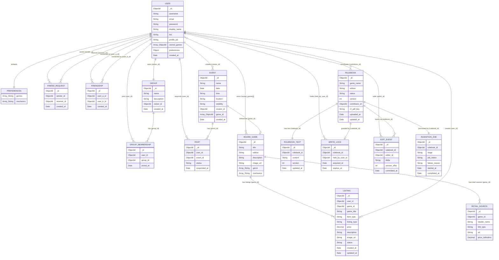

# Entity Relationship Diagram — Boardwise (Full System)

**Project:** Boardwise  
**Version:** 1.0  
**Sprint:** 1 — Demo 1 (MVP)  
**Date:** 2026-05-02  
**Status:** Active

---

## Conventions

- All `_id` fields are of type `ObjectId` and serve as the primary identifier for each document.
- Fields suffixed with `_id` (e.g. `user_id`, `group_id`) are `ObjectId` references to documents in other collections.
- `Array_String` denotes an embedded array of scalar string values.
- `Array_ObjectId` denotes an embedded array of `ObjectId` references to documents in another collection.
- `String?` denotes an optional field that may be null or absent.
- `Decimal` denotes a numeric value stored as a decimal type for monetary precision.
- Relationships are shown as logical references, not foreign key constraints, consistent with MongoDB's document model.
- Field naming follows `snake_case` consistently across all collections.
- Collections are colour-grouped by service boundary:
  - **User Service** — USER, PREFERENCES, FRIEND_REQUEST, FRIENDSHIP, GROUP, GROUP_MEMBERSHIP, EVENT, RSVP
  - **Shared** — BOARD_GAME (referenced by both User Service and Marketplace Service)
  - **Marketplace Service** — LISTING, RETAIL_SOURCE
  - **Shared Library (The Vault)** — RULEBOOK, RULEBOOK_TEXT, WRITE_LOCK, EDIT_EVENT, INGESTION_JOB

---

## Cross-Service Notes

- `BOARD_GAME` is a **shared collection** owned by the User Service but referenced by the Marketplace Service (via `game_id` on `LISTING` and `RETAIL_SOURCE`). Cross-service reads are mediated through the BFF and REST API calls — the Marketplace Service does not query the User Service database directly.
- `USER` is owned exclusively by the User Service. The Marketplace Service stores only `user_id` as an `ObjectId` reference on `LISTING`. The Vault stores only `_id`, `username`, and `display_name` as a minimal cross-service stub for display purposes.
- All cross-service `ObjectId` references are logical references only — MongoDB does not enforce referential integrity across collections or databases.

---

## Diagram

---

## Collection Descriptions

### USER SERVICE

#### USER
The primary collection for the User Service and the central entity of the entire system. Stores all account credentials, profile information, and embedded preferences. The `owned_games` field is an array of `ObjectId` references to documents in the `BOARD_GAME` collection, representing the user's game inventory. Preferences are embedded directly on the User document as they are always accessed alongside the user and never queried independently. Referenced by all three services via `ObjectId`.

#### PREFERENCES *(Embedded in USER)*
Not a standalone collection. Preferences are embedded as a subdocument within each `USER` document. Contains arrays of genre and mechanic strings representing the user's board game interests.

#### FRIEND_REQUEST
Tracks pending friend connection requests between users. Each document references a `sender_id` and `receiver_id` (both `ObjectId` references to `USER`). A `FRIEND_REQUEST` document has no status field — it exists only while the request is pending. On acceptance, the document is deleted and a `FRIENDSHIP` document is created. On rejection, the document is simply deleted with no trace retained.

#### FRIENDSHIP
Represents an established mutual connection between two users. Created when a `FRIEND_REQUEST` is accepted. References `user_a_id` and `user_b_id` (both `ObjectId` references to `USER`). Queried directly for friends list lookups, making friend retrieval efficient without filtering by status. When a user unfriends another, the `FRIENDSHIP` document is permanently deleted.

#### GROUP
Stores user-created social groups. References the `owner_id` (the creating user) as an `ObjectId`. Group membership is tracked separately in the `GROUP_MEMBERSHIP` collection.

#### GROUP_MEMBERSHIP
Join collection linking `USER` and `GROUP`. Each document holds a `user_id` and `group_id` reference along with a `joined_at` timestamp. This collection is queried to determine group members and a user's group count.

#### EVENT
Stores gaming events created by users. References the `creator_id` (the organising user) and `game_id` (the board game being played). The `visibility` field holds one of: `Public`, `Private`. RSVPs are tracked separately in the `RSVP` collection.

#### RSVP
Tracks user attendance responses to events. Each document references a `user_id` and `event_id`. The `status` field holds one of: `Joined`, `Declined`.

---

### SHARED

#### BOARD_GAME
Stores the board game catalogue entries shared across the system. Owned by the User Service but referenced by the Marketplace Service (via `game_id` on `LISTING` and `RETAIL_SOURCE`). Referenced by `USER` (via `owned_games`), `EVENT` (via `game_id`), `LISTING` (via `game_id`), and `RETAIL_SOURCE` (via `game_id`). Genre and mechanics are embedded as arrays of strings since they are simple scalar values that do not require independent querying. Cross-service reads are mediated through the BFF and REST APIs — the Marketplace Service does not query the User Service database directly.

---

### MARKETPLACE SERVICE

#### LISTING
The primary collection for the Marketplace Service. Stores all peer-to-peer rental and sale listings created by authenticated users. The `user_id` field is an `ObjectId` reference to the `USER` document in the User Service — it is not embedded, as the User Service owns that domain. The `game_title` field is denormalised directly onto the `LISTING` document to allow efficient browse and filter queries without requiring a cross-service lookup to `BOARD_GAME` on every request.

The `item_type` field holds one of: `BOARD_GAME`, `MERCHANDISE`, `EXPANSION`.
The `listing_type` field holds one of: `RENT`, `SALE`.
The `status` field holds one of: `ACTIVE`, `INACTIVE`, `DELETED`. `INACTIVE` represents a soft delete (mark as unavailable) that can be reversed. `DELETED` represents a permanent removal from public view.

#### RETAIL_SOURCE
Stores aggregated external retail purchase links for board game titles. Each document references a `game_id` linking it to a `BOARD_GAME` document. Retail sources are populated by the backend retail aggregation service and are never user-generated. The `link_type` field holds one of: `ONLINE`, `IN_STORE`. The `price_indication` and `in_stock_indication` fields are best-effort values and are not guaranteed to be real-time accurate.

---

### SHARED LIBRARY — THE VAULT

#### RULEBOOK
The aggregate root for The Vault. Stores rulebook metadata including the Cloudflare R2 key for the raw PDF (`r2_pdf_key`). The `status` field holds one of: `Processing`, `Ready`, `PendingReview`. The `version` field is incremented on every accepted collaborative edit. Owns `RULEBOOK_TEXT`, `WRITE_LOCK`, `EDIT_EVENT`, and `INGESTION_JOB` via one-to-one or one-to-many relationships.

#### RULEBOOK_TEXT
Stores the mutable collaborative text content of a rulebook. Separated from `RULEBOOK` intentionally — the text body can be large, and keeping it in a separate collection ensures that list and search queries on `RULEBOOK` remain lean and never load the full text unnecessarily.

#### WRITE_LOCK
Represents the MRSW exclusive write lock held on a rulebook during collaborative editing. A `RULEBOOK` either has a lock (`0..1` relationship) or it does not. The `expires_at` field drives the 30-second idle expiry — Spring Boot enforces this on every lock-check request.

#### EDIT_EVENT
The immutable event sourcing ledger for collaborative edits. Each document stores a delta (the change applied) and the `version_after` (the resulting version number). This enables full edit history reconstruction and rollback without joining back to `RULEBOOK_TEXT`.

#### INGESTION_JOB
Tracks the state of the FastAPI pipe-and-filter ingestion pipeline for each uploaded rulebook. The `stage` field reflects the current or last completed pipeline stage: `Sanitise`, `Extract`, `Chunk`, `Vectorise`. The `job_status` field holds one of: `Processing`, `Ready`, `PendingReview`. The `failure_reason` field captures any error that caused a pipeline failure.
