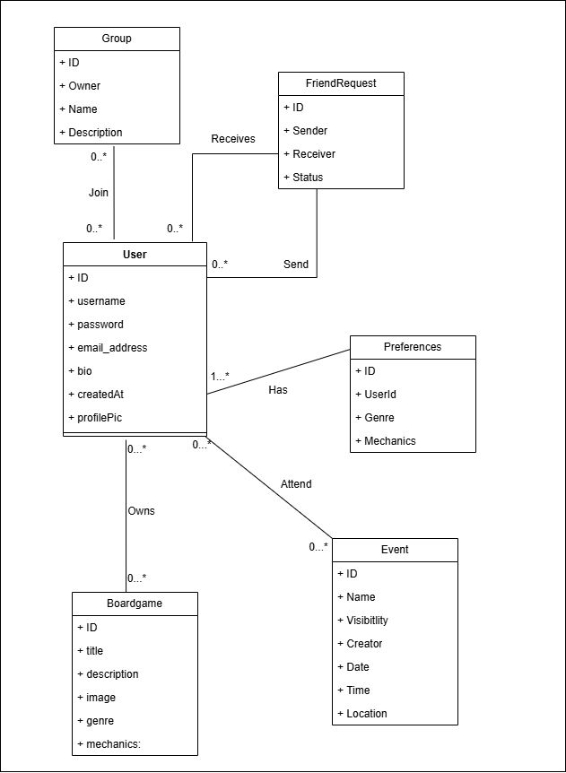
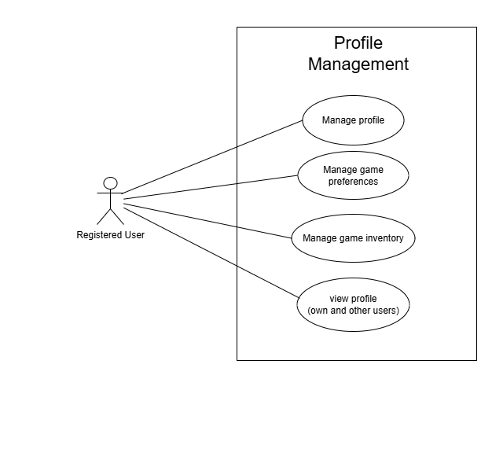
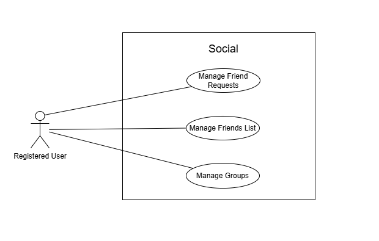
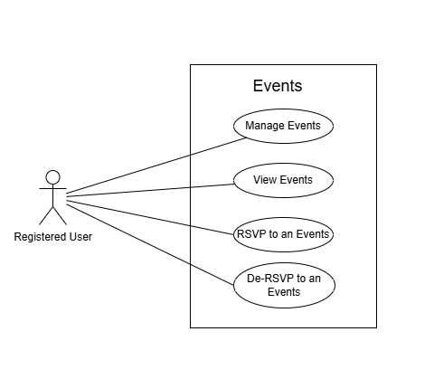
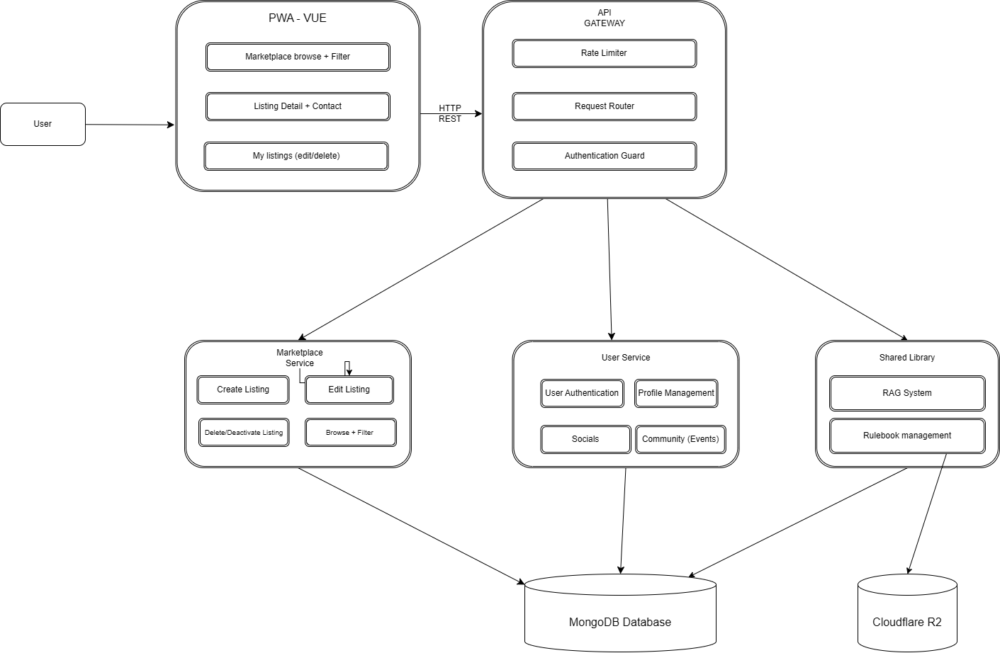

# Boardwise
## Software Requirements and Design Specifications

**Department of Computer Science**  
**Faculty of Engineering, Built Environment & IT**  
**University of Pretoria**  
**COS301 — Software Engineering**

---

**Item:** Mini Project 2026 — Phase 1  
**Team Name:** Works On My Machine

**Team Members:**

| Name | Surname | Student Number | % Contribution |
|---|---|---|---|
|Hayley\* |Booysen |u24868346 | --|
|Bandile |Mnyandu |u24675394 | --|
|Karabo |Nkomo |u24865169 |-- |
|Palesa |Nkosi |u22664638 |-- |
|Njabulo |Mathonsi |u24676412 |-- |

*\* — indicates team leader*

---

## Table of Contents

1. [Introduction](#1-introduction)
2. [Project Owner](#2-project-owner)
3. [Project Vision and Objectives](#3-project-vision-and-objectives)
4. [Functional Requirements](#4-functional-requirements)
5. [Non-Functional Requirements](#5-non-functional-requirements)
6. [Technology and Project Constraints](#6-technology-and-project-constraints)
7. [User Characteristics](#7-user-characteristics)
8. [System Domain Model](#8-system-domain-model)
9. [Subsystems](#9-subsystems)
   - [9.1 User Service (Including Community)](#91-user-service-including-community)
   - [9.2 Marketplace Service](#92-marketplace-service)
   - [9.3 Shared Library — The Vault](#93-shared-library--the-vault)
10. [API Service Contracts](#10-api-service-contracts)
    - [10.1 User Service API Contracts](#101-user-service-api-contracts)
    - [10.2 Marketplace API Contracts](#102-marketplace-api-contracts)
    - [10.3 The Vault API Contracts](#103-the-vault-api-contracts)
11. [Traceability Matrix](#11-traceability-matrix)
12. [Architectural Requirements](#12-architectural-requirements)
    - [12.1 Overall Software Architecture](#121-overall-software-architecture)
    - [12.2 Architectural Quality Requirements](#122-architectural-quality-requirements)
    - [12.3 Architectural Constraints](#123-architectural-constraints)
    - [12.4 Architectural Components](#124-architectural-components)
    - [12.5 Summary](#125-summary)

---

## 1. Introduction

Boardwise is a comprehensive platform designed to digitise and expand the board game experience for enthusiasts, particularly within the South African market. The South African board gaming community remains largely offline and fragmented; local stores host gaming days, but enthusiasts are often tied to specific retail locations to find community. Boardwise centralises this ecosystem, providing a store-agnostic platform where the community can connect, rent, and organise events independently.

The platform addresses key community problems: enabling peer-to-peer (P2P) transactions (rental and sale) without dependence on a single retailer, fostering community formation through groups and events, and democratising access to board game knowledge through a collaboratively maintained shared library of rulebooks.

**Scope Note:** This document reflects the requirements in scope for **Sprint 1 (Demo 1)**. The focus is on delivering a functional MVP with core CRUD capabilities across all system domains. The following features are explicitly deferred to future sprints and are **not covered** by this document: personalised recommendation systems, RAG-based natural language query interface, PWA installability, Generative Game Architect (AI Innovation), Setup Wizard, app theming, price comparison, and automated retrieval of rulebooks from the internet.

---

## 2. Project Owner

Name: Saskia Steyn  
Email: saskia.steyn@labs.epiuse.com

---

## 3. Project Vision and Objectives

Boardwise is a comprehensive digital ecosystem for board game enthusiasts that **optimises collection management and community engagement**. The platform features a peer-to-peer marketplace, a community events hub, and a shared digital vault for storing and collaboratively maintaining board game rulebooks.

Designed to foster local gaming networks, the application facilitates peer-to-peer game rentals and a thematic event-hosting system for organised play. By consolidating discovery, logistics, and social coordination into a single interface, it streamlines the hobby for players and collectors alike.

The objectives of the system are to:

- Provide a digital home for board game collections and community interaction in South Africa.
- Enable peer-to-peer transactions (rental and sale) without dependence on a single retailer.
- Foster community formation through groups, events, and social connections.
- Democratise access to board game knowledge through a collaboratively maintained shared library of rulebooks.

---

## 4. Functional Requirements

### 4.1 User Profile & Social Domain

- **FR1.1:** The system must allow users to create, read, update, and delete (CRUD) personal profiles.
- **FR1.2:** The system must enable users to maintain a digital inventory of owned board games.
- **FR1.3:** The system must record and store user genre and game mechanic preferences.
- **FR1.4:** The system must facilitate sending, accepting, and rejecting friend requests to form peer groups.

### 4.2 Marketplace Domain

### 4.3 Community & Events Domain

- **FR3.1:** The system must allow users to schedule gaming events, defining parameters such as date, time, game, and visibility (Public or Private).
- **FR3.2:** The system must process event RSVPs, allowing users to join or decline event invitations.

### 4.4 Shared Library Domain (The Vault)

### 4.5 UI & Usability

- **FR5.1:** The system must provide contextual help text or tooltips for complex interactions (e.g., uploading a rulebook to The Vault or setting up a P2P rental listing).

---

## 5. Non-Functional Requirements

### 5.1 Performance & Hardware Compatibility

- **NFR1.1:** The Vue.js Shared Library interface must process collaborative rulebook updates dynamically without requiring a full page reload.
- **NFR1.2:** The application frontend must be optimised to achieve fast initial load times and maintain smooth UI performance across mid-range mobile and desktop devices.
- **NFR1.3:** The system must handle real-time state updates gracefully under stable network conditions, with fallback states (e.g., loading skeletons) for slower connections.

### 5.2 Usability & Accessibility

- **NFR2.1:** The user interface must be fully responsive, scaling automatically to accommodate multiple screen sizes (mobile, tablet, and desktop).
- **NFR2.2:** The system must be accessible to users with disabilities, adhering to WCAG 2.1 Level AA guidelines, including sufficient contrast ratios, screen-reader compatibility, and full keyboard navigation support.

### 5.3 Security & Reliability

- **NFR3.1:** All P2P rental contracts and associated booking data processed by the Spring Boot backend must be ACID compliant.
- **NFR3.2:** The Shared Library must implement Multi-Reader Single-Writer (MRSW) versioning to prevent data corruption when multiple users attempt to edit a rulebook simultaneously.
- **NFR3.3:** The application must adhere to data privacy best practices, including encrypting passwords at rest and utilising secure JWTs for session management.

---

## 6. Technology and Project Constraints

- **CON1 (Licensing):** The entire system codebase must be released and maintained under an Open Source licence.
- **CON2 (Infrastructure):** All backend services (Spring Boot core, Node.js BFF, FastAPI AI Gateway, and MongoDB database) must be hosted exclusively on free cloud platform services or within standard free-tier limits.
- **CON3 (Target Hardware):** The application architecture must remain lightweight enough that both client-side rendering (Vue.js) and server-side processing do not demand high-end hardware, targeting optimisation for mid-range device groups.

---

## 7. User Characteristics

The Boardwise platform serves several distinct user types, each interacting with the system in different ways:

**Registered User (General):** Any authenticated user of the platform. They have access to all core features including profile management, game inventory, social features, marketplace browsing, event participation, and the Shared Library. They can take on more specific roles within the Vault.

**Guest User:** An unauthenticated visitor. Limited to browsing public marketplace listings and viewing basic game information. Cannot create listings, access the Vault, or interact with community features.

**Contributor (Vault):** A registered user who uploads PDF rulebooks to the Shared Library. Requires a valid authenticated session. Responsible for providing quality, correctly attributed rulebook documents.

**Collaborator (Vault):** A registered user who edits and maintains rulebook text in the Shared Library's collaborative editor. Must acquire an exclusive write lock before editing. Responsible for correcting errors and applying official publisher errata.

**Event Organiser:** A registered user who creates and manages gaming events. Controls event visibility (Public or Private), date, game, and attendee management.

**Listing Owner (Marketplace):** A registered user who creates, edits, or removes their own rental or sale listings in the marketplace. Responsible for the accuracy and availability of their listings.

---

## 8. System Domain Model

The system domain model illustrates the core entities across all subsystems and their relationships. The system is divided into three primary logical subsystems: the User Service (encompassing profiles, social features, and events), the Marketplace Service, and the Shared Library (The Vault).

The User entity is central to the entire system, forming the primary actor in all interactions across all domains. Each subsystem maintains its own set of domain classes, with cross-subsystem interactions mediated through service API calls rather than direct class coupling.


---

## 9. Subsystems

### 9.1 User Service (Including Community)

The User Service is responsible for managing all user-centric data and interactions on the Boardwise platform. This subsystem encompasses authentication (registration, login, logout), profile management (create, update, delete), game inventory management, user preference management, social features (friend requests and groups), and community features (events and RSVPs). It serves as the identity and social backbone of the platform that all other subsystems depend upon for user context.

#### 9.1.1 Domain Model

The User Service domain model centres on the `User` class, which holds core identity and profile attributes. The `User` maintains associations with `Boardgame` (ownership), `FriendRequest` (social connectivity), `Preferences` (genre and mechanic preferences), `Event` (creation and attendance), and `Group` (membership). The `FriendRequest` entity tracks the sender, receiver, and status of a connection request.



#### 9.1.2 User Stories

---

**Epic: Authentication**

##### US-AUTH-01: Register an Account

**As a user, I want to register an account, so that I can access the Boardwise platform and its features.**

**Acceptance Criteria:**
- Given I am on the registration page, when I provide a valid username, email address, and password and submit the form, then a new account is created and I am redirected to my profile setup page.
- Given I am on the registration page, when I submit the form with an email address that is already registered, then the system displays an error message informing me that the email is already in use.
- Given I am on the registration page, when I submit the form with any required field left empty, then the system displays a validation error and does not create an account.
- Given I have successfully registered, then my password is stored in an encrypted format and is never stored in plain text.

---

##### US-AUTH-02: Log Into an Account

**As a user, I want to log into my account, so that I can access my personalised profile and platform features.**

**Acceptance Criteria:**
- Given I am on the login page, when I provide a valid registered email and correct password, then I am authenticated and redirected to my home feed.
- Given I am on the login page, when I provide an incorrect password or unregistered email, then the system displays a generic error message and does not grant access.
- Given I have successfully logged in, then a secure JWT is issued and used to manage my session.
- Given I am on the login page, when I leave any required field empty and submit, then the system displays a validation error.

---

##### US-AUTH-03: Log Out of an Account

**As a user, I want to log out of my account, so that I can ensure my account is secure when I am done using the platform.**

**Acceptance Criteria:**
- Given I am logged in, when I select the logout option, then my session is terminated, my JWT is invalidated, and I am redirected to the login page.
- Given I have logged out, when I attempt to navigate to a protected page, then I am redirected to the login page and access is denied.

---

**Epic: Profile Management**

##### US-PROF-01: Create a Profile

**As a user, I want to create a personal profile, so that other users can identify me and I can personalise my experience on the platform.**

**Acceptance Criteria:**
- Given I have just registered, when I am directed to the profile setup page, then I can enter a display name, bio, and profile picture.
- Given I am setting up my profile, when I submit the form with at least a display name, then my profile is created and saved successfully.
- Given I am setting up my profile, when I submit the form without a display name, then the system displays a validation error and does not save the profile.

---

##### US-PROF-02: View a Profile

**As a user, I want to view my profile and the profiles of other users, so that I can see their information, game collections, and gaming preferences.**

**Acceptance Criteria:**
- Given I am logged in, when I navigate to my profile page, then I can see my display name, bio, profile picture, game inventory, and preferred genres and mechanics.
- Given I am logged in, when I navigate to another user's profile page, then I can see their display name, bio, profile picture, game inventory, and preferred genres and mechanics in a read-only view.
- Given a profile does not exist, when I navigate to that profile's URL, then the system displays a not-found message.

---

##### US-PROF-03: Update a Profile

**As a user, I want to update my profile information, so that I can keep my details accurate and up to date.**

**Acceptance Criteria:**
- Given I am on my profile page, when I select the edit option, then I can modify my display name, bio, and profile picture.
- Given I am editing my profile, when I save my changes with a valid display name, then the updated information is saved and reflected on my profile immediately.
- Given I am editing my profile, when I attempt to save with the display name field empty, then the system displays a validation error and does not save the changes.

---

##### US-PROF-04: Delete a Profile

**As a user, I want to delete my account and profile, so that I can remove my personal data from the platform.**

**Acceptance Criteria:**
- Given I am on my account settings page, when I select the delete account option, then the system prompts me to confirm the action before proceeding.
- Given I have confirmed the deletion, when the system processes the request, then my profile, game inventory, preferences, and associated data are permanently removed.
- Given my account has been deleted, when I attempt to log in with my previous credentials, then the system displays an error and denies access.

---

**Epic: Game Inventory**

##### US-INV-01: Add a Game to My Inventory

**As a user, I want to add board games to my digital inventory, so that I can keep track of the games I own.**

**Acceptance Criteria:**
- Given I am on my profile or inventory page, when I search for a board game and select it, then it is added to my game inventory.
- Given I attempt to add a game that already exists in my inventory, then the system displays a message informing me the game is already in my collection and does not create a duplicate entry.

---

##### US-INV-02: View a Game Inventory

**As a user, I want to view my own game inventory and the inventories of other users, so that I can see what board games are owned across the platform.**

**Acceptance Criteria:**
- Given I am on my profile page, when I navigate to my inventory, then I can see a list of all board games I have added, with options to manage them.
- Given I am viewing another user's profile, when I navigate to their inventory section, then I can see a read-only list of the board games they own, with no ability to modify their collection.
- Given a user's inventory is empty, when I navigate to their inventory section, then the system displays a message indicating no games have been added yet.

---

##### US-INV-03: Remove a Game from My Inventory

**As a user, I want to remove a board game from my inventory, so that I can keep my collection accurate if I no longer own a game.**

**Acceptance Criteria:**
- Given I am viewing my inventory, when I select the remove option on a game, then the system prompts me to confirm the action.
- Given I have confirmed the removal, then the game is removed from my inventory and no longer appears in my collection.

---

**Epic: Preferences**

##### US-PREF-01: Set Game Preferences

**As a user, I want to set my board game genre and mechanic preferences, so that other users can see what I enjoy.**

**Acceptance Criteria:**
- Given I am on my profile or settings page, when I navigate to preferences, then I can select from a list of available genres and game mechanics.
- Given I have selected my preferences, when I save them, then they are stored and displayed on my profile in a read-only view for other users.
- Given I have not set any preferences, when I visit the preferences page, then the system displays all options in an unselected state.
- Given another user is viewing my profile, when they view my preferences, then they can see my selected genres and mechanics but cannot modify them.

---

##### US-PREF-02: Update Game Preferences

**As a user, I want to update my genre and mechanic preferences, so that my profile reflects changes in my gaming interests over time.**

**Acceptance Criteria:**
- Given I am on the preferences page, when I modify my selected genres or mechanics and save, then the updated preferences are stored and reflected immediately.

---

**Epic: Social — Friends**

##### US-SOC-01: Send a Friend Request

**As a user, I want to send a friend request to another user, so that I can connect with them on the platform.**

**Acceptance Criteria:**
- Given I am viewing another user's profile, when I select the add friend option, then a friend request is sent to that user.
- Given I have already sent a friend request to a user, when I view their profile, then the add friend option is replaced with a pending status indicator.
- Given the other user has already sent me a friend request, when I attempt to send one to them, then the system instead presents me with the option to accept their existing request.

---

##### US-SOC-02: Accept or Reject a Friend Request

**As a user, I want to accept or reject incoming friend requests, so that I can control who is in my friend network.**

**Acceptance Criteria:**
- Given I have received a friend request, when I navigate to my notifications or friend requests page, then I can see the request with options to accept or reject.
- Given I accept a friend request, then both users are added to each other's friends list.
- Given I reject a friend request, then the request is removed and the requesting user is not added to my friends list.

---

##### US-SOC-03: View Friends List

**As a user, I want to view my friends list, so that I can see all the users I am connected with.**

**Acceptance Criteria:**
- Given I am on my profile or friends page, when I navigate to my friends list, then I can see all users I am currently friends with, including their display names and profile pictures.
- Given I have no friends added, when I navigate to my friends list, then the system displays a message indicating my friends list is empty.

---

##### US-SOC-04: Unfriend a User

**As a user, I want to remove a user from my friends list, so that I can manage my social connections on the platform.**

**Acceptance Criteria:**
- Given I am viewing my friends list or a friend's profile, when I select the unfriend option, then the system prompts me to confirm the action.
- Given I confirm the unfriend action, then the user is removed from my friends list and I am removed from theirs.
- Given I have unfriended a user, when I view their profile, then the add friend option is displayed again.

---

**Epic: Social — Groups**

##### US-GRP-01: Create a Group

**As a user, I want to create a group, so that I can organise a dedicated space for a specific set of users to connect.**

**Acceptance Criteria:**
- Given I am on the groups page, when I select the create group option and provide a group name, then a new group is created with me as the owner.
- Given I am creating a group, when I submit the form without a group name, then the system displays a validation error and does not create the group.
- Given I have created a group, then I am automatically added as a member of that group.

---

##### US-GRP-02: Join a Group

**As a user, I want to join an existing group, so that I can connect with other users who share my board gaming interests.**

**Acceptance Criteria:**
- Given I am browsing or searching groups, when I select the join option on a public group, then I am added as a member of that group.
- Given I am already a member of a group, when I view that group, then the join option is not displayed.

---

##### US-GRP-03: View a Group

**As a user, I want to view a group's details and members, so that I can see who is part of the group.**

**Acceptance Criteria:**
- Given I am a member of a group, when I navigate to the group's page, then I can see the group name, description, and a list of its members.
- Given I am not a member of a public group, when I navigate to the group's page, then I can see the group's basic details but am prompted to join.

---

**Epic: Community — Events**

##### US-EVT-01: Schedule an Event

**As a user, I want to schedule a gaming event, so that I can organise a session for other users to join.**

**Acceptance Criteria:**
- Given I am on the events page, when I select the create event option and provide a name, date, time, and game, then a new event is created and saved.
- Given I am creating an event, when I set the visibility to Private, then only users I invite or friends can see and join the event.
- Given I am creating an event, when I set the visibility to Public, then any user on the platform can see and join the event.
- Given I submit the event creation form with any required field missing, then the system displays a validation error and does not create the event.

---

##### US-EVT-02: View Events

**As a user, I want to view available gaming events, so that I can find sessions to join.**

**Acceptance Criteria:**
- Given I am on the events page, when I browse the events list, then I can see all public events and any private events I have been invited to.
- Given there are no events available, when I navigate to the events page, then the system displays a message indicating no events are currently scheduled.

---

##### US-EVT-03: Update an Event

**As a user, I want to update the details of an event I have created, so that I can keep the event information accurate.**

**Acceptance Criteria:**
- Given I am the creator of an event, when I navigate to the event and select the edit option, then I can modify the event name, date, time, game, and visibility.
- Given I have made changes to the event, when I save, then the updated details are reflected immediately for all users who can view the event.
- Given I am not the creator of an event, when I view that event, then no edit option is presented to me.

---

##### US-EVT-04: RSVP to an Event

**As a user, I want to RSVP to a gaming event, so that the event organiser knows I plan to attend.**

**Acceptance Criteria:**
- Given I am viewing a public event or a private event I have been invited to, when I select the join option, then my RSVP is recorded and I am added to the event's attendee list.
- Given I have already joined an event, when I view that event, then the join option is replaced with an option to decline or withdraw my RSVP.
- Given I select the decline option on an event I have joined, then I am removed from the attendee list.

---

#### 9.1.3 Use Cases


##### UC-AUTH-01: Register an Account

| Field | Detail |
|---|---|
| **Use Case ID** | UC-AUTH-01 |
| **Use Case Name** | Register an Account |
| **Actor(s)** | Unregistered User |
| **Description** | A new user registers for a Boardwise account by providing their credentials. |
| **Preconditions** | The user does not have an existing Boardwise account. The user is on the registration page. |
| **Postconditions** | A new user account is created and persisted in the system. The user is redirected to the profile setup page. |
| **Basic Flow** | 1. User navigates to the registration page. <br> 2. User enters a valid username, email address, and password. <br> 3. User submits the registration form. <br> 4. System validates that all fields are populated and the email is not already registered. <br> 5. System creates a new account with the password encrypted at rest. <br> 6. System redirects the user to the profile setup page. |
| **Alternative Flow** | **4a.** Email already registered — the system displays an error message and halts account creation. |
| **Exception Flow** | **3a.** Any required field is empty — the system displays a validation error and does not submit the form. |
| **Related FR** | FR1.1 |

---

##### UC-AUTH-02: Log Into an Account

| Field | Detail |
|---|---|
| **Use Case ID** | UC-AUTH-02 |
| **Use Case Name** | Log Into an Account |
| **Actor(s)** | Registered User |
| **Description** | A registered user authenticates with their credentials to access the platform. |
| **Preconditions** | The user has an existing registered account. The user is on the login page. |
| **Postconditions** | The user is authenticated and a secure JWT is issued for session management. The user is redirected to their home feed. |
| **Basic Flow** | 1. User navigates to the login page. <br> 2. User enters their registered email address and password. <br> 3. User submits the login form. <br> 4. System validates the credentials against the stored account. <br> 5. System issues a secure JWT for session management. <br> 6. System redirects the user to their home feed. |
| **Alternative Flow** | **4a.** Email is not registered or password is incorrect — the system displays a generic error message and does not grant access. |
| **Exception Flow** | **3a.** Any required field is empty — the system displays a validation error and does not submit the form. |
| **Related FR** | FR1.1 |

---

##### UC-AUTH-03: Log Out of an Account

| Field | Detail |
|---|---|
| **Use Case ID** | UC-AUTH-03 |
| **Use Case Name** | Log Out of an Account |
| **Actor(s)** | Registered User |
| **Description** | An authenticated user terminates their session to secure their account. |
| **Preconditions** | The user is logged in with an active session. |
| **Postconditions** | The user's session is terminated and their JWT is invalidated. The user is redirected to the login page. |
| **Basic Flow** | 1. User selects the logout option from the application. <br> 2. System invalidates the user's active JWT. <br> 3. System terminates the session. <br> 4. System redirects the user to the login page. |
| **Alternative Flow** | None. |
| **Exception Flow** | If the user attempts to navigate to a protected page after logging out, the system redirects them to the login page and denies access. |
| **Related FR** | FR1.1 |

---

##### UC-PROF-01: Manage Profile

| Field | Detail |
|---|---|
| **Use Case ID** | UC-PROF-01 |
| **Use Case Name** | Manage Profile |
| **Actor(s)** | Registered User |
| **Description** | A registered user creates, updates, or deletes their personal profile on the platform. |
| **Preconditions** | The user is authenticated and has an active session. |
| **Postconditions** | **Create:** A new profile is persisted and associated with the user's account. **Update:** The updated profile information is saved and immediately reflected. **Delete:** The user's profile and all associated data are permanently removed and the account is deactivated. |
| **Basic Flow** | **Create:** 1. System directs the user to the profile setup page following registration. 2. User enters a display name, bio, and optionally uploads a profile picture. 3. User submits the form. 4. System validates that a display name has been provided. 5. System saves the profile and redirects the user to their profile page. <br><br> **Update:** 1. User navigates to their profile and selects the edit option. 2. User modifies their display name, bio, or profile picture. 3. User saves the changes. 4. System validates that the display name field is not empty. 5. System persists the updated information and reflects the changes immediately. <br><br> **Delete:** 1. User navigates to account settings and selects delete account. 2. System presents a confirmation prompt. 3. User confirms the deletion. 4. System permanently removes the user's profile, game inventory, preferences, and all associated data. 5. System deactivates the account and redirects the user to the login page. |
| **Alternative Flow** | **Delete 3a.** User dismisses the confirmation prompt — no action is taken and the user is returned to their settings page. |
| **Exception Flow** | **Create/Update:** If the user submits without a display name, the system displays a validation error and does not save. |
| **Related FR** | FR1.1 |

---



##### UC-PROF-02: View a Profile

| Field | Detail |
|---|---|
| **Use Case ID** | UC-PROF-02 |
| **Use Case Name** | View a Profile |
| **Actor(s)** | Registered User |
| **Description** | A registered user views their own profile or the profile of another user, including their game inventory and gaming preferences. |
| **Preconditions** | The user is authenticated and has an active session. The profile being viewed exists in the system. |
| **Postconditions** | The requested profile information is displayed to the user. |
| **Basic Flow** | **Own Profile:** 1. User navigates to their profile page. 2. System retrieves and displays the user's display name, bio, profile picture, game inventory, and preferred genres and mechanics. <br><br> **Another User's Profile:** 1. User navigates to another user's profile page. 2. System retrieves and displays that user's display name, bio, profile picture, game inventory, and preferred genres and mechanics in a read-only view. |
| **Alternative Flow** | None. |
| **Exception Flow** | If the requested profile does not exist, the system displays a not-found message. |
| **Related FR** | FR1.1, FR1.2, FR1.3 |

---

##### UC-PROF-03: Manage Game Inventory

| Field | Detail |
|---|---|
| **Use Case ID** | UC-PROF-03 |
| **Use Case Name** | Manage Game Inventory |
| **Actor(s)** | Registered User |
| **Description** | A registered user adds or removes board games from the game inventory on their profile. |
| **Preconditions** | The user is authenticated and has an active session. The user has an existing profile. |
| **Postconditions** | **Add:** The selected board game is added to the user's inventory and persisted. **Remove:** The selected board game is removed from the user's inventory. |
| **Basic Flow** | **Add:** 1. User navigates to their profile and selects the inventory section. 2. User searches for a board game by name. 3. User selects the desired game from the search results. 4. System adds the game to the user's inventory and persists the change. <br><br> **Remove:** 1. User navigates to the inventory section of their profile. 2. User selects the remove option on a game. 3. System presents a confirmation prompt. 4. User confirms the removal. 5. System removes the game from the inventory and persists the change. |
| **Alternative Flow** | **Remove 4a.** User dismisses the confirmation prompt — no action is taken and the game remains in the inventory. |
| **Exception Flow** | **Add:** If the selected game already exists in the user's inventory, the system displays an informational message and does not create a duplicate entry. |
| **Related FR** | FR1.2 |

---

##### UC-PROF-04: Manage Game Preferences

| Field | Detail |
|---|---|
| **Use Case ID** | UC-PROF-04 |
| **Use Case Name** | Manage Game Preferences |
| **Actor(s)** | Registered User |
| **Description** | A registered user sets or updates their board game genre and mechanic preferences, which are stored as part of their profile and visible to other users in a read-only view. |
| **Preconditions** | The user is authenticated and has an active session. The user has an existing profile. |
| **Postconditions** | The user's selected genre and mechanic preferences are persisted and displayed on their profile in a read-only view for other users. |
| **Basic Flow** | **Set:** 1. User navigates to their profile and selects the preferences section. 2. System displays a list of available genres and game mechanics in an unselected state. 3. User selects their preferred genres and mechanics. 4. User saves their preferences. 5. System persists the selections and displays them on the user's profile. <br><br> **Update:** 1. User navigates to the preferences section. 2. System displays available genres and mechanics with current selections highlighted. 3. User modifies their selections and saves. 4. System persists the updated preferences and reflects the changes immediately on the user's profile. |
| **Alternative Flow** | None. |
| **Exception Flow** | None. |
| **Related FR** | FR1.3 |

---



##### UC-SOC-01: Manage Friend Requests

| Field | Detail |
|---|---|
| **Use Case ID** | UC-SOC-01 |
| **Use Case Name** | Manage Friend Requests |
| **Actor(s)** | Registered User |
| **Description** | A registered user sends, accepts, or rejects friend requests to form peer connections on the platform. |
| **Preconditions** | The user is authenticated and has an active session. Both users involved have existing profiles. |
| **Postconditions** | **Send:** A pending friend request is created between the two users. **Accept:** Both users are added to each other's friends lists and the request is resolved. **Reject:** The friend request is removed and no connection is established. |
| **Basic Flow** | **Send:** 1. User navigates to another user's profile and selects the add friend option. 2. System creates a pending friend request and notifies the recipient. 3. System updates the add friend option to a pending status indicator. <br><br> **Accept/Reject:** 1. User navigates to their notifications or friend requests page. 2. User views the incoming friend request and selects accept or reject. 3. On accept, both users are added to each other's friends lists and the request is resolved. On reject, the request is removed and no connection is established. |
| **Alternative Flow** | **Send:** If the target user has already sent the acting user a friend request, the system presents the option to accept that existing request instead of creating a new one. |
| **Exception Flow** | **Send:** If a pending request already exists between the two users, the system does not create a duplicate and displays the pending status indicator. |
| **Related FR** | FR1.4 |

---

##### UC-SOC-02: Manage Friends List

| Field | Detail |
|---|---|
| **Use Case ID** | UC-SOC-02 |
| **Use Case Name** | Manage Friends List |
| **Actor(s)** | Registered User |
| **Description** | A registered user views their friends list or removes an existing friend connection from the platform. |
| **Preconditions** | The user is authenticated and has an active session. |
| **Postconditions** | **View:** The user's current friends list is displayed. **Unfriend:** The connection between both users is permanently removed from each other's friends lists. |
| **Basic Flow** | **View:** 1. User navigates to their profile or friends page. 2. System retrieves and displays all current friends, showing their display names and profile pictures. <br><br> **Unfriend:** 1. User navigates to their friends list or a friend's profile and selects the unfriend option. 2. System presents a confirmation prompt. 3. User confirms the action. 4. System removes the connection from both users' friends lists. 5. System displays the add friend option on the unfriended user's profile. |
| **Alternative Flow** | **View:** If the user has no friends, the system displays a message indicating the friends list is empty. **Unfriend 3a.** User dismisses the confirmation prompt — no action is taken and the friend connection is retained. |
| **Exception Flow** | None. |
| **Related FR** | FR1.4 |

---

##### UC-SOC-03: Manage Groups

| Field | Detail |
|---|---|
| **Use Case ID** | UC-SOC-03 |
| **Use Case Name** | Manage Groups |
| **Actor(s)** | Registered User |
| **Description** | A registered user creates a new group, joins an existing group, or views a group's details and members. |
| **Preconditions** | The user is authenticated and has an active session. |
| **Postconditions** | **Create:** A new group is persisted with the user assigned as owner and first member. **Join:** The user is added as a member of the selected group. **View:** Group details and members are displayed to the user. |
| **Basic Flow** | **Create:** 1. User navigates to the groups page and selects the create group option. 2. User provides a group name and optional description. 3. System validates that a group name has been provided. 4. System creates the group, assigns the user as owner, and automatically adds them as the first member. <br><br> **Join:** 1. User browses or searches groups. 2. User selects the join option on a public group. 3. System adds the user as a member. <br><br> **View:** 1. User navigates to a group's page. 2. If a member, the system displays the group name, description, and full member list. 3. If not a member, the system displays basic details and presents the join option. |
| **Alternative Flow** | None. |
| **Exception Flow** | **Create:** If the user submits without a group name, the system displays a validation error and does not create the group. |
| **Related FR** | FR1.4 |

---



##### UC-EVT-01: Manage Events

| Field | Detail |
|---|---|
| **Use Case ID** | UC-EVT-01 |
| **Use Case Name** | Manage Events |
| **Actor(s)** | Registered User |
| **Description** | A registered user creates a new gaming event or updates the details of an existing event they own. |
| **Preconditions** | The user is authenticated and has an active session. |
| **Postconditions** | **Create:** A new event is persisted and made visible according to the selected visibility setting. **Update:** The event's updated details are persisted and reflected immediately for all users who can view it. |
| **Basic Flow** | **Create:** 1. User navigates to the events page and selects the create event option. 2. User provides an event name, date, time, game, and visibility setting. 3. System validates all required fields are populated. 4. System creates the event and makes it visible according to the selected setting. <br><br> **Update:** 1. User navigates to an event they have created and selects the edit option. 2. User modifies the desired fields. 3. System validates and persists the changes. 4. System reflects the updated details immediately for all users who can view the event. |
| **Alternative Flow** | None. |
| **Exception Flow** | **Create:** If any required field is empty, the system displays a validation error and does not save. **Update:** If the user attempting to edit is not the event creator, the system does not display the edit option and denies access. |
| **Related FR** | FR3.1 |

---

##### UC-EVT-02: View Events

| Field | Detail |
|---|---|
| **Use Case ID** | UC-EVT-02 |
| **Use Case Name** | View Events |
| **Actor(s)** | Registered User |
| **Description** | A registered user browses available gaming events to find sessions to join. |
| **Preconditions** | The user is authenticated and has an active session. |
| **Postconditions** | The user is presented with a list of events visible to them. |
| **Basic Flow** | 1. User navigates to the events page. 2. System retrieves all public events and any private events the user has been invited to. 3. System displays the events list. |
| **Alternative Flow** | None. |
| **Exception Flow** | If no events are available, the system displays a message indicating no events are currently scheduled. |
| **Related FR** | FR3.1 |

---

##### UC-EVT-03: RSVP to an Event

| Field | Detail |
|---|---|
| **Use Case ID** | UC-EVT-03 |
| **Use Case Name** | RSVP to an Event |
| **Actor(s)** | Registered User |
| **Description** | A registered user joins or withdraws from a gaming event to indicate their attendance intention. |
| **Preconditions** | The user is authenticated and has an active session. The event exists and is visible to the user. |
| **Postconditions** | **Join:** The user's RSVP is recorded and they are added to the attendee list. **Decline/Withdraw:** The user is removed from the attendee list. |
| **Basic Flow** | **Join:** 1. User selects the join option on an event. 2. System records the RSVP and adds the user to the attendee list. 3. System replaces the join option with a decline or withdraw option. <br><br> **Decline/Withdraw:** 1. User selects the decline or withdraw option on an event they have previously joined. 2. System removes the user from the attendee list and updates their RSVP status. |
| **Alternative Flow** | None. |
| **Exception Flow** | None. |
| **Related FR** | FR3.2 |

---

### 9.2 Marketplace Service

### 9.3 Shared Library - The Vault Service

---

## 10. API Service Contracts

### 10.1 User Service API Contracts

**Base URL:** `/api`  
All protected endpoints require a valid JWT passed as a Bearer token in the `Authorization` header. Sensitive fields such as `_id` and `password` are excluded from all responses.

---

#### AC-AUTH-01: Register a User

| Field | Detail |
|---|---|
| **Contract ID** | AC-AUTH-01 |
| **Endpoint** | `POST /api/auth/register` |
| **Description** | Registers a new user account on the Boardwise platform. Creates the user account and profile in a single operation. |
| **Authentication** | None required |

**Request Body:**
```json
{
  "username": "string",
  "email": "string",
  "password": "string",
  "displayName": "string",
  "bio": "string"
}
```

**Success Response — 201 Created:**
```json
{
  "message": "Account created successfully.",
  "user": {
    "username": "string",
    "email": "string",
    "displayName": "string",
    "bio": "string",
    "profilePicture": "string | null",
    "createdAt": "ISO8601 date string"
  }
}
```

**Error Responses:**

| Status Code | Reason |
|---|---|
| `400 Bad Request` | Missing or invalid required fields |
| `409 Conflict` | Email address or username already registered |
| `500 Internal Server Error` | Unexpected server error |

---

#### AC-AUTH-02: Log Into an Account

| Field | Detail |
|---|---|
| **Contract ID** | AC-AUTH-02 |
| **Endpoint** | `POST /api/auth/login` |
| **Description** | Authenticates a registered user and returns a JWT for session management. |
| **Authentication** | None required |

**Request Body:**
```json
{
  "email": "string",
  "password": "string"
}
```

**Success Response — 200 OK:**
```json
{
  "message": "Login successful.",
  "token": "string (JWT)",
  "user": {
    "username": "string",
    "email": "string",
    "displayName": "string",
    "profilePicture": "string | null"
  }
}
```

**Error Responses:**

| Status Code | Reason |
|---|---|
| `400 Bad Request` | Missing required fields |
| `401 Unauthorized` | Invalid email or password |
| `500 Internal Server Error` | Unexpected server error |

---

#### AC-AUTH-03: Log Out of an Account

| Field | Detail |
|---|---|
| **Contract ID** | AC-AUTH-03 |
| **Endpoint** | `POST /api/auth/logout` |
| **Description** | Terminates the authenticated user's session and invalidates their JWT. |
| **Authentication** | Bearer token required |

**Success Response — 200 OK:**
```json
{
  "message": "Logged out successfully."
}
```

**Error Responses:**

| Status Code | Reason |
|---|---|
| `401 Unauthorized` | Missing or invalid JWT |
| `500 Internal Server Error` | Unexpected server error |

---

#### AC-PROF-01: Get a User Profile

| Field | Detail |
|---|---|
| **Contract ID** | AC-PROF-01 |
| **Endpoint** | `GET /api/users/:username` |
| **Description** | Retrieves the full profile view for a user, including their bio, game inventory, and social counts. |
| **Authentication** | Bearer token required |

**Success Response — 200 OK:**
```json
{
  "username": "string",
  "displayName": "string",
  "bio": "string",
  "profilePicture": "string | null",
  "friendCount": "number",
  "groupCount": "number",
  "ownedGameCount": "number",
  "games": [
    {
      "title": "string",
      "description": "string",
      "image": "string | null",
      "genre": ["string"],
      "mechanics": ["string"]
    }
  ],
  "preferences": {
    "genres": ["string"],
    "mechanics": ["string"]
  },
  "createdAt": "ISO8601 date string"
}
```

**Error Responses:**

| Status Code | Reason |
|---|---|
| `401 Unauthorized` | Missing or invalid JWT |
| `404 Not Found` | User with the given username does not exist |
| `500 Internal Server Error` | Unexpected server error |

---

#### AC-PROF-02: Update a User Profile

| Field | Detail |
|---|---|
| **Contract ID** | AC-PROF-02 |
| **Endpoint** | `PATCH /api/users/:username` |
| **Description** | Updates the authenticated user's profile information. Only the authenticated user may update their own profile. |
| **Authentication** | Bearer token required |

**Request Body:**
```json
{
  "displayName": "string",
  "bio": "string",
  "profilePicture": "string | null"
}
```

**Success Response — 200 OK:**
```json
{
  "message": "Profile updated successfully.",
  "user": {
    "username": "string",
    "displayName": "string",
    "bio": "string",
    "profilePicture": "string | null"
  }
}
```

**Error Responses:**

| Status Code | Reason |
|---|---|
| `400 Bad Request` | Missing required fields |
| `401 Unauthorized` | Missing or invalid JWT |
| `403 Forbidden` | Authenticated user does not own this profile |
| `404 Not Found` | User not found |
| `500 Internal Server Error` | Unexpected server error |

---

#### AC-PROF-03: Delete a User Account

| Field | Detail |
|---|---|
| **Contract ID** | AC-PROF-03 |
| **Endpoint** | `DELETE /api/users/:username` |
| **Description** | Permanently deletes the authenticated user's account and all associated data. |
| **Authentication** | Bearer token required |

**Success Response — 200 OK:**
```json
{
  "message": "Account deleted successfully."
}
```

**Error Responses:**

| Status Code | Reason |
|---|---|
| `401 Unauthorized` | Missing or invalid JWT |
| `403 Forbidden` | Authenticated user does not own this account |
| `404 Not Found` | User not found |
| `500 Internal Server Error` | Unexpected server error |

---

#### AC-INV-01: Add a Game to Inventory

| Field | Detail |
|---|---|
| **Contract ID** | AC-INV-01 |
| **Endpoint** | `POST /api/users/:username/inventory` |
| **Description** | Adds a board game to the authenticated user's game inventory. |
| **Authentication** | Bearer token required |

**Request Body:**
```json
{
  "title": "string",
  "description": "string",
  "image": "string | null",
  "genre": ["string"],
  "mechanics": ["string"]
}
```

**Success Response — 201 Created:**
```json
{
  "message": "Game added to inventory successfully.",
  "game": {
    "title": "string",
    "description": "string",
    "image": "string | null",
    "genre": ["string"],
    "mechanics": ["string"]
  }
}
```

**Error Responses:**

| Status Code | Reason |
|---|---|
| `400 Bad Request` | Missing required fields |
| `401 Unauthorized` | Missing or invalid JWT |
| `403 Forbidden` | Authenticated user does not own this inventory |
| `409 Conflict` | Game already exists in the user's inventory |
| `500 Internal Server Error` | Unexpected server error |

---

#### AC-INV-02: Remove a Game from Inventory

| Field | Detail |
|---|---|
| **Contract ID** | AC-INV-02 |
| **Endpoint** | `DELETE /api/users/:username/inventory/:gameTitle` |
| **Description** | Removes a board game from the authenticated user's game inventory. |
| **Authentication** | Bearer token required |

**Success Response — 200 OK:**
```json
{
  "message": "Game removed from inventory successfully."
}
```

**Error Responses:**

| Status Code | Reason |
|---|---|
| `401 Unauthorized` | Missing or invalid JWT |
| `403 Forbidden` | Authenticated user does not own this inventory |
| `404 Not Found` | Game not found in the user's inventory |
| `500 Internal Server Error` | Unexpected server error |

---

#### AC-PREF-01: Set or Update Preferences

| Field | Detail |
|---|---|
| **Contract ID** | AC-PREF-01 |
| **Endpoint** | `PUT /api/users/:username/preferences` |
| **Description** | Sets or updates the authenticated user's board game genre and mechanic preferences. Uses PUT as the entire preferences object is replaced on each save. |
| **Authentication** | Bearer token required |

**Request Body:**
```json
{
  "genres": ["string"],
  "mechanics": ["string"]
}
```

**Success Response — 200 OK:**
```json
{
  "message": "Preferences updated successfully.",
  "preferences": {
    "genres": ["string"],
    "mechanics": ["string"]
  }
}
```

**Error Responses:**

| Status Code | Reason |
|---|---|
| `400 Bad Request` | Invalid or malformed preferences body |
| `401 Unauthorized` | Missing or invalid JWT |
| `403 Forbidden` | Authenticated user does not own this profile |
| `500 Internal Server Error` | Unexpected server error |

---

#### AC-SOC-01: Send a Friend Request

| Field | Detail |
|---|---|
| **Contract ID** | AC-SOC-01 |
| **Endpoint** | `POST /api/users/:username/friend-requests` |
| **Description** | Sends a friend request from the authenticated user to the specified target user. |
| **Authentication** | Bearer token required |

**Success Response — 201 Created:**
```json
{
  "message": "Friend request sent successfully.",
  "friendRequest": {
    "sender": "string (username)",
    "recipient": "string (username)",
    "status": "Pending",
    "createdAt": "ISO8601 date string"
  }
}
```

**Error Responses:**

| Status Code | Reason |
|---|---|
| `400 Bad Request` | User attempting to send a request to themselves |
| `401 Unauthorized` | Missing or invalid JWT |
| `404 Not Found` | Target user not found |
| `409 Conflict` | Friend request already exists or users are already friends |
| `500 Internal Server Error` | Unexpected server error |

---

#### AC-SOC-02: Respond to a Friend Request

| Field | Detail |
|---|---|
| **Contract ID** | AC-SOC-02 |
| **Endpoint** | `PATCH /api/users/:username/friend-requests/:senderUsername` |
| **Description** | Accepts or rejects an incoming friend request. Only the recipient of the request may respond to it. |
| **Authentication** | Bearer token required |

**Request Body:**
```json
{
  "status": "Accepted | Rejected"
}
```

**Success Response — 200 OK:**
```json
{
  "message": "Friend request accepted. | Friend request rejected.",
  "friendRequest": {
    "sender": "string (username)",
    "recipient": "string (username)",
    "status": "Accepted | Rejected"
  }
}
```

**Error Responses:**

| Status Code | Reason |
|---|---|
| `400 Bad Request` | Invalid status value |
| `401 Unauthorized` | Missing or invalid JWT |
| `403 Forbidden` | Authenticated user is not the recipient of this request |
| `404 Not Found` | Friend request not found |
| `500 Internal Server Error` | Unexpected server error |

---

#### AC-SOC-03: Get Friends List

| Field | Detail |
|---|---|
| **Contract ID** | AC-SOC-03 |
| **Endpoint** | `GET /api/users/:username/friends` |
| **Description** | Retrieves the friends list for the specified user. |
| **Authentication** | Bearer token required |

**Success Response — 200 OK:**
```json
{
  "friends": [
    {
      "username": "string",
      "displayName": "string",
      "profilePicture": "string | null"
    }
  ],
  "friendCount": "number"
}
```

**Error Responses:**

| Status Code | Reason |
|---|---|
| `401 Unauthorized` | Missing or invalid JWT |
| `404 Not Found` | User not found |
| `500 Internal Server Error` | Unexpected server error |

---

#### AC-SOC-04: Unfriend a User

| Field | Detail |
|---|---|
| **Contract ID** | AC-SOC-04 |
| **Endpoint** | `DELETE /api/users/:username/friends/:friendUsername` |
| **Description** | Removes the friendship connection between the authenticated user and the specified friend. The connection is removed from both users' friends lists. |
| **Authentication** | Bearer token required |

**Success Response — 200 OK:**
```json
{
  "message": "Friend removed successfully."
}
```

**Error Responses:**

| Status Code | Reason |
|---|---|
| `401 Unauthorized` | Missing or invalid JWT |
| `403 Forbidden` | Authenticated user does not own this account |
| `404 Not Found` | Friendship not found |
| `500 Internal Server Error` | Unexpected server error |

---

#### AC-GRP-01: Create a Group

| Field | Detail |
|---|---|
| **Contract ID** | AC-GRP-01 |
| **Endpoint** | `POST /api/groups` |
| **Description** | Creates a new group. The authenticated user is automatically assigned as the group owner and first member. |
| **Authentication** | Bearer token required |

**Request Body:**
```json
{
  "name": "string",
  "description": "string | null"
}
```

**Success Response — 201 Created:**
```json
{
  "message": "Group created successfully.",
  "group": {
    "name": "string",
    "description": "string | null",
    "owner": "string (username)",
    "memberCount": 1,
    "createdAt": "ISO8601 date string"
  }
}
```

**Error Responses:**

| Status Code | Reason |
|---|---|
| `400 Bad Request` | Missing group name |
| `401 Unauthorized` | Missing or invalid JWT |
| `500 Internal Server Error` | Unexpected server error |

---

#### AC-GRP-02: Join a Group

| Field | Detail |
|---|---|
| **Contract ID** | AC-GRP-02 |
| **Endpoint** | `POST /api/groups/:groupId/members` |
| **Description** | Adds the authenticated user as a member of the specified group. |
| **Authentication** | Bearer token required |

**Success Response — 200 OK:**
```json
{
  "message": "Joined group successfully.",
  "group": {
    "name": "string",
    "description": "string | null",
    "memberCount": "number"
  }
}
```

**Error Responses:**

| Status Code | Reason |
|---|---|
| `401 Unauthorized` | Missing or invalid JWT |
| `404 Not Found` | Group not found |
| `409 Conflict` | User is already a member of this group |
| `500 Internal Server Error` | Unexpected server error |

---

#### AC-GRP-03: Get a Group

| Field | Detail |
|---|---|
| **Contract ID** | AC-GRP-03 |
| **Endpoint** | `GET /api/groups/:groupId` |
| **Description** | Retrieves the details and member list of a group. Members receive the full member list while non-members receive only the group's basic details. |
| **Authentication** | Bearer token required |

**Success Response — 200 OK (Member):**
```json
{
  "name": "string",
  "description": "string | null",
  "owner": "string (username)",
  "memberCount": "number",
  "members": [
    {
      "username": "string",
      "displayName": "string",
      "profilePicture": "string | null"
    }
  ],
  "createdAt": "ISO8601 date string"
}
```

**Success Response — 200 OK (Non-Member):**
```json
{
  "name": "string",
  "description": "string | null",
  "owner": "string (username)",
  "memberCount": "number",
  "createdAt": "ISO8601 date string"
}
```

**Error Responses:**

| Status Code | Reason |
|---|---|
| `401 Unauthorized` | Missing or invalid JWT |
| `404 Not Found` | Group not found |
| `500 Internal Server Error` | Unexpected server error |

---

#### AC-EVT-01: Create an Event

| Field | Detail |
|---|---|
| **Contract ID** | AC-EVT-01 |
| **Endpoint** | `POST /api/events` |
| **Description** | Creates a new gaming event. The authenticated user is automatically assigned as the event creator. |
| **Authentication** | Bearer token required |

**Request Body:**
```json
{
  "name": "string",
  "date": "ISO8601 date string",
  "time": "string (HH:MM)",
  "location": "string",
  "game": "string (game title)",
  "visibility": "Public | Private"
}
```

**Success Response — 201 Created:**
```json
{
  "message": "Event created successfully.",
  "event": {
    "name": "string",
    "date": "ISO8601 date string",
    "time": "string",
    "location": "string",
    "game": "string",
    "visibility": "Public | Private",
    "creator": "string (username)",
    "createdAt": "ISO8601 date string"
  }
}
```

**Error Responses:**

| Status Code | Reason |
|---|---|
| `400 Bad Request` | Missing or invalid required fields |
| `401 Unauthorized` | Missing or invalid JWT |
| `500 Internal Server Error` | Unexpected server error |

---

#### AC-EVT-02: Get Events

| Field | Detail |
|---|---|
| **Contract ID** | AC-EVT-02 |
| **Endpoint** | `GET /api/events` |
| **Description** | Retrieves all events visible to the authenticated user. Returns all public events and any private events the user has been invited to or created. |
| **Authentication** | Bearer token required |

**Success Response — 200 OK:**
```json
{
  "events": [
    {
      "name": "string",
      "date": "ISO8601 date string",
      "time": "string",
      "location": "string",
      "game": "string",
      "visibility": "Public | Private",
      "creator": "string (username)",
      "attendeeCount": "number",
      "createdAt": "ISO8601 date string"
    }
  ]
}
```

**Error Responses:**

| Status Code | Reason |
|---|---|
| `401 Unauthorized` | Missing or invalid JWT |
| `500 Internal Server Error` | Unexpected server error |

---

#### AC-EVT-03: Update an Event

| Field | Detail |
|---|---|
| **Contract ID** | AC-EVT-03 |
| **Endpoint** | `PATCH /api/events/:eventId` |
| **Description** | Updates the details of an existing event. Only the creator of the event may update it. |
| **Authentication** | Bearer token required |

**Request Body:**
```json
{
  "name": "string",
  "date": "ISO8601 date string",
  "time": "string (HH:MM)",
  "location": "string",
  "game": "string",
  "visibility": "Public | Private"
}
```

**Success Response — 200 OK:**
```json
{
  "message": "Event updated successfully.",
  "event": {
    "name": "string",
    "date": "ISO8601 date string",
    "time": "string",
    "location": "string",
    "game": "string",
    "visibility": "Public | Private",
    "creator": "string (username)"
  }
}
```

**Error Responses:**

| Status Code | Reason |
|---|---|
| `400 Bad Request` | Missing or invalid required fields |
| `401 Unauthorized` | Missing or invalid JWT |
| `403 Forbidden` | Authenticated user is not the event creator |
| `404 Not Found` | Event not found |
| `500 Internal Server Error` | Unexpected server error |

---

#### AC-EVT-04: RSVP to an Event

| Field | Detail |
|---|---|
| **Contract ID** | AC-EVT-04 |
| **Endpoint** | `PATCH /api/events/:eventId/rsvp` |
| **Description** | Records or updates the authenticated user's RSVP status for an event. |
| **Authentication** | Bearer token required |

**Request Body:**
```json
{
  "status": "Joined | Declined"
}
```

**Success Response — 200 OK:**
```json
{
  "message": "RSVP recorded successfully.",
  "rsvp": {
    "event": "string (event name)",
    "user": "string (username)",
    "status": "Joined | Declined",
    "respondedAt": "ISO8601 date string"
  }
}
```

**Error Responses:**

| Status Code | Reason |
|---|---|
| `400 Bad Request` | Invalid status value |
| `401 Unauthorized` | Missing or invalid JWT |
| `404 Not Found` | Event not found |
| `500 Internal Server Error` | Unexpected server error |

---

### 10.2 Marketplace Service API Contracts

### 10.3 The Vault Service API Contracts

---

## 11. Traceability Matrix

---

## 12. Architectural Requirements

### 12.1 Overall Software Architecture

#### 12.1.1 High-Level Architecture



Boardwise follows a **Client-Server architecture**. The client is a Vue.js single-page application running in the user's browser. The server side consists of multiple backend services hosted on free-tier cloud infrastructure. All communication between the client and the server is initiated by the client, with the server responding to requests — there is no peer-to-peer communication between clients.

#### 12.1.2 Communication Patterns

The primary communication pattern across the system is the **Request-Response model**, implemented over HTTP/HTTPS using **REST** as the application-level messaging protocol. The client sends HTTP requests to the Nuxt/Node.js Backend-for-Frontend (BFF), which acts as the entry point for all client traffic, routing requests to the appropriate backend service.

The BFF applies **direct-to-microservice routing**: transactional requests (user, marketplace, Vault metadata, and collaborative editing) are forwarded to Spring Boot, while AI and ingestion tasks (PDF upload processing) are forwarded directly to the FastAPI AI Gateway. This bypasses Spring Boot for compute-heavy AI workloads, eliminating a bottleneck.

The Shared Library (The Vault) introduces an additional communication pattern: **WebSocket-based push messaging** between the Spring Boot backend and connected Vue.js clients. This is used specifically for real-time collaborative editing — when a user acquires or releases the MRSW write lock, or when a text delta is committed, the Spring Boot service broadcasts the state change to all active readers via WebSocket, ensuring consistency without requiring clients to poll.

#### 12.1.3 Architectural Patterns

The system employs a combination of architectural patterns across its subsystems:

**Service-Oriented Architecture (SOA)** is the overarching pattern for the system as a whole. The three backend services — User Service, Marketplace Service, and Shared Library (The Vault) — are logically separated, each owning its domain and exposing well-defined REST APIs. They communicate through the BFF rather than directly with each other.

**Layered (N-Tier) Architecture** is applied within each backend service. Each service is structured into a presentation layer (REST controllers), a business logic layer (service beans), and a data access layer (repositories communicating with MongoDB). This is most clearly visible in the User Service's SecurityFilterChain → Controller → Service → Repository stack.

**Pipe and Filter** is applied within The Vault's AI ingestion pipeline. A PDF upload passes sequentially through discrete processing stages — Sanitise → Extract — each stage transforming the data before passing it to the next. This pattern is realised by the FastAPI AI Gateway.

**Domain-Driven Design (DDD)** informs the logical separation of the system into bounded contexts. Each of the three services represents a bounded context with its own domain model and ubiquitous language, with cross-context interactions mediated through API calls rather than shared data models.

**Command-Query Responsibility Segregation (CQRS)** is partially applied within The Vault. Write operations (PDF upload, lock acquisition, delta commits) are routed to the appropriate service's command side, while read operations (search, text retrieval) are handled by the Spring Boot query side.

**Event Sourcing** is applied to the collaborative editing history in The Vault. Every edit committed to a rulebook is stored as an immutable event in the `EDIT_EVENT` ledger in MongoDB, with a version counter incremented on each commit. This enables full edit history and auditability.

---

### 12.2 Architectural Quality Requirements

#### 12.2.1 Maintainability

#### 12.2.2 Scalability

#### 12.2.3 Flexibility

#### 12.2.4 Performance

#### 12.2.5 Security

#### 12.2.6 Reliability

#### 12.2.7 Usability

#### 12.2.8 Testability

---

### 12.3 Architectural Constraints

---

### 12.4 Architectural Components

#### 12.4.1 User Service

---

#### 12.4.2 Marketplace Service

---

#### 12.4.3 Shared Library — The Vault

---

### 12.5 Summary