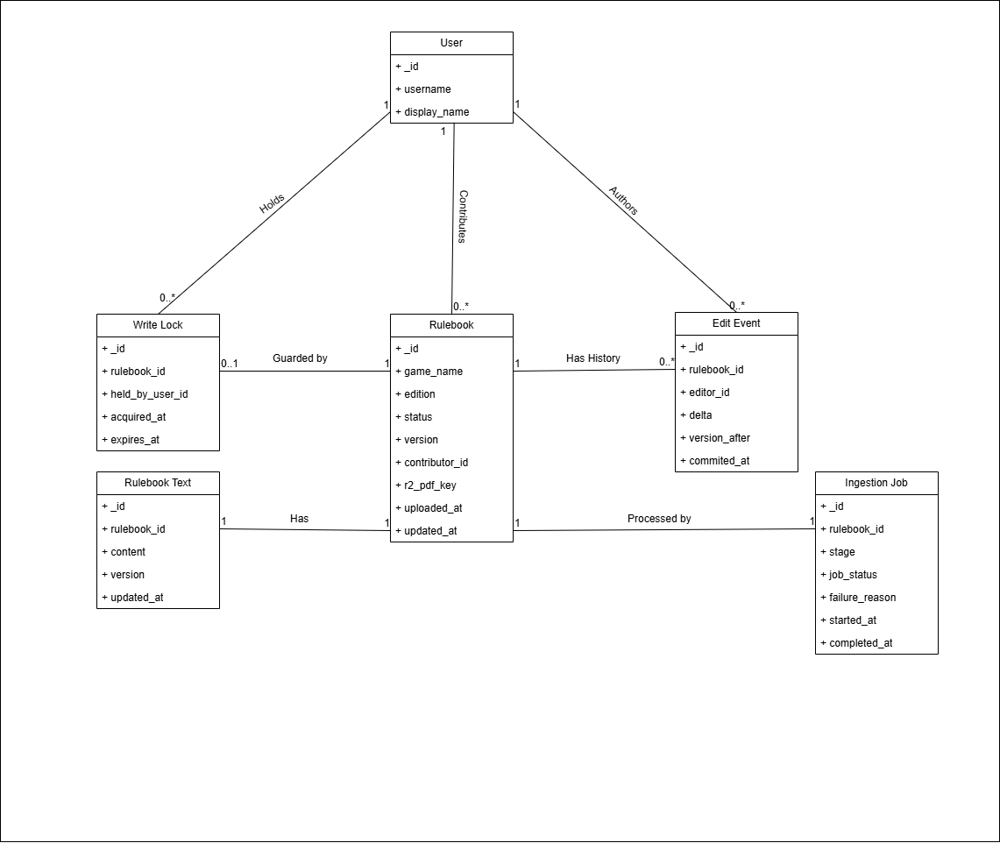
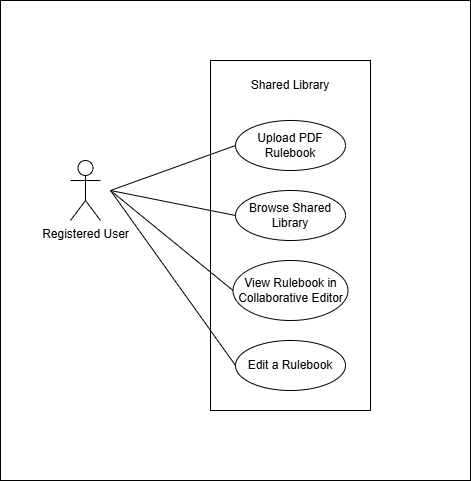
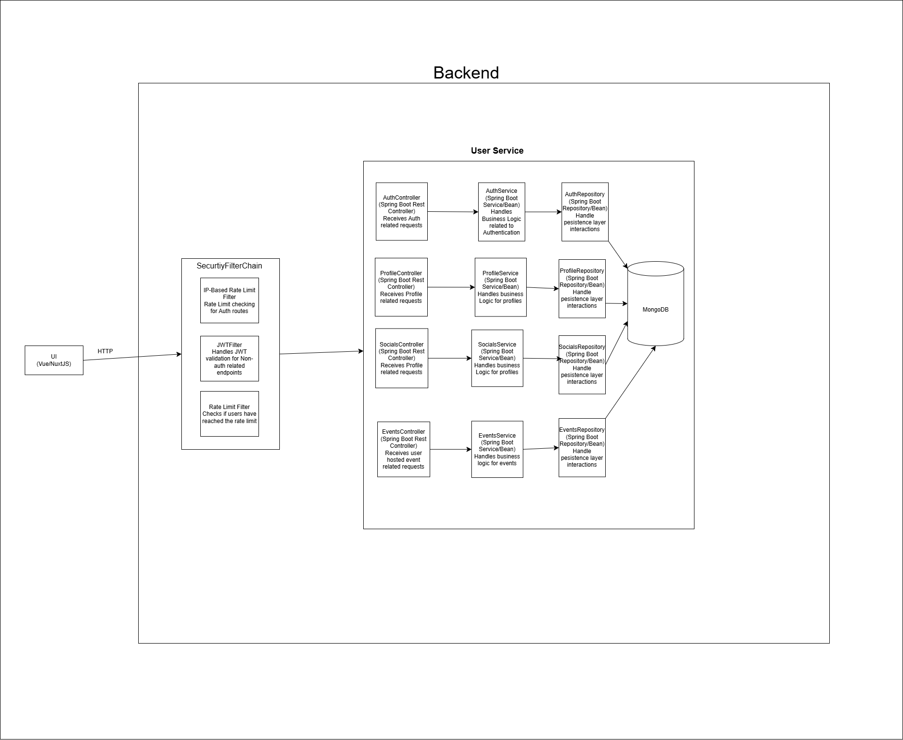
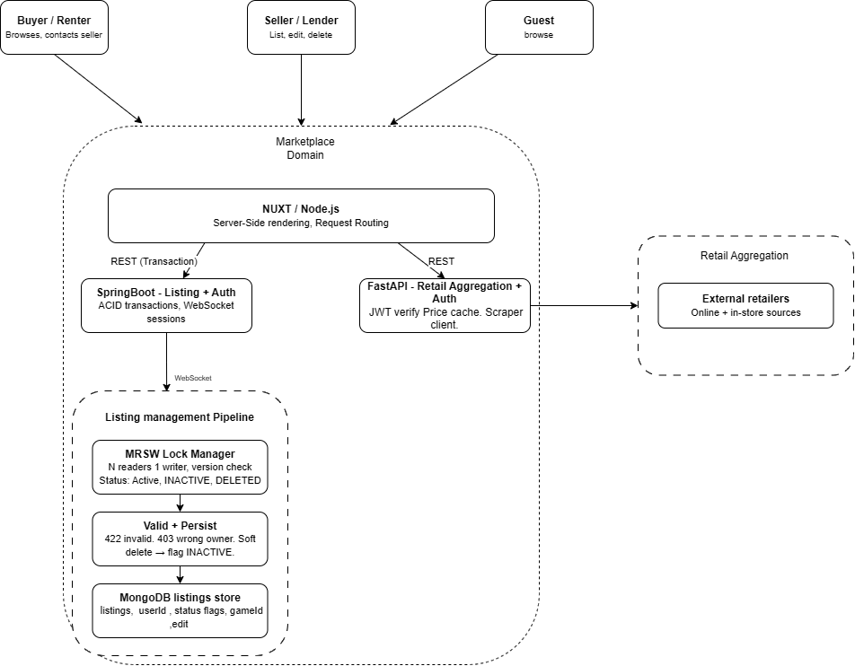

# Boardwise
## Software Requirements and Design Specifications

**Department of Computer Science**  
**Faculty of Engineering, Built Environment & IT**  
**University of Pretoria**  
**COS301 — Software Engineering**

---

**Item:** Mini Project 2026 — Phase 1  
**Team Name:** Works On My Machine

**Team Members:**

| Name | Surname | Student Number | % Contribution |
|---|---|---|---|
|Hayley\* |Booysen |u24868346 | --|
|Bandile |Mnyandu |u24675394 | --|
|Karabo |Nkomo |u24865169 |-- |
|Palesa |Nkosi |u22664638 |-- |
|Njabulo |Mathonsi |u24676412 |-- |

*\* — indicates team leader*

---

## Table of Contents

1. [Introduction](#1-introduction)
2. [Project Owner](#2-project-owner)
3. [Project Vision and Objectives](#3-project-vision-and-objectives)
4. [Functional Requirements](#4-functional-requirements)
5. [Non-Functional Requirements](#5-non-functional-requirements)
6. [Technology and Project Constraints](#6-technology-and-project-constraints)
7. [User Characteristics](#7-user-characteristics)
8. [System Domain Model](#8-system-domain-model)
9. [Subsystems](#9-subsystems)
   - [9.1 User Service (Including Community)](#91-user-service-including-community)
   - [9.2 Marketplace Service](#92-marketplace-service)
   - [9.3 Shared Library — The Vault](#93-shared-library--the-vault)
10. [API Service Contracts](#10-api-service-contracts)
    - [10.1 User Service API Contracts](#101-user-service-api-contracts)
    - [10.2 Marketplace API Contracts](#102-marketplace-api-contracts)
    - [10.3 The Vault API Contracts](#103-the-vault-api-contracts)
11. [Traceability Matrix](#11-traceability-matrix)
12. [Architectural Requirements](#12-architectural-requirements)
    - [12.1 Overall Software Architecture](#121-overall-software-architecture)
    - [12.2 Architectural Quality Requirements](#122-architectural-quality-requirements)
    - [12.3 Architectural Constraints](#123-architectural-constraints)
    - [12.4 Architectural Components](#124-architectural-components)
    - [12.5 Summary](#125-summary)

---

## 1. Introduction

Boardwise is a comprehensive platform designed to digitise and expand the board game experience for enthusiasts, particularly within the South African market. The South African board gaming community remains largely offline and fragmented; local stores host gaming days, but enthusiasts are often tied to specific retail locations to find community. Boardwise centralises this ecosystem, providing a store-agnostic platform where the community can connect, rent, and organise events independently.

The platform addresses key community problems: enabling peer-to-peer (P2P) transactions (rental and sale) without dependence on a single retailer, fostering community formation through groups and events, and democratising access to board game knowledge through a collaboratively maintained shared library of rulebooks.

**Scope Note:** This document reflects the requirements in scope for **Sprint 1 (Demo 1)**. The focus is on delivering a functional MVP with core CRUD capabilities across all system domains. The following features are explicitly deferred to future sprints and are **not covered** by this document: personalised recommendation systems, RAG-based natural language query interface, PWA installability, Generative Game Architect (AI Innovation), Setup Wizard, app theming, price comparison, and automated retrieval of rulebooks from the internet.

---

## 2. Project Owner

Name: Saskia Steyn  
Email: saskia.steyn@labs.epiuse.com

---

## 3. Project Vision and Objectives

Boardwise is a comprehensive digital ecosystem for board game enthusiasts that **optimises collection management and community engagement**. The platform features a peer-to-peer marketplace, a community events hub, and a shared digital vault for storing and collaboratively maintaining board game rulebooks.

Designed to foster local gaming networks, the application facilitates peer-to-peer game rentals and a thematic event-hosting system for organised play. By consolidating discovery, logistics, and social coordination into a single interface, it streamlines the hobby for players and collectors alike.

The objectives of the system are to:

- Provide a digital home for board game collections and community interaction in South Africa.
- Enable peer-to-peer transactions (rental and sale) without dependence on a single retailer.
- Foster community formation through groups, events, and social connections.
- Democratise access to board game knowledge through a collaboratively maintained shared library of rulebooks.

---

## 4. Functional Requirements

### 4.1 User Profile & Social Domain

- **FR1.1:** The system must allow users to create, read, update, and delete (CRUD) personal profiles.
- **FR1.2:** The system must enable users to maintain a digital inventory of owned board games.
- **FR1.3:** The system must record and store user genre and game mechanic preferences.
- **FR1.4:** The system must facilitate sending, accepting, and rejecting friend requests to form peer groups.

### 4.2 Marketplace Domain

- **FR2.1:** The system must display user-generated listings for board game rentals and sales, including pricing and availability.
- **FR2.2:** The system must allow users to create and manage their own rental and sale listings.
- **FR2.3:** The system must aggregate and display external retail purchasing links (online and in-store) for specific board games.

### 4.3 Community & Events Domain

- **FR3.1:** The system must allow users to schedule gaming events, defining parameters such as date, time, game, and visibility (Public or Private).
- **FR3.2:** The system must process event RSVPs, allowing users to join or decline event invitations.

### 4.4 Shared Library Domain (The Vault)

- **FR4.1:** The system must accept and store user-uploaded PDF documents representing board game rulebooks.
- **FR4.2:** The system must provide a collaborative interface allowing users to view and update existing rulebook text.
### 4.5 UI & Usability

- **FR5.1:** The system must provide contextual help text or tooltips for complex interactions (e.g., uploading a rulebook to The Vault or setting up a P2P rental listing).

---

## 5. Non-Functional Requirements

### 5.1 Performance & Hardware Compatibility

- **NFR1.1:** The Vue.js Shared Library interface must process collaborative rulebook updates dynamically without requiring a full page reload.
- **NFR1.2:** The application frontend must be optimised to achieve fast initial load times and maintain smooth UI performance across mid-range mobile and desktop devices.
- **NFR1.3:** The system must handle real-time state updates gracefully under stable network conditions, with fallback states (e.g., loading skeletons) for slower connections.

### 5.2 Usability & Accessibility

- **NFR2.1:** The user interface must be fully responsive, scaling automatically to accommodate multiple screen sizes (mobile, tablet, and desktop).
- **NFR2.2:** The system must be accessible to users with disabilities, adhering to WCAG 2.1 Level AA guidelines, including sufficient contrast ratios, screen-reader compatibility, and full keyboard navigation support.

### 5.3 Security & Reliability

- **NFR3.1:** All P2P rental contracts and associated booking data processed by the Spring Boot backend must be ACID compliant.
- **NFR3.2:** The Shared Library must implement Multi-Reader Single-Writer (MRSW) versioning to prevent data corruption when multiple users attempt to edit a rulebook simultaneously.
- **NFR3.3:** The application must adhere to data privacy best practices, including encrypting passwords at rest and utilising secure JWTs for session management.

---

## 6. Technology and Project Constraints

- **CON1 (Licensing):** The entire system codebase must be released and maintained under an Open Source licence.
- **CON2 (Infrastructure):** All backend services (Spring Boot core, Node.js BFF, FastAPI AI Gateway, and MongoDB database) must be hosted exclusively on free cloud platform services or within standard free-tier limits.
- **CON3 (Target Hardware):** The application architecture must remain lightweight enough that both client-side rendering (Vue.js) and server-side processing do not demand high-end hardware, targeting optimisation for mid-range device groups.

---

## 7. User Characteristics

The Boardwise platform serves several distinct user types, each interacting with the system in different ways:

**Registered User (General):** Any authenticated user of the platform. They have access to all core features including profile management, game inventory, social features, marketplace browsing, event participation, and the Shared Library. They can take on more specific roles within the Vault.

**Guest User:** An unauthenticated visitor. Limited to browsing public marketplace listings and viewing basic game information. Cannot create listings, access the Vault, or interact with community features.

**Contributor (Vault):** A registered user who uploads PDF rulebooks to the Shared Library. Requires a valid authenticated session. Responsible for providing quality, correctly attributed rulebook documents.

**Collaborator (Vault):** A registered user who edits and maintains rulebook text in the Shared Library's collaborative editor. Must acquire an exclusive write lock before editing. Responsible for correcting errors and applying official publisher errata.

**Event Organiser:** A registered user who creates and manages gaming events. Controls event visibility (Public or Private), date, game, and attendee management.

**Listing Owner (Marketplace):** A registered user who creates, edits, or removes their own rental or sale listings in the marketplace. Responsible for the accuracy and availability of their listings.

---

## 8. System Domain Model

The system domain model illustrates the core entities across all subsystems and their relationships. The system is divided into three primary logical subsystems: the User Service (encompassing profiles, social features, and events), the Marketplace Service, and the Shared Library (The Vault).

The User entity is central to the entire system, forming the primary actor in all interactions across all domains. Each subsystem maintains its own set of domain classes, with cross-subsystem interactions mediated through service API calls rather than direct class coupling.


---

## 9. Subsystems

### 9.1 User Service (Including Community)

The User Service is responsible for managing all user-centric data and interactions on the Boardwise platform. This subsystem encompasses authentication (registration, login, logout), profile management (create, update, delete), game inventory management, user preference management, social features (friend requests and groups), and community features (events and RSVPs). It serves as the identity and social backbone of the platform that all other subsystems depend upon for user context.

#### 9.1.1 Domain Model

The User Service domain model centres on the `User` class, which holds core identity and profile attributes. The `User` maintains associations with `Boardgame` (ownership), `FriendRequest` (social connectivity), `Preferences` (genre and mechanic preferences), `Event` (creation and attendance), and `Group` (membership). The `FriendRequest` entity tracks the sender, receiver, and status of a connection request.


#### 9.1.2 User Stories

---

**Epic: Authentication**

##### US-AUTH-01: Register an Account

**As a user, I want to register an account, so that I can access the Boardwise platform and its features.**

**Acceptance Criteria:**
- Given I am on the registration page, when I provide a valid username, email address, and password and submit the form, then a new account is created and I am redirected to my profile setup page.
- Given I am on the registration page, when I submit the form with an email address that is already registered, then the system displays an error message informing me that the email is already in use.
- Given I am on the registration page, when I submit the form with any required field left empty, then the system displays a validation error and does not create an account.
- Given I have successfully registered, then my password is stored in an encrypted format and is never stored in plain text.

---

##### US-AUTH-02: Log Into an Account

**As a user, I want to log into my account, so that I can access my personalised profile and platform features.**

**Acceptance Criteria:**
- Given I am on the login page, when I provide a valid registered email and correct password, then I am authenticated and redirected to my home feed.
- Given I am on the login page, when I provide an incorrect password or unregistered email, then the system displays a generic error message and does not grant access.
- Given I have successfully logged in, then a secure JWT is issued and used to manage my session.
- Given I am on the login page, when I leave any required field empty and submit, then the system displays a validation error.

---

##### US-AUTH-03: Log Out of an Account

**As a user, I want to log out of my account, so that I can ensure my account is secure when I am done using the platform.**

**Acceptance Criteria:**
- Given I am logged in, when I select the logout option, then my session is terminated, my JWT is invalidated, and I am redirected to the login page.
- Given I have logged out, when I attempt to navigate to a protected page, then I am redirected to the login page and access is denied.

---

**Epic: Profile Management**

##### US-PROF-01: Create a Profile

**As a user, I want to create a personal profile, so that other users can identify me and I can personalise my experience on the platform.**

**Acceptance Criteria:**
- Given I have just registered, when I am directed to the profile setup page, then I can enter a display name, bio, and profile picture.
- Given I am setting up my profile, when I submit the form with at least a display name, then my profile is created and saved successfully.
- Given I am setting up my profile, when I submit the form without a display name, then the system displays a validation error and does not save the profile.

---

##### US-PROF-02: View a Profile

**As a user, I want to view my profile and the profiles of other users, so that I can see their information, game collections, and gaming preferences.**

**Acceptance Criteria:**
- Given I am logged in, when I navigate to my profile page, then I can see my display name, bio, profile picture, game inventory, and preferred genres and mechanics.
- Given I am logged in, when I navigate to another user's profile page, then I can see their display name, bio, profile picture, game inventory, and preferred genres and mechanics in a read-only view.
- Given a profile does not exist, when I navigate to that profile's URL, then the system displays a not-found message.

---

##### US-PROF-03: Update a Profile

**As a user, I want to update my profile information, so that I can keep my details accurate and up to date.**

**Acceptance Criteria:**
- Given I am on my profile page, when I select the edit option, then I can modify my display name, bio, and profile picture.
- Given I am editing my profile, when I save my changes with a valid display name, then the updated information is saved and reflected on my profile immediately.
- Given I am editing my profile, when I attempt to save with the display name field empty, then the system displays a validation error and does not save the changes.

---

##### US-PROF-04: Delete a Profile

**As a user, I want to delete my account and profile, so that I can remove my personal data from the platform.**

**Acceptance Criteria:**
- Given I am on my account settings page, when I select the delete account option, then the system prompts me to confirm the action before proceeding.
- Given I have confirmed the deletion, when the system processes the request, then my profile, game inventory, preferences, and associated data are permanently removed.
- Given my account has been deleted, when I attempt to log in with my previous credentials, then the system displays an error and denies access.

---

**Epic: Game Inventory**

##### US-INV-01: Add a Game to My Inventory

**As a user, I want to add board games to my digital inventory, so that I can keep track of the games I own.**

**Acceptance Criteria:**
- Given I am on my profile or inventory page, when I search for a board game and select it, then it is added to my game inventory.
- Given I attempt to add a game that already exists in my inventory, then the system displays a message informing me the game is already in my collection and does not create a duplicate entry.

---

##### US-INV-02: View a Game Inventory

**As a user, I want to view my own game inventory and the inventories of other users, so that I can see what board games are owned across the platform.**

**Acceptance Criteria:**
- Given I am on my profile page, when I navigate to my inventory, then I can see a list of all board games I have added, with options to manage them.
- Given I am viewing another user's profile, when I navigate to their inventory section, then I can see a read-only list of the board games they own, with no ability to modify their collection.
- Given a user's inventory is empty, when I navigate to their inventory section, then the system displays a message indicating no games have been added yet.

---

##### US-INV-03: Remove a Game from My Inventory

**As a user, I want to remove a board game from my inventory, so that I can keep my collection accurate if I no longer own a game.**

**Acceptance Criteria:**
- Given I am viewing my inventory, when I select the remove option on a game, then the system prompts me to confirm the action.
- Given I have confirmed the removal, then the game is removed from my inventory and no longer appears in my collection.

---

**Epic: Preferences**

##### US-PREF-01: Set Game Preferences

**As a user, I want to set my board game genre and mechanic preferences, so that other users can see what I enjoy.**

**Acceptance Criteria:**
- Given I am on my profile or settings page, when I navigate to preferences, then I can select from a list of available genres and game mechanics.
- Given I have selected my preferences, when I save them, then they are stored and displayed on my profile in a read-only view for other users.
- Given I have not set any preferences, when I visit the preferences page, then the system displays all options in an unselected state.
- Given another user is viewing my profile, when they view my preferences, then they can see my selected genres and mechanics but cannot modify them.

---

##### US-PREF-02: Update Game Preferences

**As a user, I want to update my genre and mechanic preferences, so that my profile reflects changes in my gaming interests over time.**

**Acceptance Criteria:**
- Given I am on the preferences page, when I modify my selected genres or mechanics and save, then the updated preferences are stored and reflected immediately.

---

**Epic: Social — Friends**

##### US-SOC-01: Send a Friend Request

**As a user, I want to send a friend request to another user, so that I can connect with them on the platform.**

**Acceptance Criteria:**
- Given I am viewing another user's profile, when I select the add friend option, then a friend request is sent to that user.
- Given I have already sent a friend request to a user, when I view their profile, then the add friend option is replaced with a pending status indicator.
- Given the other user has already sent me a friend request, when I attempt to send one to them, then the system instead presents me with the option to accept their existing request.

---

##### US-SOC-02: Accept or Reject a Friend Request

**As a user, I want to accept or reject incoming friend requests, so that I can control who is in my friend network.**

**Acceptance Criteria:**
- Given I have received a friend request, when I navigate to my notifications or friend requests page, then I can see the request with options to accept or reject.
- Given I accept a friend request, then both users are added to each other's friends list.
- Given I reject a friend request, then the request is removed and the requesting user is not added to my friends list.

---

##### US-SOC-03: View Friends List

**As a user, I want to view my friends list, so that I can see all the users I am connected with.**

**Acceptance Criteria:**
- Given I am on my profile or friends page, when I navigate to my friends list, then I can see all users I am currently friends with, including their display names and profile pictures.
- Given I have no friends added, when I navigate to my friends list, then the system displays a message indicating my friends list is empty.

---

##### US-SOC-04: Unfriend a User

**As a user, I want to remove a user from my friends list, so that I can manage my social connections on the platform.**

**Acceptance Criteria:**
- Given I am viewing my friends list or a friend's profile, when I select the unfriend option, then the system prompts me to confirm the action.
- Given I confirm the unfriend action, then the user is removed from my friends list and I am removed from theirs.
- Given I have unfriended a user, when I view their profile, then the add friend option is displayed again.

---

**Epic: Social — Groups**

##### US-GRP-01: Create a Group

**As a user, I want to create a group, so that I can organise a dedicated space for a specific set of users to connect.**

**Acceptance Criteria:**
- Given I am on the groups page, when I select the create group option and provide a group name, then a new group is created with me as the owner.
- Given I am creating a group, when I submit the form without a group name, then the system displays a validation error and does not create the group.
- Given I have created a group, then I am automatically added as a member of that group.

---

##### US-GRP-02: Join a Group

**As a user, I want to join an existing group, so that I can connect with other users who share my board gaming interests.**

**Acceptance Criteria:**
- Given I am browsing or searching groups, when I select the join option on a public group, then I am added as a member of that group.
- Given I am already a member of a group, when I view that group, then the join option is not displayed.

---

##### US-GRP-03: View a Group

**As a user, I want to view a group's details and members, so that I can see who is part of the group.**

**Acceptance Criteria:**
- Given I am a member of a group, when I navigate to the group's page, then I can see the group name, description, and a list of its members.
- Given I am not a member of a public group, when I navigate to the group's page, then I can see the group's basic details but am prompted to join.

---

**Epic: Community — Events**

##### US-EVT-01: Schedule an Event

**As a user, I want to schedule a gaming event, so that I can organise a session for other users to join.**

**Acceptance Criteria:**
- Given I am on the events page, when I select the create event option and provide a name, date, time, and game, then a new event is created and saved.
- Given I am creating an event, when I set the visibility to Private, then only users I invite or friends can see and join the event.
- Given I am creating an event, when I set the visibility to Public, then any user on the platform can see and join the event.
- Given I submit the event creation form with any required field missing, then the system displays a validation error and does not create the event.

---

##### US-EVT-02: View Events

**As a user, I want to view available gaming events, so that I can find sessions to join.**

**Acceptance Criteria:**
- Given I am on the events page, when I browse the events list, then I can see all public events and any private events I have been invited to.
- Given there are no events available, when I navigate to the events page, then the system displays a message indicating no events are currently scheduled.

---

##### US-EVT-03: Update an Event

**As a user, I want to update the details of an event I have created, so that I can keep the event information accurate.**

**Acceptance Criteria:**
- Given I am the creator of an event, when I navigate to the event and select the edit option, then I can modify the event name, date, time, game, and visibility.
- Given I have made changes to the event, when I save, then the updated details are reflected immediately for all users who can view the event.
- Given I am not the creator of an event, when I view that event, then no edit option is presented to me.

---

##### US-EVT-04: RSVP to an Event

**As a user, I want to RSVP to a gaming event, so that the event organiser knows I plan to attend.**

**Acceptance Criteria:**
- Given I am viewing a public event or a private event I have been invited to, when I select the join option, then my RSVP is recorded and I am added to the event's attendee list.
- Given I have already joined an event, when I view that event, then the join option is replaced with an option to decline or withdraw my RSVP.
- Given I select the decline option on an event I have joined, then I am removed from the attendee list.

---

#### 9.1.3 Use Cases


##### UC-AUTH-01: Register an Account

| Field | Detail |
|---|---|
| **Use Case ID** | UC-AUTH-01 |
| **Use Case Name** | Register an Account |
| **Actor(s)** | Unregistered User |
| **Description** | A new user registers for a Boardwise account by providing their credentials. |
| **Preconditions** | The user does not have an existing Boardwise account. The user is on the registration page. |
| **Postconditions** | A new user account is created and persisted in the system. The user is redirected to the profile setup page. |
| **Basic Flow** | 1. User navigates to the registration page. <br> 2. User enters a valid username, email address, and password. <br> 3. User submits the registration form. <br> 4. System validates that all fields are populated and the email is not already registered. <br> 5. System creates a new account with the password encrypted at rest. <br> 6. System redirects the user to the profile setup page. |
| **Alternative Flow** | **4a.** Email already registered — the system displays an error message and halts account creation. |
| **Exception Flow** | **3a.** Any required field is empty — the system displays a validation error and does not submit the form. |
| **Related FR** | FR1.1 |

---

##### UC-AUTH-02: Log Into an Account

| Field | Detail |
|---|---|
| **Use Case ID** | UC-AUTH-02 |
| **Use Case Name** | Log Into an Account |
| **Actor(s)** | Registered User |
| **Description** | A registered user authenticates with their credentials to access the platform. |
| **Preconditions** | The user has an existing registered account. The user is on the login page. |
| **Postconditions** | The user is authenticated and a secure JWT is issued for session management. The user is redirected to their home feed. |
| **Basic Flow** | 1. User navigates to the login page. <br> 2. User enters their registered email address and password. <br> 3. User submits the login form. <br> 4. System validates the credentials against the stored account. <br> 5. System issues a secure JWT for session management. <br> 6. System redirects the user to their home feed. |
| **Alternative Flow** | **4a.** Email is not registered or password is incorrect — the system displays a generic error message and does not grant access. |
| **Exception Flow** | **3a.** Any required field is empty — the system displays a validation error and does not submit the form. |
| **Related FR** | FR1.1 |

---

##### UC-AUTH-03: Log Out of an Account

| Field | Detail |
|---|---|
| **Use Case ID** | UC-AUTH-03 |
| **Use Case Name** | Log Out of an Account |
| **Actor(s)** | Registered User |
| **Description** | An authenticated user terminates their session to secure their account. |
| **Preconditions** | The user is logged in with an active session. |
| **Postconditions** | The user's session is terminated and their JWT is invalidated. The user is redirected to the login page. |
| **Basic Flow** | 1. User selects the logout option from the application. <br> 2. System invalidates the user's active JWT. <br> 3. System terminates the session. <br> 4. System redirects the user to the login page. |
| **Alternative Flow** | None. |
| **Exception Flow** | If the user attempts to navigate to a protected page after logging out, the system redirects them to the login page and denies access. |
| **Related FR** | FR1.1 |

---

##### UC-PROF-01: Manage Profile

| Field | Detail |
|---|---|
| **Use Case ID** | UC-PROF-01 |
| **Use Case Name** | Manage Profile |
| **Actor(s)** | Registered User |
| **Description** | A registered user creates, updates, or deletes their personal profile on the platform. |
| **Preconditions** | The user is authenticated and has an active session. |
| **Postconditions** | **Create:** A new profile is persisted and associated with the user's account. **Update:** The updated profile information is saved and immediately reflected. **Delete:** The user's profile and all associated data are permanently removed and the account is deactivated. |
| **Basic Flow** | **Create:** 1. System directs the user to the profile setup page following registration. 2. User enters a display name, bio, and optionally uploads a profile picture. 3. User submits the form. 4. System validates that a display name has been provided. 5. System saves the profile and redirects the user to their profile page. <br><br> **Update:** 1. User navigates to their profile and selects the edit option. 2. User modifies their display name, bio, or profile picture. 3. User saves the changes. 4. System validates that the display name field is not empty. 5. System persists the updated information and reflects the changes immediately. <br><br> **Delete:** 1. User navigates to account settings and selects delete account. 2. System presents a confirmation prompt. 3. User confirms the deletion. 4. System permanently removes the user's profile, game inventory, preferences, and all associated data. 5. System deactivates the account and redirects the user to the login page. |
| **Alternative Flow** | **Delete 3a.** User dismisses the confirmation prompt — no action is taken and the user is returned to their settings page. |
| **Exception Flow** | **Create/Update:** If the user submits without a display name, the system displays a validation error and does not save. |
| **Related FR** | FR1.1 |

---


##### UC-PROF-02: View a Profile

| Field | Detail |
|---|---|
| **Use Case ID** | UC-PROF-02 |
| **Use Case Name** | View a Profile |
| **Actor(s)** | Registered User |
| **Description** | A registered user views their own profile or the profile of another user, including their game inventory and gaming preferences. |
| **Preconditions** | The user is authenticated and has an active session. The profile being viewed exists in the system. |
| **Postconditions** | The requested profile information is displayed to the user. |
| **Basic Flow** | **Own Profile:** 1. User navigates to their profile page. 2. System retrieves and displays the user's display name, bio, profile picture, game inventory, and preferred genres and mechanics. <br><br> **Another User's Profile:** 1. User navigates to another user's profile page. 2. System retrieves and displays that user's display name, bio, profile picture, game inventory, and preferred genres and mechanics in a read-only view. |
| **Alternative Flow** | None. |
| **Exception Flow** | If the requested profile does not exist, the system displays a not-found message. |
| **Related FR** | FR1.1, FR1.2, FR1.3 |

---

##### UC-PROF-03: Manage Game Inventory

| Field | Detail |
|---|---|
| **Use Case ID** | UC-PROF-03 |
| **Use Case Name** | Manage Game Inventory |
| **Actor(s)** | Registered User |
| **Description** | A registered user adds or removes board games from the game inventory on their profile. |
| **Preconditions** | The user is authenticated and has an active session. The user has an existing profile. |
| **Postconditions** | **Add:** The selected board game is added to the user's inventory and persisted. **Remove:** The selected board game is removed from the user's inventory. |
| **Basic Flow** | **Add:** 1. User navigates to their profile and selects the inventory section. 2. User searches for a board game by name. 3. User selects the desired game from the search results. 4. System adds the game to the user's inventory and persists the change. <br><br> **Remove:** 1. User navigates to the inventory section of their profile. 2. User selects the remove option on a game. 3. System presents a confirmation prompt. 4. User confirms the removal. 5. System removes the game from the inventory and persists the change. |
| **Alternative Flow** | **Remove 4a.** User dismisses the confirmation prompt — no action is taken and the game remains in the inventory. |
| **Exception Flow** | **Add:** If the selected game already exists in the user's inventory, the system displays an informational message and does not create a duplicate entry. |
| **Related FR** | FR1.2 |

---

##### UC-PROF-04: Manage Game Preferences

| Field | Detail |
|---|---|
| **Use Case ID** | UC-PROF-04 |
| **Use Case Name** | Manage Game Preferences |
| **Actor(s)** | Registered User |
| **Description** | A registered user sets or updates their board game genre and mechanic preferences, which are stored as part of their profile and visible to other users in a read-only view. |
| **Preconditions** | The user is authenticated and has an active session. The user has an existing profile. |
| **Postconditions** | The user's selected genre and mechanic preferences are persisted and displayed on their profile in a read-only view for other users. |
| **Basic Flow** | **Set:** 1. User navigates to their profile and selects the preferences section. 2. System displays a list of available genres and game mechanics in an unselected state. 3. User selects their preferred genres and mechanics. 4. User saves their preferences. 5. System persists the selections and displays them on the user's profile. <br><br> **Update:** 1. User navigates to the preferences section. 2. System displays available genres and mechanics with current selections highlighted. 3. User modifies their selections and saves. 4. System persists the updated preferences and reflects the changes immediately on the user's profile. |
| **Alternative Flow** | None. |
| **Exception Flow** | None. |
| **Related FR** | FR1.3 |

---


##### UC-SOC-01: Manage Friend Requests

| Field | Detail |
|---|---|
| **Use Case ID** | UC-SOC-01 |
| **Use Case Name** | Manage Friend Requests |
| **Actor(s)** | Registered User |
| **Description** | A registered user sends, accepts, or rejects friend requests to form peer connections on the platform. |
| **Preconditions** | The user is authenticated and has an active session. Both users involved have existing profiles. |
| **Postconditions** | **Send:** A pending friend request is created between the two users. **Accept:** Both users are added to each other's friends lists and the request is resolved. **Reject:** The friend request is removed and no connection is established. |
| **Basic Flow** | **Send:** 1. User navigates to another user's profile and selects the add friend option. 2. System creates a pending friend request and notifies the recipient. 3. System updates the add friend option to a pending status indicator. <br><br> **Accept/Reject:** 1. User navigates to their notifications or friend requests page. 2. User views the incoming friend request and selects accept or reject. 3. On accept, both users are added to each other's friends lists and the request is resolved. On reject, the request is removed and no connection is established. |
| **Alternative Flow** | **Send:** If the target user has already sent the acting user a friend request, the system presents the option to accept that existing request instead of creating a new one. |
| **Exception Flow** | **Send:** If a pending request already exists between the two users, the system does not create a duplicate and displays the pending status indicator. |
| **Related FR** | FR1.4 |

---

##### UC-SOC-02: Manage Friends List

| Field | Detail |
|---|---|
| **Use Case ID** | UC-SOC-02 |
| **Use Case Name** | Manage Friends List |
| **Actor(s)** | Registered User |
| **Description** | A registered user views their friends list or removes an existing friend connection from the platform. |
| **Preconditions** | The user is authenticated and has an active session. |
| **Postconditions** | **View:** The user's current friends list is displayed. **Unfriend:** The connection between both users is permanently removed from each other's friends lists. |
| **Basic Flow** | **View:** 1. User navigates to their profile or friends page. 2. System retrieves and displays all current friends, showing their display names and profile pictures. <br><br> **Unfriend:** 1. User navigates to their friends list or a friend's profile and selects the unfriend option. 2. System presents a confirmation prompt. 3. User confirms the action. 4. System removes the connection from both users' friends lists. 5. System displays the add friend option on the unfriended user's profile. |
| **Alternative Flow** | **View:** If the user has no friends, the system displays a message indicating the friends list is empty. **Unfriend 3a.** User dismisses the confirmation prompt — no action is taken and the friend connection is retained. |
| **Exception Flow** | None. |
| **Related FR** | FR1.4 |

---

##### UC-SOC-03: Manage Groups

| Field | Detail |
|---|---|
| **Use Case ID** | UC-SOC-03 |
| **Use Case Name** | Manage Groups |
| **Actor(s)** | Registered User |
| **Description** | A registered user creates a new group, joins an existing group, or views a group's details and members. |
| **Preconditions** | The user is authenticated and has an active session. |
| **Postconditions** | **Create:** A new group is persisted with the user assigned as owner and first member. **Join:** The user is added as a member of the selected group. **View:** Group details and members are displayed to the user. |
| **Basic Flow** | **Create:** 1. User navigates to the groups page and selects the create group option. 2. User provides a group name and optional description. 3. System validates that a group name has been provided. 4. System creates the group, assigns the user as owner, and automatically adds them as the first member. <br><br> **Join:** 1. User browses or searches groups. 2. User selects the join option on a public group. 3. System adds the user as a member. <br><br> **View:** 1. User navigates to a group's page. 2. If a member, the system displays the group name, description, and full member list. 3. If not a member, the system displays basic details and presents the join option. |
| **Alternative Flow** | None. |
| **Exception Flow** | **Create:** If the user submits without a group name, the system displays a validation error and does not create the group. |
| **Related FR** | FR1.4 |

---


##### UC-EVT-01: Manage Events

| Field | Detail |
|---|---|
| **Use Case ID** | UC-EVT-01 |
| **Use Case Name** | Manage Events |
| **Actor(s)** | Registered User |
| **Description** | A registered user creates a new gaming event or updates the details of an existing event they own. |
| **Preconditions** | The user is authenticated and has an active session. |
| **Postconditions** | **Create:** A new event is persisted and made visible according to the selected visibility setting. **Update:** The event's updated details are persisted and reflected immediately for all users who can view it. |
| **Basic Flow** | **Create:** 1. User navigates to the events page and selects the create event option. 2. User provides an event name, date, time, game, and visibility setting. 3. System validates all required fields are populated. 4. System creates the event and makes it visible according to the selected setting. <br><br> **Update:** 1. User navigates to an event they have created and selects the edit option. 2. User modifies the desired fields. 3. System validates and persists the changes. 4. System reflects the updated details immediately for all users who can view the event. |
| **Alternative Flow** | None. |
| **Exception Flow** | **Create:** If any required field is empty, the system displays a validation error and does not save. **Update:** If the user attempting to edit is not the event creator, the system does not display the edit option and denies access. |
| **Related FR** | FR3.1 |

---

##### UC-EVT-02: View Events

| Field | Detail |
|---|---|
| **Use Case ID** | UC-EVT-02 |
| **Use Case Name** | View Events |
| **Actor(s)** | Registered User |
| **Description** | A registered user browses available gaming events to find sessions to join. |
| **Preconditions** | The user is authenticated and has an active session. |
| **Postconditions** | The user is presented with a list of events visible to them. |
| **Basic Flow** | 1. User navigates to the events page. 2. System retrieves all public events and any private events the user has been invited to. 3. System displays the events list. |
| **Alternative Flow** | None. |
| **Exception Flow** | If no events are available, the system displays a message indicating no events are currently scheduled. |
| **Related FR** | FR3.1 |

---

##### UC-EVT-03: RSVP to an Event

| Field | Detail |
|---|---|
| **Use Case ID** | UC-EVT-03 |
| **Use Case Name** | RSVP to an Event |
| **Actor(s)** | Registered User |
| **Description** | A registered user joins or withdraws from a gaming event to indicate their attendance intention. |
| **Preconditions** | The user is authenticated and has an active session. The event exists and is visible to the user. |
| **Postconditions** | **Join:** The user's RSVP is recorded and they are added to the attendee list. **Decline/Withdraw:** The user is removed from the attendee list. |
| **Basic Flow** | **Join:** 1. User selects the join option on an event. 2. System records the RSVP and adds the user to the attendee list. 3. System replaces the join option with a decline or withdraw option. <br><br> **Decline/Withdraw:** 1. User selects the decline or withdraw option on an event they have previously joined. 2. System removes the user from the attendee list and updates their RSVP status. |
| **Alternative Flow** | None. |
| **Exception Flow** | None. |
| **Related FR** | FR3.2 |

---

### 9.2 Marketplace Service

### 9.3 Shared Library - The Vault Service

The Vault is the Shared Library subsystem of Boardwise. It provides a community-maintained digital repository of board game rulebooks, accessible to all registered users. The Vault enables contributors to upload PDF rulebooks and collaborators to edit and correct rulebook text using a strict Multi-Reader Single-Writer (MRSW) concurrency model. The subsystem is built on a dual-backend architecture: Spring Boot handles transactional operations (metadata management, MRSW lock management, edit history), while FastAPI handles the PDF ingestion pipeline.

#### 9.3.1 Domain Model

The Vault domain model is centred on the `Rulebook` entity. The `IngestionPipeline` processes the uploaded PDF and creates the `Rulebook` document itself. A `Rulebook` is guarded by a `WriteLock` (the MRSW lock), has current text stored in a `RulebookText` document, and tracks all historical changes via the `EditEvent` ledger (event sourcing).



#### 9.3.2 User Stories

---

**Epic: Digital Vault Ingestion & Management**

##### US-VLT-01: Upload a Rulebook

**As a community contributor, I want to upload a PDF of a board game rulebook, so that it can be added to the Shared Library for others to view and edit.**

**Acceptance Criteria:**
- The system accepts `.pdf` file formats up to 50 MB.
- The upload UI provides a clear progress indicator and a success or failure notification.
- The raw PDF is securely stored in Cloudflare R2.
- The Nuxt BFF proxies the upload request directly to FastAPI, which validates the JWT, sanitises the PDF, extracts text, and stores metadata in MongoDB Atlas.
- The file is rejected with a clear error if it exceeds the size limit, is not a PDF, or fails sanitisation.

---

##### US-VLT-02: Browse the Vault Library

**As a tabletop player, I want to search for and view existing rulebooks in the Vault, so that I can find and read the rules for a specific game.**

**Acceptance Criteria:**
- Users can search the Vault by game title.
- The Nuxt BFF routes the search request to Spring Boot, which fetches rulebook metadata from MongoDB.
- The UI displays rulebook cards with game name, edition, upload date, version number, and contributor username.
- The interface scales appropriately for mobile and desktop screens.
- Only rulebooks with status `Ready` appear in search results.

---

**Epic: Collaborative Rulebook Editor**

##### US-VLT-03: View a Rulebook in the Editor

**As a registered user, I want to view the text content of a rulebook in the collaborative editor, so that I can read the rules without downloading the PDF.**

**Acceptance Criteria:**
- The rulebook text content loads within 2 seconds of selection.
- The current version number and last editor username are displayed.
- Multiple users may view the same rulebook simultaneously in read-only mode without conflict.
- If another user holds the write lock, a banner displays "Currently being edited by [username]" and the Edit button is disabled.

---

##### US-VLT-04: Edit a Rulebook

**As a community contributor, I want to edit a specific section of a rulebook, so that I can correct an error or add an official publisher errata.**

**Acceptance Criteria:**
- The user interface provides an "Edit" button when viewing a rulebook that is not currently locked.
- After acquiring the write lock via Spring Boot's MRSW lock manager, the editor becomes active.
- Modifying the text triggers debounced auto-save; a full page reload is never required.
- Other users viewing the document see committed changes in real time via WebSocket.

---

##### US-VLT-05: Concurrency Lock (MRSW)

**As a reader, I want to be prevented from editing a rulebook that another user is currently working on, so that our changes do not overwrite each other.**

**Acceptance Criteria:**
- Spring Boot issues an exclusive write lock to the first user who requests edit access on a rulebook.
- Other users viewing the document see a real-time banner: "Currently being edited by [username]" and the Edit button is disabled.
- If the lock holder goes idle for 30 seconds, the lock is automatically released and all readers are notified.
- WebSocket broadcasts ensure all active readers see lock state changes instantly.

---

##### US-VLT-06: Edit History

**As a Vault user, I want to view the version history of a rulebook, so that I can see what changes have been made and by whom.**

**Acceptance Criteria:**
- Spring Boot logs every edit as an immutable event in the MongoDB `EDIT_EVENT` ledger.
- Each commit increments a version counter and stores the delta.
- Authorised users can view a chronological list of changes including who made them and when.

---

#### 9.3.3 Use Cases



##### UC-VLT-01: Upload a PDF Rulebook

| Field | Detail |
|---|---|
| **Use Case ID** | UC-VLT-01 |
| **Use Case Name** | Upload a PDF Rulebook |
| **Actor(s)** | Contributor (Registered User) |
| **Description** | An authenticated user uploads a PDF rulebook to the Vault. The system sanitises and extracts the content, then makes it available to the community. |
| **Preconditions** | User is authenticated. File is in PDF format and within the size limit. Network connectivity is stable. |
| **Postconditions** | Rulebook metadata is stored in MongoDB. Raw PDF is stored in Cloudflare R2. Rulebook status is set to 'Ready'. |
| **Basic Flow** | 1. User navigates to the Vault and selects 'Upload Rulebook'. <br> 2. System presents a file picker filtered to PDF only. <br> 3. User selects a file, enters the game name, and confirms the upload. <br> 4. System displays a real-time upload progress indicator. <br> 5. The Nuxt BFF proxies the request directly to FastAPI. <br> 6. FastAPI validates the JWT, sanitises the PDF, and extracts text. <br> 7. Raw PDF and extracted text are written to Cloudflare R2; rulebook metadata is stored in MongoDB Atlas. <br> 8. Rulebook status transitions to 'Ready' and the user receives an in-app notification. |
| **Alternative Flow** | **3a.** User uploads a file without entering a game name — the system highlights the required field and prevents submission until it is filled. |
| **Exception Flow** | **2a.** User selects a non-PDF file — the system rejects it with a clear format error message. <br> **4a.** File exceeds the size limit — the system rejects the upload and prompts the user to compress or split the file. <br> **6a.** Sanitisation detects unsafe content — the file is rejected, the attempt is logged, and the user sees a plain-language error. <br> **7a.** Text extraction fails — the raw PDF is stored to R2 with status 'Pending Review' and the user is notified. <br> **8a.** Network failure mid-upload — the system presents a retry option with the file still selected. |
| **Related FR** | FR4.1 |

---

##### UC-VLT-02: View and Browse the Vault Library

| Field | Detail |
|---|---|
| **Use Case ID** | UC-VLT-02 |
| **Use Case Name** | View and Browse the Vault Library |
| **Actor(s)** | Registered User |
| **Description** | An authenticated user navigates to the Vault, browses available rulebooks, and optionally searches by game name to find a specific rulebook. |
| **Preconditions** | User is authenticated. At least one rulebook has 'Ready' status. Network connectivity is stable. |
| **Postconditions** | The user is presented with a filtered or unfiltered list of ready rulebooks. No state changes are made to any rulebook document. |
| **Basic Flow** | 1. User navigates to the Vault section of the application. <br> 2. The Nuxt BFF routes the request to Spring Boot. <br> 3. Spring Boot fetches and returns all 'Ready' rulebooks from MongoDB. <br> 4. Each rulebook card displays game name, upload date, version number, and contributor username. <br> 5. User optionally types a game name into the search bar. <br> 6. System re-queries Spring Boot and updates the displayed list. <br> 7. User selects a rulebook card to open its detail page. <br> 8. Detail page displays full metadata and options to view, edit, or download the rulebook. |
| **Alternative Flow** | **4a.** User browses without searching — all 'Ready' rulebooks are displayed in order of most recently updated. <br> **8a.** User selects 'Download PDF' — Spring Boot generates a short-lived pre-signed URL for the Cloudflare R2 object; the client downloads directly from R2. |
| **Exception Flow** | **2a.** Backend fails to return rulebooks — the system displays an error message and a retry option. <br> **5a.** Search returns no matching rulebooks — the system displays a 'No rulebooks found for [query]' message with a prompt to upload one. |
| **Related FR** | FR4.2 |

---

##### UC-VLT-03: View a Rulebook in the Collaborative Editor

| Field | Detail |
|---|---|
| **Use Case ID** | UC-VLT-03 |
| **Use Case Name** | View a Rulebook in the Collaborative Editor |
| **Actor(s)** | Registered User |
| **Description** | An authenticated user opens a rulebook in the collaborative editor to read its text content. Multiple users may view the same rulebook simultaneously in read-only mode. |
| **Preconditions** | User is authenticated. The selected rulebook has 'Ready' status. Network connectivity is stable. |
| **Postconditions** | The rulebook text is displayed to the user. No changes are made to the rulebook document or version counter. |
| **Basic Flow** | 1. User selects a rulebook and selects 'View Rulebook'. <br> 2. Nuxt routes the request to Spring Boot, which fetches the current text state from MongoDB and returns it. <br> 3. The current version number and last editor username are displayed. <br> 4. If another user holds the write lock, a banner shows 'Currently being edited by [username]'. <br> 5. The user reads the rulebook in read-only mode. <br> 6. If the active editor commits a change, the user's view updates in real time via WebSocket without a page refresh. |
| **Alternative Flow** | **4a.** No user holds the write lock — the user is presented with an 'Edit' button to request the write lock. |
| **Exception Flow** | **2a.** Text content fails to load within 2 seconds — the system displays an error and a retry option. <br> **6a.** WebSocket connection drops — the UI shows a 'Reconnecting…' banner and re-syncs to the latest version on reconnect. |
| **Related FR** | FR4.2 |

---

##### UC-VLT-04: Edit a Rulebook Collaboratively

| Field | Detail |
|---|---|
| **Use Case ID** | UC-VLT-04 |
| **Use Case Name** | Edit a Rulebook Collaboratively |
| **Actor(s)** | Collaborator — writer (primary), Collaborator — reader (secondary), Spring Boot (system) |
| **Description** | An authenticated user acquires the write lock on a rulebook and makes edits. Changes are committed to MongoDB, the version counter is incremented, and a delta is broadcast in real time to all other active viewers. |
| **Preconditions** | User is authenticated. Rulebook status is 'Ready'. No other user currently holds the write lock. |
| **Postconditions** | MongoDB contains the updated text state and an incremented version number. The edit delta is appended to the EDIT_EVENT ledger. All active readers see the latest version. |
| **Basic Flow** | 1. User opens a rulebook in read mode and selects 'Edit'. <br> 2. Spring Boot checks the lock state — no write lock is held. <br> 3. Spring Boot grants the write lock to the user; the editor becomes active. <br> 4. All other active viewers receive a WebSocket broadcast banner: 'Being edited by [username]'. <br> 5. User makes edits; each keystroke triggers a debounced auto-save. <br> 6. Spring Boot validates the edit against the current version counter. <br> 7. Edit passes the version check; Spring Boot commits the delta to MongoDB and increments the version counter. <br> 8. Delta is broadcast via WebSocket to all active readers; their views update without a refresh. <br> 9. User selects 'Done Editing'; Spring Boot releases the write lock. <br> 10. All active readers are notified that editing is now available. |
| **Alternative Flow** | **1a.** User selects 'Edit' but the write lock is held by another user — the Edit button is disabled and a banner shows 'Being edited by [username]'. |
| **Exception Flow** | **6a.** Version mismatch — Spring Boot rejects the edit, presents the latest version, and prompts the user to re-apply their change. <br> **9a.** User's session expires mid-edit — the write lock is automatically released after a 30-second idle timeout. <br> **8a.** WebSocket broadcast fails — affected readers are flagged with a 'View may be out of date' warning and prompted to refresh. |
| **Related FR** | FR4.2 |


---

## 10. API Service Contracts

### 10.1 User Service API Contracts

**Base URL:** `/api`  
All protected endpoints require a valid JWT passed as a Bearer token in the `Authorization` header. Sensitive fields such as `_id` and `password` are excluded from all responses.

---

#### AC-AUTH-01: Register a User

| Field | Detail |
|---|---|
| **Contract ID** | AC-AUTH-01 |
| **Endpoint** | `POST /api/auth/register` |
| **Description** | Registers a new user account on the Boardwise platform. Creates the user account and profile in a single operation. |
| **Authentication** | None required |

**Request Body:**
```json
{
  "username": "string",
  "email": "string",
  "password": "string",
  "displayName": "string",
  "bio": "string"
}
```

**Success Response — 201 Created:**
```json
{
  "message": "Account created successfully.",
  "user": {
    "username": "string",
    "email": "string",
    "displayName": "string",
    "bio": "string",
    "profilePicture": "string | null",
    "createdAt": "ISO8601 date string"
  }
}
```

**Error Responses:**

| Status Code | Reason |
|---|---|
| `400 Bad Request` | Missing or invalid required fields |
| `409 Conflict` | Email address or username already registered |
| `500 Internal Server Error` | Unexpected server error |

---

#### AC-AUTH-02: Log Into an Account

| Field | Detail |
|---|---|
| **Contract ID** | AC-AUTH-02 |
| **Endpoint** | `POST /api/auth/login` |
| **Description** | Authenticates a registered user and returns a JWT for session management. |
| **Authentication** | None required |

**Request Body:**
```json
{
  "email": "string",
  "password": "string"
}
```

**Success Response — 200 OK:**
```json
{
  "message": "Login successful.",
  "token": "string (JWT)",
  "user": {
    "username": "string",
    "email": "string",
    "displayName": "string",
    "profilePicture": "string | null"
  }
}
```

**Error Responses:**

| Status Code | Reason |
|---|---|
| `400 Bad Request` | Missing required fields |
| `401 Unauthorized` | Invalid email or password |
| `500 Internal Server Error` | Unexpected server error |

---

#### AC-AUTH-03: Log Out of an Account

| Field | Detail |
|---|---|
| **Contract ID** | AC-AUTH-03 |
| **Endpoint** | `POST /api/auth/logout` |
| **Description** | Terminates the authenticated user's session and invalidates their JWT. |
| **Authentication** | Bearer token required |

**Success Response — 200 OK:**
```json
{
  "message": "Logged out successfully."
}
```

**Error Responses:**

| Status Code | Reason |
|---|---|
| `401 Unauthorized` | Missing or invalid JWT |
| `500 Internal Server Error` | Unexpected server error |

---

#### AC-PROF-01: Get a User Profile

| Field | Detail |
|---|---|
| **Contract ID** | AC-PROF-01 |
| **Endpoint** | `GET /api/users/:username` |
| **Description** | Retrieves the full profile view for a user, including their bio, game inventory, and social counts. |
| **Authentication** | Bearer token required |

**Success Response — 200 OK:**
```json
{
  "username": "string",
  "displayName": "string",
  "bio": "string",
  "profilePicture": "string | null",
  "friendCount": "number",
  "groupCount": "number",
  "ownedGameCount": "number",
  "games": [
    {
      "title": "string",
      "description": "string",
      "image": "string | null",
      "genre": ["string"],
      "mechanics": ["string"]
    }
  ],
  "preferences": {
    "genres": ["string"],
    "mechanics": ["string"]
  },
  "createdAt": "ISO8601 date string"
}
```

**Error Responses:**

| Status Code | Reason |
|---|---|
| `401 Unauthorized` | Missing or invalid JWT |
| `404 Not Found` | User with the given username does not exist |
| `500 Internal Server Error` | Unexpected server error |

---

#### AC-PROF-02: Update a User Profile

| Field | Detail |
|---|---|
| **Contract ID** | AC-PROF-02 |
| **Endpoint** | `PATCH /api/users/:username` |
| **Description** | Updates the authenticated user's profile information. Only the authenticated user may update their own profile. |
| **Authentication** | Bearer token required |

**Request Body:**
```json
{
  "displayName": "string",
  "bio": "string",
  "profilePicture": "string | null"
}
```

**Success Response — 200 OK:**
```json
{
  "message": "Profile updated successfully.",
  "user": {
    "username": "string",
    "displayName": "string",
    "bio": "string",
    "profilePicture": "string | null"
  }
}
```

**Error Responses:**

| Status Code | Reason |
|---|---|
| `400 Bad Request` | Missing required fields |
| `401 Unauthorized` | Missing or invalid JWT |
| `403 Forbidden` | Authenticated user does not own this profile |
| `404 Not Found` | User not found |
| `500 Internal Server Error` | Unexpected server error |

---

#### AC-PROF-03: Delete a User Account

| Field | Detail |
|---|---|
| **Contract ID** | AC-PROF-03 |
| **Endpoint** | `DELETE /api/users/:username` |
| **Description** | Permanently deletes the authenticated user's account and all associated data. |
| **Authentication** | Bearer token required |

**Success Response — 200 OK:**
```json
{
  "message": "Account deleted successfully."
}
```

**Error Responses:**

| Status Code | Reason |
|---|---|
| `401 Unauthorized` | Missing or invalid JWT |
| `403 Forbidden` | Authenticated user does not own this account |
| `404 Not Found` | User not found |
| `500 Internal Server Error` | Unexpected server error |

---

#### AC-INV-01: Add a Game to Inventory

| Field | Detail |
|---|---|
| **Contract ID** | AC-INV-01 |
| **Endpoint** | `POST /api/users/:username/inventory` |
| **Description** | Adds a board game to the authenticated user's game inventory. |
| **Authentication** | Bearer token required |

**Request Body:**
```json
{
  "title": "string",
  "description": "string",
  "image": "string | null",
  "genre": ["string"],
  "mechanics": ["string"]
}
```

**Success Response — 201 Created:**
```json
{
  "message": "Game added to inventory successfully.",
  "game": {
    "title": "string",
    "description": "string",
    "image": "string | null",
    "genre": ["string"],
    "mechanics": ["string"]
  }
}
```

**Error Responses:**

| Status Code | Reason |
|---|---|
| `400 Bad Request` | Missing required fields |
| `401 Unauthorized` | Missing or invalid JWT |
| `403 Forbidden` | Authenticated user does not own this inventory |
| `409 Conflict` | Game already exists in the user's inventory |
| `500 Internal Server Error` | Unexpected server error |

---

#### AC-INV-02: Remove a Game from Inventory

| Field | Detail |
|---|---|
| **Contract ID** | AC-INV-02 |
| **Endpoint** | `DELETE /api/users/:username/inventory/:gameTitle` |
| **Description** | Removes a board game from the authenticated user's game inventory. |
| **Authentication** | Bearer token required |

**Success Response — 200 OK:**
```json
{
  "message": "Game removed from inventory successfully."
}
```

**Error Responses:**

| Status Code | Reason |
|---|---|
| `401 Unauthorized` | Missing or invalid JWT |
| `403 Forbidden` | Authenticated user does not own this inventory |
| `404 Not Found` | Game not found in the user's inventory |
| `500 Internal Server Error` | Unexpected server error |

---

#### AC-PREF-01: Set or Update Preferences

| Field | Detail |
|---|---|
| **Contract ID** | AC-PREF-01 |
| **Endpoint** | `PUT /api/users/:username/preferences` |
| **Description** | Sets or updates the authenticated user's board game genre and mechanic preferences. Uses PUT as the entire preferences object is replaced on each save. |
| **Authentication** | Bearer token required |

**Request Body:**
```json
{
  "genres": ["string"],
  "mechanics": ["string"]
}
```

**Success Response — 200 OK:**
```json
{
  "message": "Preferences updated successfully.",
  "preferences": {
    "genres": ["string"],
    "mechanics": ["string"]
  }
}
```

**Error Responses:**

| Status Code | Reason |
|---|---|
| `400 Bad Request` | Invalid or malformed preferences body |
| `401 Unauthorized` | Missing or invalid JWT |
| `403 Forbidden` | Authenticated user does not own this profile |
| `500 Internal Server Error` | Unexpected server error |

---

#### AC-SOC-01: Send a Friend Request

| Field | Detail |
|---|---|
| **Contract ID** | AC-SOC-01 |
| **Endpoint** | `POST /api/users/:username/friend-requests` |
| **Description** | Sends a friend request from the authenticated user to the specified target user. |
| **Authentication** | Bearer token required |

**Success Response — 201 Created:**
```json
{
  "message": "Friend request sent successfully.",
  "friendRequest": {
    "sender": "string (username)",
    "recipient": "string (username)",
    "status": "Pending",
    "createdAt": "ISO8601 date string"
  }
}
```

**Error Responses:**

| Status Code | Reason |
|---|---|
| `400 Bad Request` | User attempting to send a request to themselves |
| `401 Unauthorized` | Missing or invalid JWT |
| `404 Not Found` | Target user not found |
| `409 Conflict` | Friend request already exists or users are already friends |
| `500 Internal Server Error` | Unexpected server error |

---

#### AC-SOC-02: Respond to a Friend Request

| Field | Detail |
|---|---|
| **Contract ID** | AC-SOC-02 |
| **Endpoint** | `PATCH /api/users/:username/friend-requests/:senderUsername` |
| **Description** | Accepts or rejects an incoming friend request. Only the recipient of the request may respond to it. |
| **Authentication** | Bearer token required |

**Request Body:**
```json
{
  "status": "Accepted | Rejected"
}
```

**Success Response — 200 OK:**
```json
{
  "message": "Friend request accepted. | Friend request rejected.",
  "friendRequest": {
    "sender": "string (username)",
    "recipient": "string (username)",
    "status": "Accepted | Rejected"
  }
}
```

**Error Responses:**

| Status Code | Reason |
|---|---|
| `400 Bad Request` | Invalid status value |
| `401 Unauthorized` | Missing or invalid JWT |
| `403 Forbidden` | Authenticated user is not the recipient of this request |
| `404 Not Found` | Friend request not found |
| `500 Internal Server Error` | Unexpected server error |

---

#### AC-SOC-03: Get Friends List

| Field | Detail |
|---|---|
| **Contract ID** | AC-SOC-03 |
| **Endpoint** | `GET /api/users/:username/friends` |
| **Description** | Retrieves the friends list for the specified user. |
| **Authentication** | Bearer token required |

**Success Response — 200 OK:**
```json
{
  "friends": [
    {
      "username": "string",
      "displayName": "string",
      "profilePicture": "string | null"
    }
  ],
  "friendCount": "number"
}
```

**Error Responses:**

| Status Code | Reason |
|---|---|
| `401 Unauthorized` | Missing or invalid JWT |
| `404 Not Found` | User not found |
| `500 Internal Server Error` | Unexpected server error |

---

#### AC-SOC-04: Unfriend a User

| Field | Detail |
|---|---|
| **Contract ID** | AC-SOC-04 |
| **Endpoint** | `DELETE /api/users/:username/friends/:friendUsername` |
| **Description** | Removes the friendship connection between the authenticated user and the specified friend. The connection is removed from both users' friends lists. |
| **Authentication** | Bearer token required |

**Success Response — 200 OK:**
```json
{
  "message": "Friend removed successfully."
}
```

**Error Responses:**

| Status Code | Reason |
|---|---|
| `401 Unauthorized` | Missing or invalid JWT |
| `403 Forbidden` | Authenticated user does not own this account |
| `404 Not Found` | Friendship not found |
| `500 Internal Server Error` | Unexpected server error |

---

#### AC-GRP-01: Create a Group

| Field | Detail |
|---|---|
| **Contract ID** | AC-GRP-01 |
| **Endpoint** | `POST /api/groups` |
| **Description** | Creates a new group. The authenticated user is automatically assigned as the group owner and first member. |
| **Authentication** | Bearer token required |

**Request Body:**
```json
{
  "name": "string",
  "description": "string | null"
}
```

**Success Response — 201 Created:**
```json
{
  "message": "Group created successfully.",
  "group": {
    "name": "string",
    "description": "string | null",
    "owner": "string (username)",
    "memberCount": 1,
    "createdAt": "ISO8601 date string"
  }
}
```

**Error Responses:**

| Status Code | Reason |
|---|---|
| `400 Bad Request` | Missing group name |
| `401 Unauthorized` | Missing or invalid JWT |
| `500 Internal Server Error` | Unexpected server error |

---

#### AC-GRP-02: Join a Group

| Field | Detail |
|---|---|
| **Contract ID** | AC-GRP-02 |
| **Endpoint** | `POST /api/groups/:groupId/members` |
| **Description** | Adds the authenticated user as a member of the specified group. |
| **Authentication** | Bearer token required |

**Success Response — 200 OK:**
```json
{
  "message": "Joined group successfully.",
  "group": {
    "name": "string",
    "description": "string | null",
    "memberCount": "number"
  }
}
```

**Error Responses:**

| Status Code | Reason |
|---|---|
| `401 Unauthorized` | Missing or invalid JWT |
| `404 Not Found` | Group not found |
| `409 Conflict` | User is already a member of this group |
| `500 Internal Server Error` | Unexpected server error |

---

#### AC-GRP-03: Get a Group

| Field | Detail |
|---|---|
| **Contract ID** | AC-GRP-03 |
| **Endpoint** | `GET /api/groups/:groupId` |
| **Description** | Retrieves the details and member list of a group. Members receive the full member list while non-members receive only the group's basic details. |
| **Authentication** | Bearer token required |

**Success Response — 200 OK (Member):**
```json
{
  "name": "string",
  "description": "string | null",
  "owner": "string (username)",
  "memberCount": "number",
  "members": [
    {
      "username": "string",
      "displayName": "string",
      "profilePicture": "string | null"
    }
  ],
  "createdAt": "ISO8601 date string"
}
```

**Success Response — 200 OK (Non-Member):**
```json
{
  "name": "string",
  "description": "string | null",
  "owner": "string (username)",
  "memberCount": "number",
  "createdAt": "ISO8601 date string"
}
```

**Error Responses:**

| Status Code | Reason |
|---|---|
| `401 Unauthorized` | Missing or invalid JWT |
| `404 Not Found` | Group not found |
| `500 Internal Server Error` | Unexpected server error |

---

#### AC-EVT-01: Create an Event

| Field | Detail |
|---|---|
| **Contract ID** | AC-EVT-01 |
| **Endpoint** | `POST /api/events` |
| **Description** | Creates a new gaming event. The authenticated user is automatically assigned as the event creator. |
| **Authentication** | Bearer token required |

**Request Body:**
```json
{
  "name": "string",
  "date": "ISO8601 date string",
  "time": "string (HH:MM)",
  "location": "string",
  "game": "string (game title)",
  "visibility": "Public | Private"
}
```

**Success Response — 201 Created:**
```json
{
  "message": "Event created successfully.",
  "event": {
    "name": "string",
    "date": "ISO8601 date string",
    "time": "string",
    "location": "string",
    "game": "string",
    "visibility": "Public | Private",
    "creator": "string (username)",
    "createdAt": "ISO8601 date string"
  }
}
```

**Error Responses:**

| Status Code | Reason |
|---|---|
| `400 Bad Request` | Missing or invalid required fields |
| `401 Unauthorized` | Missing or invalid JWT |
| `500 Internal Server Error` | Unexpected server error |

---

#### AC-EVT-02: Get Events

| Field | Detail |
|---|---|
| **Contract ID** | AC-EVT-02 |
| **Endpoint** | `GET /api/events` |
| **Description** | Retrieves all events visible to the authenticated user. Returns all public events and any private events the user has been invited to or created. |
| **Authentication** | Bearer token required |

**Success Response — 200 OK:**
```json
{
  "events": [
    {
      "name": "string",
      "date": "ISO8601 date string",
      "time": "string",
      "location": "string",
      "game": "string",
      "visibility": "Public | Private",
      "creator": "string (username)",
      "attendeeCount": "number",
      "createdAt": "ISO8601 date string"
    }
  ]
}
```

**Error Responses:**

| Status Code | Reason |
|---|---|
| `401 Unauthorized` | Missing or invalid JWT |
| `500 Internal Server Error` | Unexpected server error |

---

#### AC-EVT-03: Update an Event

| Field | Detail |
|---|---|
| **Contract ID** | AC-EVT-03 |
| **Endpoint** | `PATCH /api/events/:eventId` |
| **Description** | Updates the details of an existing event. Only the creator of the event may update it. |
| **Authentication** | Bearer token required |

**Request Body:**
```json
{
  "name": "string",
  "date": "ISO8601 date string",
  "time": "string (HH:MM)",
  "location": "string",
  "game": "string",
  "visibility": "Public | Private"
}
```

**Success Response — 200 OK:**
```json
{
  "message": "Event updated successfully.",
  "event": {
    "name": "string",
    "date": "ISO8601 date string",
    "time": "string",
    "location": "string",
    "game": "string",
    "visibility": "Public | Private",
    "creator": "string (username)"
  }
}
```

**Error Responses:**

| Status Code | Reason |
|---|---|
| `400 Bad Request` | Missing or invalid required fields |
| `401 Unauthorized` | Missing or invalid JWT |
| `403 Forbidden` | Authenticated user is not the event creator |
| `404 Not Found` | Event not found |
| `500 Internal Server Error` | Unexpected server error |

---

#### AC-EVT-04: RSVP to an Event

| Field | Detail |
|---|---|
| **Contract ID** | AC-EVT-04 |
| **Endpoint** | `PATCH /api/events/:eventId/rsvp` |
| **Description** | Records or updates the authenticated user's RSVP status for an event. |
| **Authentication** | Bearer token required |

**Request Body:**
```json
{
  "status": "Joined | Declined"
}
```

**Success Response — 200 OK:**
```json
{
  "message": "RSVP recorded successfully.",
  "rsvp": {
    "event": "string (event name)",
    "user": "string (username)",
    "status": "Joined | Declined",
    "respondedAt": "ISO8601 date string"
  }
}
```

**Error Responses:**

| Status Code | Reason |
|---|---|
| `400 Bad Request` | Invalid status value |
| `401 Unauthorized` | Missing or invalid JWT |
| `404 Not Found` | Event not found |
| `500 Internal Server Error` | Unexpected server error |

---

### 10.2 Marketplace Service API Contracts

### 10.3 The Vault API Contracts

All Vault endpoints require JWT authentication unless noted otherwise. JWTs are issued by Spring Boot and independently verified by FastAPI using a shared secret.

---

#### VC-001: Upload a PDF Rulebook

| Field | Detail |
|---|---|
| **Contract ID** | VC-001 |
| **Endpoint** | `POST /api/vault/rulebooks` |
| **Routes To** | FastAPI |
| **Description** | Uploads a PDF rulebook. The BFF streams the multipart payload directly to FastAPI, which sanitises and extracts the content before writing metadata to MongoDB Atlas and the raw file to Cloudflare R2. |
| **Authentication** | Bearer JWT — verified by FastAPI via shared secret |
| **Content-Type** | `multipart/form-data` |

**Request Body (multipart/form-data):**

| Field | Required | Description |
|---|---|---|
| `file` | Yes | PDF only, max 50 MB |
| `gameName` | Yes | String, max 120 chars |
| `edition` | No | e.g. "3rd Edition" |

**Success Response — 202 Accepted:**
```json
{
  "rulebookId": "string",
  "status": "Processing",
  "message": "Rulebook accepted. Processing in background."
}
```

**Error Responses:**

| Status Code | Reason |
|---|---|
| `400 Bad Request` | Missing `gameName`, or file field is absent |
| `401 Unauthorized` | JWT is missing, expired, or signature verification failed |
| `413 Payload Too Large` | File exceeds the 50 MB size limit |
| `415 Unsupported Media Type` | Uploaded file is not a valid PDF |
| `422 Unprocessable Entity` | Sanitisation stage detected unsafe embedded content |
| `500 Internal Server Error` | Unexpected server error |

---

#### VC-002: List / Search Rulebooks

| Field | Detail |
|---|---|
| **Contract ID** | VC-002 |
| **Endpoint** | `GET /api/vault/rulebooks` |
| **Routes To** | Spring Boot |
| **Description** | Returns a paginated list of rulebooks with `status: "Ready"`, ordered by most recently updated. Supports optional game-name search. |
| **Authentication** | Bearer JWT |

**Query Parameters:**

| Parameter | Required | Description |
|---|---|---|
| `search` | No | Partial game-name match |
| `page` | No | Default 1 |
| `limit` | No | Default 20, max 100 |

**Success Response — 200 OK:**
```json
{
  "total": 48,
  "page": 1,
  "limit": 20,
  "rulebooks": [
    {
      "rulebookId": "string",
      "gameName": "string",
      "edition": "string | null",
      "version": 12,
      "contributorName": "string",
      "uploadedAt": "ISO 8601",
      "updatedAt": "ISO 8601"
    }
  ]
}
```

**Error Responses:**

| Status Code | Reason |
|---|---|
| `401 Unauthorized` | JWT is missing or invalid |
| `500 Internal Server Error` | MongoDB query failed |

---

#### VC-003: Get Rulebook Detail

| Field | Detail |
|---|---|
| **Contract ID** | VC-003 |
| **Endpoint** | `GET /api/vault/rulebooks/{id}` |
| **Routes To** | Spring Boot |
| **Description** | Returns full metadata for a single rulebook, including its current processing status. Used to poll for `status: "Ready"` after upload. |
| **Authentication** | Bearer JWT |

**Success Response — 200 OK:**
```json
{
  "rulebookId": "string",
  "gameName": "string",
  "edition": "string | null",
  "status": "Processing | Ready | PendingReview",
  "version": 12,
  "contributorId": "string",
  "contributorName": "string",
  "uploadedAt": "ISO 8601",
  "updatedAt": "ISO 8601",
  "lockHeldBy": "username | null"
}
```

**Error Responses:**

| Status Code | Reason |
|---|---|
| `401 Unauthorized` | JWT is missing or invalid |
| `404 Not Found` | No rulebook exists with the provided `id` |
| `500 Internal Server Error` | Unexpected server error |

---

#### VC-004: Download Raw PDF

| Field | Detail |
|---|---|
| **Contract ID** | VC-004 |
| **Endpoint** | `GET /api/vault/rulebooks/{id}/download` |
| **Routes To** | Spring Boot |
| **Description** | Generates a short-lived pre-signed URL to the raw PDF stored in Cloudflare R2 and returns it to the client. The download event is logged in MongoDB for analytics. |
| **Authentication** | Bearer JWT |

**Success Response — 200 OK:**
```json
{
  "downloadUrl": "string",
  "expiresAt": "ISO 8601"
}
```

**Error Responses:**

| Status Code | Reason |
|---|---|
| `401 Unauthorized` | JWT is missing or invalid |
| `404 Not Found` | Rulebook not found or PDF not yet stored in R2 |
| `502 Bad Gateway` | R2 pre-sign request failed |

---

#### VC-005: Get Rulebook Text State

| Field | Detail |
|---|---|
| **Contract ID** | VC-005 |
| **Endpoint** | `GET /api/vault/rulebooks/{id}/text` |
| **Routes To** | Spring Boot |
| **Description** | Returns the current collaborative text state of the rulebook, including the version counter and active lock status. |
| **Authentication** | Bearer JWT |

**Success Response — 200 OK:**
```json
{
  "rulebookId": "string",
  "version": 12,
  "content": "string",
  "lockHeldBy": "username | null",
  "updatedAt": "ISO 8601"
}
```

**Error Responses:**

| Status Code | Reason |
|---|---|
| `401 Unauthorized` | JWT is missing or invalid |
| `404 Not Found` | Rulebook not found or not in `Ready` status |
| `504 Gateway Timeout` | MongoDB text fetch exceeded 2-second threshold |

---

#### VC-006: Acquire Write Lock (MRSW)

| Field | Detail |
|---|---|
| **Contract ID** | VC-006 |
| **Endpoint** | `POST /api/vault/rulebooks/{id}/lock` |
| **Routes To** | Spring Boot |
| **Description** | Requests the exclusive write lock on a rulebook from the MRSW lock manager. Succeeds only if no other user currently holds the lock. On success, the editor becomes active and all current readers receive a WebSocket broadcast. |
| **Authentication** | Bearer JWT |

**Success Response — 200 OK:**
```json
{
  "lockGranted": true,
  "lockedBy": "string",
  "expiresAt": "ISO 8601",
  "currentVersion": 12
}
```

**Error Responses:**

| Status Code | Reason |
|---|---|
| `401 Unauthorized` | JWT is missing or invalid |
| `404 Not Found` | Rulebook not found |
| `409 Conflict` | Write lock is already held by another user |

---

#### VC-007: Commit Edit Delta

| Field | Detail |
|---|---|
| **Contract ID** | VC-007 |
| **Endpoint** | `PATCH /api/vault/rulebooks/{id}/text` |
| **Routes To** | Spring Boot |
| **Description** | Commits a text delta to the rulebook. Spring Boot validates the caller holds the write lock, performs an optimistic version check, writes the delta to MongoDB, increments the version counter, appends to the EDIT_EVENT ledger, and broadcasts the delta to all active WebSocket readers. |
| **Authentication** | Bearer JWT — caller must be the current lock holder |

**Request Body:**
```json
{
  "expectedVersion": 12,
  "delta": "string"
}
```

**Success Response — 200 OK:**
```json
{
  "committed": true,
  "newVersion": 13,
  "committedAt": "ISO 8601"
}
```

**Error Responses:**

| Status Code | Reason |
|---|---|
| `401 Unauthorized` | JWT is missing or invalid |
| `403 Forbidden` | Caller does not hold the current write lock |
| `404 Not Found` | Rulebook not found |
| `409 Conflict` | Version mismatch — `expectedVersion` does not match the stored version |
| `500 Internal Server Error` | MongoDB write or WebSocket broadcast failed |

---

#### VC-008: Release Write Lock

| Field | Detail |
|---|---|
| **Contract ID** | VC-008 |
| **Endpoint** | `DELETE /api/vault/rulebooks/{id}/lock` |
| **Routes To** | Spring Boot |
| **Description** | Voluntarily releases the write lock. Spring Boot clears the lock in MongoDB and broadcasts a WebSocket release event to all active readers. |
| **Authentication** | Bearer JWT — caller must be the current lock holder |

**Success Response — 200 OK:**
```json
{
  "lockReleased": true,
  "releasedAt": "ISO 8601"
}
```

**Error Responses:**

| Status Code | Reason |
|---|---|
| `401 Unauthorized` | JWT is missing or invalid |
| `403 Forbidden` | Caller does not hold the write lock |
| `404 Not Found` | Rulebook not found |

---

## 11. Traceability Matrix

The requirement traceability matrix maps functional requirements to their corresponding use cases, ensuring that all identified requirements are addressed and demonstrating which use cases satisfy which requirements.

| | FR1.1 | FR1.2 | FR1.3 | FR1.4 | FR2.1 | FR2.2 | FR2.3 | FR3.1 | FR3.2 | FR4.1 | FR4.2 | FR5.1 |
|---|:---:|:---:|:---:|:---:|:---:|:---:|:---:|:---:|:---:|:---:|:---:|:---:|
| UC-AUTH-01 | X | | | | | | | | | | | |
| UC-AUTH-02 | X | | | | | | | | | | | |
| UC-AUTH-03 | X | | | | | | | | | | | |
| UC-PROF-01 | X | | | | | | | | | | | |
| UC-PROF-02 | X | X | X | | | | | | | | | |
| UC-PROF-03 | | X | | | | | | | | | | |
| UC-PROF-04 | | | X | | | | | | | | | |
| UC-SOC-01 | | | | X | | | | | | | | |
| UC-SOC-02 | | | | X | | | | | | | | |
| UC-SOC-03 | | | | X | | | | | | | | |
| UC-EVT-01 | | | | | | | | X | | | | X |
| UC-EVT-02 | | | | | | | | X | | | | |
| UC-EVT-03 | | | | | | | | | X | | | |
| UC-MKT-01 | | | | | X | | | | | | | |
| UC-MKT-02 | | | | | X | | | | | | | |
| UC-MKT-03 | | | | | | X | | | | | | X |
| UC-MKT-04 | | | | | | X | | | | | | |
| UC-MKT-05 | | | | | | X | | | | | | |
| UC-MKT-06 | | | | | | | X | | | | | |
| UC-VLT-01 | | | | | | | | | | X | | X |
| UC-VLT-02 | | | | | | | | | | | X | |
| UC-VLT-03 | | | | | | | | | | | X | |
| UC-VLT-04 | | | | | | | | | | | X | |

---

## 12. Architectural Requirements

### 12.1 Overall Software Architecture

#### 12.1.1 High-Level Architecture


Boardwise follows a **Client-Server architecture**. The client is a Vue.js single-page application running in the user's browser. The server side consists of multiple backend services hosted on free-tier cloud infrastructure. All communication between the client and the server is initiated by the client, with the server responding to requests — there is no peer-to-peer communication between clients.

#### 12.1.2 Communication Patterns

The primary communication pattern across the system is the **Request-Response model**, implemented over HTTP/HTTPS using **REST** as the application-level messaging protocol. The client sends HTTP requests to the Nuxt/Node.js Backend-for-Frontend (BFF), which acts as the entry point for all client traffic, routing requests to the appropriate backend service.

The BFF applies **direct-to-microservice routing**: transactional requests (user, marketplace, Vault metadata, and collaborative editing) are forwarded to Spring Boot, while AI and ingestion tasks (PDF upload processing) are forwarded directly to the FastAPI AI Gateway. This bypasses Spring Boot for compute-heavy AI workloads, eliminating a bottleneck.

The Shared Library (The Vault) introduces an additional communication pattern: **WebSocket-based push messaging** between the Spring Boot backend and connected Vue.js clients. This is used specifically for real-time collaborative editing — when a user acquires or releases the MRSW write lock, or when a text delta is committed, the Spring Boot service broadcasts the state change to all active readers via WebSocket, ensuring consistency without requiring clients to poll.

#### 12.1.3 Architectural Patterns

The system employs a combination of architectural patterns across its subsystems:

**Service-Oriented Architecture (SOA)** is the overarching pattern for the system as a whole. The three backend services — User Service, Marketplace Service, and Shared Library (The Vault) — are logically separated, each owning its domain and exposing well-defined REST APIs. They communicate through the BFF rather than directly with each other.

**Layered (N-Tier) Architecture** is applied within each backend service. Each service is structured into a presentation layer (REST controllers), a business logic layer (service beans), and a data access layer (repositories communicating with MongoDB). This is most clearly visible in the User Service's SecurityFilterChain → Controller → Service → Repository stack.

**Pipe and Filter** is applied within The Vault's AI ingestion pipeline. A PDF upload passes sequentially through discrete processing stages — Sanitise → Extract — each stage transforming the data before passing it to the next. This pattern is realised by the FastAPI AI Gateway.

**Domain-Driven Design (DDD)** informs the logical separation of the system into bounded contexts. Each of the three services represents a bounded context with its own domain model and ubiquitous language, with cross-context interactions mediated through API calls rather than shared data models.

**Command-Query Responsibility Segregation (CQRS)** is partially applied within The Vault. Write operations (PDF upload, lock acquisition, delta commits) are routed to the appropriate service's command side, while read operations (search, text retrieval) are handled by the Spring Boot query side.

**Event Sourcing** is applied to the collaborative editing history in The Vault. Every edit committed to a rulebook is stored as an immutable event in the `EDIT_EVENT` ledger in MongoDB, with a version counter incremented on each commit. This enables full edit history and auditability.

---

### 12.2 Architectural Quality Requirements

#### 12.2.1 Maintainability

Maintainability is critical for Boardwise given its open-source licence (CON1) and incremental, sprint-based development model. The system must remain readable, modifiable, and extensible by a distributed team across multiple sprints without incurring significant technical debt.

Maintainability is measured by:
- Maintaining a cyclomatic complexity of no more than 10 per function across all services.
- Achieving a SonarQube maintainability rating of A or B for each service.
- Ensuring all public methods and classes are self-documenting, with inline comments for non-obvious logic.
- Enforcing a depth of inheritance no greater than 3 levels.
- Keeping class coupling low through the use of interfaces and dependency injection in Spring Boot.

#### 12.2.2 Scalability

While Boardwise targets the South African board gaming community initially, the platform must be designed to accommodate growth in user base and data volume. The free-tier infrastructure constraint (CON2) limits horizontal scaling at this stage, but the architecture must not prevent future scaling.

Scalability is measured by:
- The system must handle at least 50 concurrent user sessions without degradation in response time during Sprint 1.
- MongoDB Atlas's free tier (512MB) must not be exceeded; collections must be monitored and data pruned or archived as needed.
- Each service must be independently deployable, allowing individual services to be scaled horizontally in future sprints without architectural changes.

#### 12.2.3 Flexibility

The system must be flexible enough to accommodate new features in future sprints (e.g., RAG queries, recommendation systems) without requiring structural changes to existing services.

Flexibility is measured by:
- All external packages and third-party integrations must be placed behind standardised internal APIs or interfaces — no direct calls to external libraries from business logic.
- New subsystems or features must be addable without modifying existing service contracts.
- Ensuring low coupling between services — inter-service communication is mediated exclusively through the BFF and REST APIs.

#### 12.2.4 Performance

Performance is important to maintain a smooth user experience on mid-range devices (CON3).

Performance is measured by:
- All REST API endpoints must respond within 500ms under normal load conditions.
- The frontend must achieve a Lighthouse performance score of 70 or above on a mid-range mobile device.
- Collaborative rulebook updates in The Vault must be reflected to all active readers within 1 second of a delta commit via WebSocket.
- Paginated responses must be used for all list endpoints to prevent large payloads from degrading performance.

#### 12.2.5 Security

Security is critical as the system handles user credentials, session tokens, and P2P transaction data.

Security is measured by:
- All passwords must be hashed using BCrypt before storage — plain text passwords must never be persisted.
- JWTs must use a minimum 256-bit secret and expire within 24 hours.
- All protected endpoints must validate the JWT on every request via the SecurityFilterChain (User Service and Marketplace Service) or the shared JWT secret verification (Vault FastAPI).
- The system must mitigate OWASP Top 10 vulnerabilities, including SQL/NoSQL injection, broken authentication, and insecure direct object references.
- IP-based rate limiting must be applied to authentication routes to prevent brute-force attacks.

#### 12.2.6 Reliability

The system must operate consistently and recover gracefully from failures, particularly given the free-tier infrastructure which may have cold-start latency.

Reliability is measured by:
- All database write operations in the Marketplace Service must be ACID compliant (NFR3.1).
- The Shared Library must implement MRSW versioning with optimistic version checks to prevent data corruption on concurrent edits (NFR3.2).
- The frontend must implement loading skeleton states for all data-fetching operations to provide graceful degradation under slow network conditions (NFR1.3).
- Free-tier cold start delays must be handled with appropriate timeout and retry logic in the BFF.

#### 12.2.7 Usability

The system must be intuitive and accessible across device types and user abilities, targeting a broad South African board gaming community.

Usability is measured by:
- The UI must be fully responsive across mobile, tablet, and desktop screen sizes (NFR2.1).
- The system must conform to WCAG 2.1 Level AA accessibility guidelines, including sufficient colour contrast ratios, screen-reader compatibility via ARIA labels, and full keyboard navigation support (NFR2.2).
- Contextual tooltips must be provided for complex interactions such as creating a P2P listing or uploading to The Vault (FR5.1).

#### 12.2.8 Testability

The system must be structured to support automated testing at unit and integration levels to ensure correctness across all services.

Testability is measured by:
- Each service must achieve a minimum of 80% unit test code coverage for business logic layer components.
- Integration tests must be implemented for all API endpoints, verifying correct status codes and response shapes.
- The CI/CD pipeline must execute the full test suite on every push and block merges on test failure.

---

### 12.3 Architectural Constraints

- **CON1 (Open Source Licensing):** The entire codebase must be released under an Open Source licence. This constrains the choice of third-party libraries to those with compatible licences (MIT, Apache 2.0, etc.). Proprietary frameworks or SDKs may not be used.
- **CON2 (Free-Tier Infrastructure):** All backend services must be hosted within free-tier limits. This constrains the available compute, memory, storage, and network egress. MongoDB Atlas is limited to 512MB storage. Cloudflare R2 is used for PDF storage due to its zero-egress-cost model. Render or Railway free tiers are used for service hosting.
- **CON3 (Target Hardware):** The application must be performant on mid-range mobile and desktop devices. This constrains the frontend bundle size, the complexity of client-side rendering, and the payload sizes returned by backend APIs.
- **CON4 (Client-Mandated Architecture):** The client has mandated the use of Component-Based Architecture and Domain-Driven Architecture as required styles, with Pipe & Filter and SOA as recommended styles. These are not negotiable and must be reflected in the implementation.

---

### 12.4 Architectural Components

#### 12.4.1 User Service



The User Service is the identity and social backbone of the Boardwise platform. All other services depend on the User Service for user context and authentication. It is responsible for authentication (registration, login, logout), profile management, game inventory, preferences, social features (friends and groups), and community features (events and RSVPs).

**How it fits into the overall architecture:** The User Service sits behind the Nuxt/Node.js BFF. All client requests to user-related endpoints pass through the BFF's Authentication Guard, which validates the JWT before forwarding the request to the Spring Boot User Service. The User Service is the only service that issues JWTs — other services validate them using the shared secret.

**Quality Requirements:**

*Security:* The User Service is the authentication authority for the entire platform. It implements a multi-layered SecurityFilterChain consisting of an IP-based rate limit filter (applied to auth routes only), a JWT validation filter (applied to all non-auth endpoints), and a general rate limit filter. Passwords are hashed using BCrypt. JWTs are signed with a minimum 256-bit secret and expire within 24 hours.

*Reliability:* The User Service uses MongoDB for persistence. All user data mutations (profile updates, friend connections, group memberships) are performed as atomic MongoDB operations to ensure consistency.

*Maintainability:* The service is structured as a standard Spring Boot layered application — Controller → Service → Repository — ensuring clear separation of concerns and testability at each layer.

**Architectural Responsibilities:**
- Authentication and authorisation (JWT issuance and validation)
- IP-based and general rate limiting via the SecurityFilterChain
- Profile, inventory, preference, friend, group, and event CRUD operations
- MongoDB persistence for all User Service domain entities

**Frameworks and Technologies:**

| Concern | Option 1 | Option 2 | Option 3 | Chosen |
|---|---|---|---|---|
| Backend framework | Spring Boot (Java/Kotlin) | Quarkus | Micronaut | Spring Boot |
| Authentication | Spring Security + JWT | Auth0 | Keycloak | Spring Security + JWT |
| Database driver | Spring Data MongoDB | Morphia | Jongo | Spring Data MongoDB |

**Technology Choice Justification:** Spring Boot was chosen for the User Service because it provides a mature, production-grade ecosystem for building REST APIs with built-in support for Spring Security, which directly satisfies the authentication and rate-limiting responsibilities. Spring Data MongoDB provides a clean repository abstraction over MongoDB, reducing boilerplate and maintaining consistency with the rest of the team's backend choices. Auth0 and Keycloak were ruled out as they introduce external service dependencies that conflict with CON1 (open source) and CON2 (free-tier constraints).


---

#### 12.4.2 Marketplace Service



The Marketplace Service manages all peer-to-peer listing activity and external retail discovery on the Boardwise platform. It handles the creation, retrieval, update, and deletion of listings, as well as the aggregation of external retail purchase links for board games.

**How it fits into the overall architecture:** The Marketplace Service is accessed via the BFF. Unauthenticated users may browse and view listings (read operations do not require a JWT). Write operations (create, update, delete listing) require a valid JWT which the BFF's Authentication Guard validates before forwarding to the Marketplace Service.

**Quality Requirements:**

*Reliability:* All listing write operations must be ACID compliant to ensure that listing state is never left in an inconsistent state during create, update, or delete operations.

*Performance:* All listing browse endpoints must support pagination (default page size 20, maximum 50) to prevent large payloads from degrading performance on mid-range devices.

*Security:* All mutating endpoints (create, update, delete) require a valid JWT. Ownership is verified server-side on every update and delete operation — a user may only modify their own listings.

**Architectural Responsibilities:**
- Listing CRUD operations (create, read, update, delete/deactivate)
- Ownership enforcement on listing mutations
- Pagination and filtering for listing browse operations
- External retail link aggregation and serving

**Frameworks and Technologies:**

| Concern | Option 1 | Option 2 | Option 3 | Chosen |
|---|---|---|---|---|
| Backend framework | Spring Boot (Java/Kotlin) | Express.js | FastAPI | Spring Boot |
| Database driver | Spring Data MongoDB | Morphia | Mongoose (Node) | Spring Data MongoDB |
| Image storage | Cloudflare R2 | AWS S3 | Cloudinary | Cloudflare R2 |

**Technology Choice Justification:** Spring Boot was chosen for consistency with the User Service and to leverage Spring Data MongoDB's repository pattern. Cloudflare R2 was chosen for listing image storage due to its zero-egress-cost model, which is critical under CON2 (free-tier infrastructure). AWS S3 and Cloudinary were ruled out due to egress costs and paid-tier requirements respectively.

---

#### 12.4.3 Shared Library — The Vault

---

### 12.5 Summary